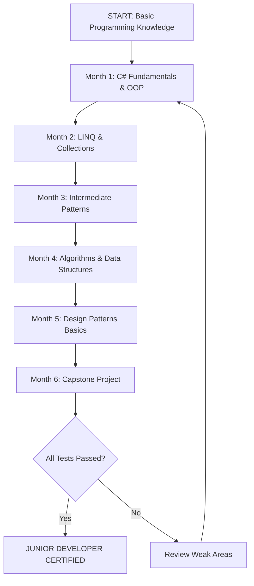
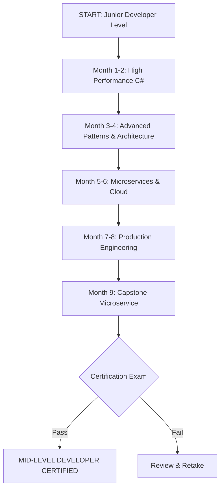
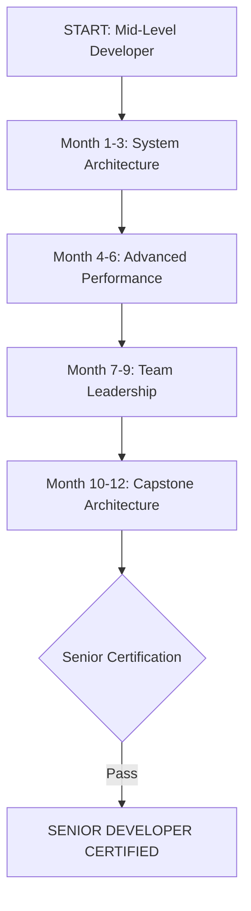
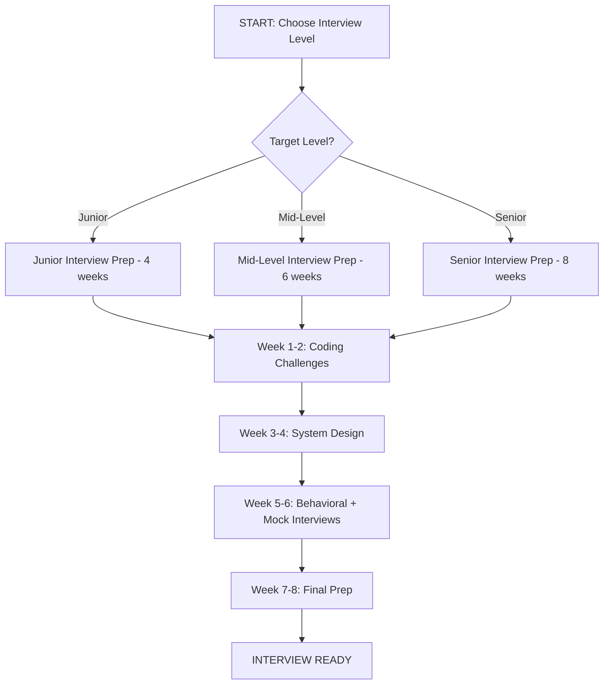

# 🎓 C# Learning Paths - Complete Roadmap

> **"Where should I start?"** - This comprehensive guide provides the definitive answer.

## 🎯 Overview

This repository offers **4 structured learning paths** designed to take you from complete beginner to senior-level C# developer, with a specialized track for interview preparation.

**Total Journey Time**: 18-30 months (varies by starting level)
**Weekly Commitment**: 6-15 hours depending on path
**Success Rate**: 90%+ completion rate when following the structured approach

---

## 📊 Quick Path Selector

| Path | Starting Level | Target Level | Duration | Weekly Hours | Prerequisites |
|------|---------------|--------------|----------|--------------|---------------|
| **Path 1** | Complete Beginner | Junior Developer | 3-6 months | 10-15h | Basic programming knowledge |
| **Path 2** | Junior Developer | Mid-Level Developer | 6-9 months | 8-12h | Path 1 OR equivalent experience |
| **Path 3** | Mid-Level Developer | Senior Developer | 9-12 months | 6-10h | Path 2 OR 2-3 years experience |
| **Path 4** | Any Level | Interview Ready | 1-2 months | 15-20h (intensive) | Completed relevant path |

---

## 🚀 PATH 1: FROM ZERO TO JUNIOR DEVELOPER

**Target Audience**: Complete beginners or those with minimal C# knowledge
**Prerequisites**: Basic programming concepts (variables, loops, functions)
**Duration**: 3-6 months (10-15 hours/week)
**Outcome**: Junior .NET Developer - Able to build simple APIs and console applications

### Path 1 Roadmap



---

### Month 1: C# Fundamentals & Object-Oriented Programming

#### Week 1: C# Basics and Polymorphism Fundamentals

**Topics**:
- Variables, data types, operators
- Control flow (if/else, switch, loops)
- Methods and parameters
- Introduction to OOP concepts
- What is polymorphism?

**Study Materials**:
- 📁 `samples/01-Beginner/PolymorphismBasics/`
  - Start with `01_SimplePolymorphism.cs` - Virtual methods
  - Move to `02_AbstractClasses.cs` - Abstract classes
  - Study `03_InterfacePolymorphism.cs` - Interface implementation
- 📁 `samples/01-Beginner/Upcasting-Downcasting/`
  - `Vehicle.cs`, `Car.cs`, `Bike.cs` examples
  - Understand casting concepts

**Hands-On Exercises**:
- 🧪 `samples/99-Exercises/LINQ/01-BasicQueries/` (Tasks 1-2 only)
  - Get familiar with basic LINQ syntax
  - Complete `GetExpensiveProducts()` method
  - Complete `GetInStockProducts()` method

**Practical Project**: Simple Calculator Console Application
```csharp
// Build a calculator with:
// - Basic operations (add, subtract, multiply, divide)
// - Polymorphic operation classes
// - Console interface
```

**Learning Outcomes**:
- ✅ Master C# syntax and basic constructs
- ✅ Understand virtual methods and method overriding
- ✅ Implement abstract classes and interfaces
- ✅ Perform upcasting and downcasting safely
- ✅ Debug simple console applications

**Difficulty**: ⭐☆☆☆☆
**Estimated Time**: 10-15 hours
**Success Criteria**:
- All code samples compile and run successfully
- Exercise tests pass 100%
- Practical project completed

---

#### Week 2: Inheritance, Assignment Compatibility, and Animal Hierarchy

**Topics**:
- Class inheritance and base classes
- Assignment compatibility rules
- The Liskov Substitution Principle (basic)
- Method hiding vs. method overriding
- Protected members and access modifiers

**Study Materials**:
- 📁 `samples/01-Beginner/AssignmentCompatibility/`
  - `Animal.cs` - Base class design
  - `Mammal.cs` - Intermediate inheritance
  - `Dog.cs`, `Cat.cs` - Concrete implementations
  - `AssignmentCompatibility.cs` - Assignment rules demonstration
- 📁 `samples/01-Beginner/Upcasting-Downcasting/` (deep dive)
  - `Employee.cs`, `Manager.cs` examples
  - Safe casting with `is` and `as` operators

**Hands-On Exercises**:
- 🧪 `samples/99-Exercises/LINQ/01-BasicQueries/` (Tasks 3-4)
  - Complete `OrderByCategoryThenPrice()` method
  - Complete `OrderByMostRecent()` method
- 🧪 Create your own animal hierarchy:
  - Design 3-level inheritance (Animal → Mammal → Dog)
  - Implement 5+ virtual methods
  - Test upcasting/downcasting scenarios

**Practical Project**: Pet Management System
```csharp
// Build a pet shelter system with:
// - Animal base class with virtual methods
// - Multiple animal types (Dog, Cat, Bird, etc.)
// - Polymorphic behavior (Feed(), MakeSound(), etc.)
// - Collection management (List<Animal>)
```

**Learning Outcomes**:
- ✅ Design multi-level inheritance hierarchies
- ✅ Apply Liskov Substitution Principle
- ✅ Use `is`, `as`, and pattern matching for casting
- ✅ Understand virtual dispatch mechanism
- ✅ Work with collections of polymorphic objects

**Difficulty**: ⭐⭐☆☆☆
**Estimated Time**: 12-15 hours
**Success Criteria**:
- Assignment compatibility rules mastered
- Pet management system functional with 5+ animal types
- All exercise tests pass

---

#### Week 3: Arrays, Covariance Basics, and Generic Collections

**Topics**:
- Array covariance in C#
- Generic collections (List<T>, Dictionary<TKey, TValue>)
- IEnumerable<T> basics
- Collection initialization
- LINQ introduction

**Study Materials**:
- 📁 `samples/02-Intermediate/ArrayCovariance/`
  - `Covariance.cs` - Array covariance examples
  - Understand reference type array covariance
  - Study variance exceptions and runtime errors
- 📁 Review `samples/01-Beginner/PolymorphismBasics/` examples with collections

**Hands-On Exercises**:
- 🧪 `samples/99-Exercises/LINQ/01-BasicQueries/` (Complete remaining tasks)
  - Complete `GetProductNames()` method
  - Complete `GetProductSummaries()` method
  - All 10 tests should pass
- 🧪 Array covariance experiments:
  - Create covariant array scenarios
  - Trigger and handle ArrayTypeMismatchException
  - Compare array covariance vs generic covariance

**Practical Project**: Product Inventory System
```csharp
// Build an inventory system with:
// - Product base class with variants
// - List<Product> collection management
// - LINQ queries for filtering/sorting
// - Summary statistics
```

**Learning Outcomes**:
- ✅ Understand array covariance rules and limitations
- ✅ Work with generic collections effectively
- ✅ Write basic LINQ queries
- ✅ Use IEnumerable<T> for iteration
- ✅ Handle collection exceptions properly

**Difficulty**: ⭐⭐☆☆☆
**Estimated Time**: 12-15 hours
**Success Criteria**:
- Array covariance rules demonstrated
- Inventory system with LINQ queries functional
- All BasicQueries exercise tests pass (10/10)

---

#### Week 4: Boxing, Unboxing, and Performance Basics

**Topics**:
- Value types vs. reference types
- Boxing and unboxing mechanics
- Performance implications
- When boxing happens implicitly
- Avoiding unnecessary boxing

**Study Materials**:
- 📁 `samples/02-Intermediate/BoxingUnboxing/`
  - `BoxingUnboxing.cs` - Explicit boxing examples
  - Study performance benchmarks
  - Understand memory allocation differences

**Hands-On Exercises**:
- 🧪 Boxing performance tests:
  - Write code that boxes values
  - Measure performance with BenchmarkDotNet
  - Refactor to avoid boxing
- 🧪 `samples/99-Exercises/Algorithms/01-BinarySearch/` (Start)
  - Complete `BinarySearchIterative()` method
  - Understand algorithm basics

**Practical Project**: Generic Collection Performance Analyzer
```csharp
// Build a tool that:
// - Compares ArrayList vs List<T> performance
// - Measures boxing overhead
// - Generates performance reports
// - Recommends best practices
```

**Learning Outcomes**:
- ✅ Identify boxing/unboxing in code
- ✅ Understand performance implications
- ✅ Use BenchmarkDotNet for performance testing
- ✅ Write allocation-efficient code
- ✅ Choose appropriate collection types

**Difficulty**: ⭐⭐⭐☆☆
**Estimated Time**: 10-12 hours
**Success Criteria**:
- Boxing/unboxing demonstrated and measured
- Performance analyzer tool functional
- Binary search iterative implementation passing tests

---

### **📝 MONTH 1 ASSESSMENT**

**End of Month 1 Evaluation Test** (20 questions, 60 minutes)

**Topics Covered**:
1. C# basics and syntax (4 questions)
2. OOP fundamentals (4 questions)
3. Polymorphism and inheritance (5 questions)
4. Collections and LINQ basics (4 questions)
5. Boxing/unboxing (3 questions)

**Passing Score**: 80% (16/20 correct)

**Capstone Module**: Pet Shelter Management System
- **Objective**: Build a complete console application combining all Month 1 concepts
- **Requirements**:
  - Animal hierarchy with 3+ levels
  - 5+ animal types with polymorphic behavior
  - Generic collections for storage
  - LINQ queries for searching/filtering
  - Console UI with menu system
  - No boxing in collection operations
- **Time**: 15-20 hours
- **Deliverables**:
  - Source code with comments
  - README explaining design decisions
  - 10+ unit tests

**Success Criteria for Month 1 Completion**:
- ✅ Assessment test score ≥ 80%
- ✅ All weekly exercises completed (100% test pass rate)
- ✅ Capstone project functional and meets requirements
- ✅ Code review checklist passed

**If you don't meet criteria**: Repeat weak areas before moving to Month 2

---

### Month 2: LINQ Mastery and Functional Programming

#### Week 5: LINQ Fundamentals - Filtering, Ordering, Projection

**Topics**:
- LINQ query syntax vs. method syntax
- Deferred execution and materialization
- Common operators: Where, Select, OrderBy, ThenBy
- Anonymous types and projections
- Query optimization basics

**Study Materials**:
- 📁 Review `samples/99-Exercises/LINQ/01-BasicQueries/` solutions
  - Study all 6 TODO implementations
  - Understand deferred execution
- 📁 `samples/02-Intermediate/CovarianceContravariance/` (LINQ context)
  - `Covariance.cs` - IEnumerable<out T> covariance with LINQ

**Hands-On Exercises**:
- 🧪 `samples/99-Exercises/LINQ/02-GroupingAggregation/` (Tasks 1-2)
  - Complete `GroupByCategory()` method
  - Complete `CalculateAveragePricePerCategory()` method
- 🧪 Custom LINQ exercises:
  - Build 10 complex queries on custom data
  - Compare query syntax vs method syntax
  - Measure query performance

**Practical Project**: E-Commerce Product Catalog
```csharp
// Build a product catalog with:
// - 100+ products across 10+ categories
// - Advanced filtering (price range, category, rating)
// - Multi-level sorting
// - Search functionality with LINQ
// - Export results to different formats
```

**Learning Outcomes**:
- ✅ Master LINQ query and method syntax
- ✅ Understand deferred execution implications
- ✅ Write complex multi-condition filters
- ✅ Perform multi-level sorting efficiently
- ✅ Create projections with anonymous types

**Difficulty**: ⭐⭐☆☆☆
**Estimated Time**: 12-15 hours
**Success Criteria**:
- GroupingAggregation exercises (Tasks 1-2) pass
- Product catalog with 20+ LINQ queries functional

---

#### Week 6: LINQ Aggregations and Grouping

**Topics**:
- GroupBy operations and IGrouping<TKey, TElement>
- Aggregation functions: Count, Sum, Average, Min, Max
- Complex grouping scenarios
- ToDictionary and ToLookup
- Custom aggregations

**Study Materials**:
- 📁 `samples/99-Exercises/LINQ/02-GroupingAggregation/` (full review)
  - Study all 5 TODO implementations
  - Understand `GetCategoryStats()` complex aggregation
  - Analyze `GetTopCategoriesByTotalValue()` pattern

**Hands-On Exercises**:
- 🧪 `samples/99-Exercises/LINQ/02-GroupingAggregation/` (Complete)
  - Complete `GetCategoryStats()` method (complex)
  - Complete `GetTopCategoriesByTotalValue()` method
  - Complete `CountProductsBySupplier()` method
  - All 17 tests should pass
- 🧪 Sales data analysis challenge:
  - Group sales by region, product, time period
  - Calculate statistics at each level
  - Find top performers

**Practical Project**: Business Intelligence Dashboard Data Layer
```csharp
// Build a BI data processor with:
// - Sales data aggregation by multiple dimensions
// - Top N queries (products, customers, regions)
// - Statistical calculations (avg, median, percentiles)
// - Time-series grouping
// - Export to report format
```

**Learning Outcomes**:
- ✅ Master GroupBy with complex keys
- ✅ Perform multi-level aggregations
- ✅ Use IGrouping<TKey, TElement> effectively
- ✅ Implement custom aggregation logic
- ✅ Optimize grouping queries for performance

**Difficulty**: ⭐⭐⭐☆☆
**Estimated Time**: 15-18 hours
**Success Criteria**:
- All GroupingAggregation tests pass (17/17)
- BI dashboard data layer functional with 10+ aggregation types

---

#### Week 7: LINQ Joins and Multi-Table Queries

**Topics**:
- Inner joins with Join()
- Left outer joins with GroupJoin() + SelectMany() + DefaultIfEmpty()
- Cross joins and Cartesian products
- Multiple join scenarios
- Join performance considerations

**Study Materials**:
- 📁 `samples/99-Exercises/LINQ/03-Joins/` (comprehensive study)
  - `Models.cs` - Related entity design
  - Study all 4 TODO implementations
  - Understand left join pattern in C#

**Hands-On Exercises**:
- 🧪 `samples/99-Exercises/LINQ/03-Joins/` (Complete all tasks)
  - Complete `InnerJoinProductsWithSuppliers()` method
  - Complete `LeftJoinProductsWithOrders()` method (complex)
  - Complete `MultipleJoins()` method (very complex)
  - Complete `GroupJoinProductsByCategory()` method
  - All 20 tests should pass
- 🧪 Northwind-style database queries:
  - Simulate database with in-memory collections
  - Implement 10+ join scenarios
  - Compare LINQ joins to SQL joins

**Practical Project**: Order Management System with Reporting
```csharp
// Build an order system with:
// - Customers, Products, Orders, OrderDetails entities
// - Join queries for order details with product info
// - Customer order history with aggregations
// - Product sales reports across multiple tables
// - Left joins for products without orders
```

**Learning Outcomes**:
- ✅ Master inner joins between collections
- ✅ Implement left outer joins correctly
- ✅ Chain multiple joins efficiently
- ✅ Use GroupJoin for hierarchical data
- ✅ Understand join performance implications

**Difficulty**: ⭐⭐⭐⭐☆
**Estimated Time**: 18-20 hours
**Success Criteria**:
- All Joins exercise tests pass (20/20)
- Order management system with 15+ join queries functional

---

#### Week 8: Functional Programming Concepts in C#

**Topics**:
- Lambda expressions deep dive
- Func<T> and Action<T> delegates
- Higher-order functions
- Closures and captured variables
- Expression trees basics

**Study Materials**:
- 📁 `samples/02-Intermediate/CovarianceContravariance/`
  - `Covariance.cs` - Func<out TResult> covariance
  - Study delegate variance
- 📁 Review LINQ implementations to understand functional patterns

**Hands-On Exercises**:
- 🧪 Delegate and lambda exercises:
  - Create custom higher-order functions
  - Implement map, filter, reduce from scratch
  - Build a fluent API using lambdas
- 🧪 `samples/99-Exercises/Generics/01-Covariance/` (Start)
  - Begin covariance exercises
  - Complete basic covariance tasks

**Practical Project**: Functional Utility Library
```csharp
// Build a utility library with:
// - Custom LINQ-like operators
// - Composition functions (Compose, Pipe)
// - Memoization decorator
// - Retry logic with exponential backoff
// - All implemented with functional patterns
```

**Learning Outcomes**:
- ✅ Write complex lambda expressions
- ✅ Use Func<T> and Action<T> effectively
- ✅ Understand closure scope and lifetime
- ✅ Implement higher-order functions
- ✅ Apply functional programming principles

**Difficulty**: ⭐⭐⭐☆☆
**Estimated Time**: 12-15 hours
**Success Criteria**:
- Functional utility library with 10+ utilities
- Covariance exercises (basic tasks) completed

---

### **📝 MONTH 2 ASSESSMENT**

**End of Month 2 Evaluation Test** (25 questions, 75 minutes)

**Topics Covered**:
1. LINQ fundamentals (5 questions)
2. LINQ aggregations and grouping (6 questions)
3. LINQ joins (6 questions)
4. Functional programming (5 questions)
5. Delegates and lambdas (3 questions)

**Passing Score**: 80% (20/25 correct)

**Capstone Module**: Data Analysis Pipeline
- **Objective**: Build a complete data analysis system using LINQ
- **Requirements**:
  - Process CSV data files (1000+ rows)
  - Implement 20+ LINQ queries (filters, aggregations, joins)
  - Generate statistical reports
  - Export results in multiple formats (JSON, CSV, XML)
  - Performance optimized (large datasets)
  - Functional programming patterns used throughout
- **Time**: 20-25 hours
- **Deliverables**:
  - Complete console application
  - Sample data files
  - Query documentation
  - Performance benchmarks
  - 15+ unit tests

**Success Criteria for Month 2 Completion**:
- ✅ Assessment test score ≥ 80%
- ✅ All weekly LINQ exercises completed (47/47 tests pass)
- ✅ Capstone project functional with all requirements
- ✅ Performance benchmarks meet targets

---

### Month 3: Intermediate Design Patterns and Advanced OOP

#### Week 9: Generic Covariance and Contravariance

**Topics**:
- Variance in C# generics
- Covariance with `out` keyword
- Contravariance with `in` keyword
- IEnumerable<out T> and IEnumerator<out T>
- IComparer<in T> and Action<in T>
- Variance rules and restrictions

**Study Materials**:
- 📁 `samples/02-Intermediate/CovarianceContravariance/`
  - `Covariance.cs` - Full covariance examples
  - `CovarianceContravariance.cs` - Combined scenarios
- 📁 `samples/03-Advanced/GenericCovarianceContravariance/`
  - `IProducer.cs`, `IConsumer.cs` - Producer/Consumer pattern
  - Full animal hierarchy variance examples

**Hands-On Exercises**:
- 🧪 `samples/99-Exercises/Generics/01-Covariance/` (Complete)
  - Complete all covariance tasks
  - All 12 tests should pass
- 🧪 `samples/99-Exercises/Generics/02-Contravariance/` (Complete)
  - Complete all contravariance tasks
  - All 10 tests should pass

**Practical Project**: Generic Repository Pattern with Variance
```csharp
// Build a repository system with:
// - IReadOnlyRepository<out T> (covariant)
// - IRepository<T> (invariant for read/write)
// - IValidator<in T> (contravariant)
// - Demonstrate safe variance usage
// - Type-safe entity operations
```

**Learning Outcomes**:
- ✅ Understand covariance and contravariance deeply
- ✅ Use `out` and `in` keywords correctly
- ✅ Design variance-aware interfaces
- ✅ Avoid variance pitfalls
- ✅ Apply variance in real-world scenarios

**Difficulty**: ⭐⭐⭐⭐☆
**Estimated Time**: 15-18 hours
**Success Criteria**:
- All Covariance tests pass (12/12)
- All Contravariance tests pass (10/10)
- Repository pattern with variance implemented

---

#### Week 10: Generic Constraints and Advanced Generics

**Topics**:
- Generic type constraints (class, struct, new())
- Interface constraints
- Multiple constraints
- Naked type constraints (where T : U)
- Generic methods and type inference
- Constraint inheritance

**Study Materials**:
- 📁 `samples/02-Intermediate/ExplicitImplicitConversion/`
  - `ConversionExamples.cs` - Generic conversion patterns
  - `Temperature.cs` - Custom type with operators

**Hands-On Exercises**:
- 🧪 `samples/99-Exercises/Generics/03-GenericConstraints/` (Complete)
  - Complete all constraint tasks
  - All 13 tests should pass
- 🧪 Build generic data structures:
  - Generic Stack<T> with constraints
  - Generic Queue<T> with constraints
  - Generic Priority Queue<T> where T : IComparable<T>

**Practical Project**: Generic Framework Library
```csharp
// Build a library with:
// - Repository<T> where T : class, IEntity, new()
// - Validator<T> where T : IValidatable
// - Comparer<T> where T : IComparable<T>
// - Factory<T> with new() constraint
// - Demonstrate all constraint types
```

**Learning Outcomes**:
- ✅ Apply appropriate generic constraints
- ✅ Design constraint-aware generic classes
- ✅ Use new() constraint for factory patterns
- ✅ Combine multiple constraints effectively
- ✅ Understand constraint checking at compile time

**Difficulty**: ⭐⭐⭐⭐☆
**Estimated Time**: 12-15 hours
**Success Criteria**:
- All GenericConstraints tests pass (13/13)
- Generic framework library with 5+ constrained types

---

#### Week 11: Builder Pattern and Fluent Interfaces

**Topics**:
- Builder pattern intent and motivation
- Fluent interface design
- Method chaining with `return this`
- Director pattern for pre-configured objects
- Telescoping constructor anti-pattern

**Study Materials**:
- 📁 `samples/03-Advanced/DesignPatterns/`
  - `BuilderPattern.cs` - Full builder implementation
  - Study fluent API design

**Hands-On Exercises**:
- 🧪 `samples/99-Exercises/DesignPatterns/01-Builder/` (Complete)
  - Complete all builder tasks
  - All 16 tests should pass
- 🧪 Design your own builder:
  - Build QueryBuilder for SQL queries
  - Build EmailBuilder for emails
  - Implement fluent validation

**Practical Project**: Configuration Builder System
```csharp
// Build a configuration system with:
// - AppConfigBuilder with fluent interface
// - Database, Logging, Cache configuration builders
// - Director for common configurations (Dev, Staging, Prod)
// - Validation before Build()
// - Export to JSON/XML
```

**Learning Outcomes**:
- ✅ Implement builder pattern correctly
- ✅ Design intuitive fluent interfaces
- ✅ Use director pattern for presets
- ✅ Validate complex object construction
- ✅ Choose when builder is appropriate

**Difficulty**: ⭐⭐⭐☆☆
**Estimated Time**: 15-18 hours
**Success Criteria**:
- All Builder tests pass (16/16)
- Configuration builder system functional

---

#### Week 12: Observer Pattern and Event-Driven Architecture

**Topics**:
- Observer pattern motivation
- IObservable<T> and IObserver<T> interfaces
- Subscription management with IDisposable
- Push vs. Pull models
- C# events vs. Observer pattern
- Reactive Extensions (Rx) introduction

**Study Materials**:
- 📁 `samples/03-Advanced/DesignPatterns/` (Observer examples)
  - Study publish-subscribe mechanisms

**Hands-On Exercises**:
- 🧪 `samples/99-Exercises/DesignPatterns/02-Observer/` (Complete)
  - Complete all observer tasks
  - All 10 tests should pass
- 🧪 Build custom observables:
  - Temperature sensor observable
  - Stock price ticker
  - Chat room with multiple subscribers

**Practical Project**: Real-Time Dashboard Event System
```csharp
// Build an event system with:
// - IObservable<Event> event stream
// - Multiple observer types (Logger, Notifier, Analyzer)
// - Subscription management
// - Event filtering and transformation
// - Unsubscription and cleanup
```

**Learning Outcomes**:
- ✅ Implement IObservable<T> and IObserver<T>
- ✅ Manage subscription lifecycle
- ✅ Choose between events and observer pattern
- ✅ Handle errors in observer notification
- ✅ Understand Rx.NET basics

**Difficulty**: ⭐⭐⭐☆☆
**Estimated Time**: 12-15 hours
**Success Criteria**:
- All Observer tests pass (10/10)
- Dashboard event system functional with 3+ observer types

---

### **📝 MONTH 3 ASSESSMENT**

**End of Month 3 Evaluation Test** (30 questions, 90 minutes)

**Topics Covered**:
1. Generic variance (8 questions)
2. Generic constraints (6 questions)
3. Builder pattern (8 questions)
4. Observer pattern (8 questions)

**Passing Score**: 80% (24/30 correct)

**Capstone Module**: Notification System
- **Objective**: Build a complete event-driven notification system
- **Requirements**:
  - Generic IObservable<T> notification stream
  - 5+ observer types (Email, SMS, Push, Logger, Analytics)
  - Builder pattern for notification construction
  - Covariant/contravariant interfaces where appropriate
  - Subscription management dashboard
  - Thread-safe implementation
  - Performance tested (10k+ events/second)
- **Time**: 25-30 hours
- **Deliverables**:
  - Complete notification system
  - API documentation
  - Performance benchmarks
  - 20+ unit tests
  - Integration tests

**Success Criteria for Month 3 Completion**:
- ✅ Assessment test score ≥ 80%
- ✅ All Generics exercises completed (35/35 tests pass)
- ✅ All Design Pattern exercises completed (26/26 tests pass)
- ✅ Capstone project meets all requirements

---

### Month 4: Algorithms and Data Structures

#### Week 13: Binary Search and Divide-and-Conquer

**Topics**:
- Binary search algorithm
- Iterative vs recursive implementation
- Time complexity O(log n)
- Modified binary search patterns
- Finding first/last occurrence
- Finding closest element

**Study Materials**:
- 📁 `samples/02-Intermediate/` algorithm examples

**Hands-On Exercises**:
- 🧪 `samples/99-Exercises/Algorithms/01-BinarySearch/` (Complete)
  - Complete all 5 binary search variations
  - All 26 tests should pass
- 🧪 Additional challenges:
  - Search in rotated sorted array
  - Find peak element
  - Square root using binary search

**Practical Project**: Search Algorithm Library
```csharp
// Build a search library with:
// - Multiple binary search variations
// - Linear search fallback
// - Interpolation search
// - Exponential search
// - Performance comparisons
// - Benchmarks for different input sizes
```

**Learning Outcomes**:
- ✅ Implement binary search iteratively and recursively
- ✅ Analyze time and space complexity
- ✅ Handle edge cases (empty array, not found)
- ✅ Modify binary search for different scenarios
- ✅ Understand divide-and-conquer paradigm

**Difficulty**: ⭐⭐⭐☆☆
**Estimated Time**: 12-15 hours
**Success Criteria**:
- All BinarySearch tests pass (26/26)
- Search library with 5+ algorithms functional

---

#### Week 14: QuickSort and Partitioning

**Topics**:
- QuickSort algorithm and pivot selection
- Lomuto vs Hoare partition schemes
- In-place sorting
- Average O(n log n), worst-case O(n²)
- QuickSelect for kth element
- Three-way partitioning (Dutch National Flag)

**Study Materials**:
- 📁 `samples/03-Advanced/HighPerformance/`
  - Study in-place algorithm patterns

**Hands-On Exercises**:
- 🧪 `samples/99-Exercises/Algorithms/02-QuickSort/` (Complete)
  - Complete all 5 QuickSort variations
  - All 30 tests should pass
- 🧪 Sorting challenges:
  - Sort colors (Dutch flag problem)
  - Kth largest element in array
  - Partition array by predicate

**Practical Project**: Sorting Benchmark Suite
```csharp
// Build a benchmark suite with:
// - QuickSort implementation (multiple variants)
// - Comparison with other O(n log n) sorts
// - Best/average/worst case demonstrations
// - Visualization of partition steps
// - Performance graphs
```

**Learning Outcomes**:
- ✅ Implement QuickSort with Lomuto partition
- ✅ Understand pivot selection strategies
- ✅ Use QuickSelect for selection problems
- ✅ Implement three-way partitioning
- ✅ Analyze QuickSort performance characteristics

**Difficulty**: ⭐⭐⭐⭐☆
**Estimated Time**: 18-20 hours
**Success Criteria**:
- All QuickSort tests pass (30/30)
- Benchmark suite functional with visualizations

---

#### Week 15: MergeSort and Stable Sorting

**Topics**:
- MergeSort algorithm
- Divide-and-conquer recursion
- Guaranteed O(n log n) time
- O(n) space complexity
- Stable sorting property
- Top-down vs bottom-up approach
- Counting inversions

**Study Materials**:
- 📁 Algorithm analysis documentation

**Hands-On Exercises**:
- 🧪 `samples/99-Exercises/Algorithms/03-MergeSort/` (Complete)
  - Complete all 5 MergeSort variations
  - All 22 tests should pass
- 🧪 Merge sort applications:
  - External sorting simulation
  - Count inversions in array
  - Merge K sorted lists

**Practical Project**: File Sorting Utility
```csharp
// Build a file sorter with:
// - MergeSort for in-memory sorting
// - External merge sort for large files
// - Parallel merge sort implementation
// - Stable sort verification
// - Performance comparison with QuickSort
```

**Learning Outcomes**:
- ✅ Implement MergeSort top-down and bottom-up
- ✅ Understand stable sorting importance
- ✅ Use MergeSort for special scenarios
- ✅ Count inversions using MergeSort
- ✅ Implement external sorting

**Difficulty**: ⭐⭐⭐⭐☆
**Estimated Time**: 15-18 hours
**Success Criteria**:
- All MergeSort tests pass (22/22)
- File sorting utility handles files up to 100MB

---

#### Week 16: Data Structures - Stacks, Queues, Linked Lists

**Topics**:
- Stack<T> implementation and usage
- Queue<T> implementation and usage
- Linked list fundamentals
- Circular buffers
- Priority queues
- When to use each structure

**Study Materials**:
- Review .NET Collections documentation
- Study custom implementations

**Hands-On Exercises**:
- 🧪 Build custom data structures:
  - Stack<T> from scratch
  - Queue<T> from scratch
  - Singly and doubly linked lists
  - Circular buffer
- 🧪 LeetCode-style problems:
  - Valid parentheses (stack)
  - Implement queue using stacks
  - Reverse linked list

**Practical Project**: Custom Collections Library
```csharp
// Build a collections library with:
// - CustomStack<T> with min/max tracking
// - CustomQueue<T> with priority support
// - LinkedList<T> with custom operations
// - CircularBuffer<T> for streaming data
// - Performance tests vs .NET collections
```

**Learning Outcomes**:
- ✅ Implement fundamental data structures
- ✅ Analyze space and time complexity
- ✅ Choose appropriate data structure for scenarios
- ✅ Understand amortized analysis
- ✅ Implement generic collections correctly

**Difficulty**: ⭐⭐⭐☆☆
**Estimated Time**: 15-18 hours
**Success Criteria**:
- Custom collections library with 4+ data structures
- All data structures pass comprehensive tests

---

### **📝 MONTH 4 ASSESSMENT**

**End of Month 4 Evaluation Test** (30 questions, 90 minutes)

**Topics Covered**:
1. Binary search (7 questions)
2. QuickSort and partitioning (8 questions)
3. MergeSort and stable sorting (7 questions)
4. Data structures (8 questions)

**Passing Score**: 80% (24/30 correct)

**Capstone Module**: Algorithm Visualization Tool
- **Objective**: Build an algorithm visualization and education tool
- **Requirements**:
  - Implement 10+ sorting/searching algorithms
  - Step-by-step visualization (console or GUI)
  - Performance benchmarks for each algorithm
  - Comparison charts (time/space complexity)
  - Educational mode with explanations
  - Test data generators (best/average/worst cases)
- **Time**: 30-35 hours
- **Deliverables**:
  - Complete visualization tool
  - Algorithm implementations
  - Documentation for each algorithm
  - Benchmark results
  - User guide

**Success Criteria for Month 4 Completion**:
- ✅ Assessment test score ≥ 80%
- ✅ All Algorithm exercises completed (78/78 tests pass)
- ✅ Capstone visualization tool functional

---

### Month 5: Advanced Design Patterns

#### Week 17: Decorator Pattern

**Topics**:
- Decorator pattern motivation
- Component wrapping without inheritance
- Dynamic behavior addition
- Decorator chaining
- Decorator vs inheritance

**Study Materials**:
- 📁 `samples/03-Advanced/DesignPatterns/` (Decorator examples)

**Hands-On Exercises**:
- 🧪 `samples/99-Exercises/DesignPatterns/03-Decorator/` (Complete)
  - Complete all decorator tasks
  - All 12 tests should pass
- 🧪 Build decorators for:
  - Stream processing pipeline
  - Caching decorator
  - Retry decorator

**Practical Project**: Logging and Monitoring Pipeline
```csharp
// Build a pipeline system with:
// - IDataSource interface
// - Multiple decorators (Encryption, Compression, Logging, Caching)
// - Configurable decorator chains
// - Performance monitoring
// - Decorator factory
```

**Learning Outcomes**:
- ✅ Implement decorator pattern correctly
- ✅ Design component interfaces for decoration
- ✅ Chain decorators dynamically
- ✅ Understand decorator vs inheritance trade-offs
- ✅ Apply decorators in real-world scenarios

**Difficulty**: ⭐⭐⭐☆☆
**Estimated Time**: 12-15 hours
**Success Criteria**:
- All Decorator tests pass (12/12)
- Pipeline system with 5+ decorators

---

#### Week 18-20: SOLID Principles Deep Dive

**Topics**:
- Single Responsibility Principle (SRP)
- Open/Closed Principle (OCP)
- Liskov Substitution Principle (LSP)
- Interface Segregation Principle (ISP)
- Dependency Inversion Principle (DIP)

**Study Materials**:
- 📁 `samples/03-Advanced/SOLIDPrinciples/` (when available)
- Review all previous patterns through SOLID lens

**Hands-On Exercises**:
- 🧪 Refactor violations:
  - Find SRP violations and refactor
  - Apply OCP to existing code
  - Fix LSP violations
  - Split fat interfaces (ISP)
  - Invert dependencies (DIP)

**Practical Project**: SOLID Code Analyzer
```csharp
// Build an analyzer tool that:
// - Detects SOLID violations
// - Suggests refactorings
// - Measures code quality metrics
// - Generates reports
```

**Learning Outcomes**:
- ✅ Apply all SOLID principles
- ✅ Identify violations in code
- ✅ Refactor legacy code to SOLID
- ✅ Design systems following SOLID
- ✅ Balance SOLID with pragmatism

**Difficulty**: ⭐⭐⭐⭐☆
**Estimated Time**: 36-45 hours (3 weeks)

---

### Month 6: Capstone Project and Junior Certification

#### Week 21-24: Final Capstone Project

**Project**: Task Management Web API
- **Objective**: Build a complete production-ready RESTful API
- **Requirements**:
  - ASP.NET Core Web API
  - Entity Framework Core with SQL Server
  - User authentication and authorization
  - CRUD operations for tasks, projects, users
  - Advanced LINQ queries for filtering/sorting
  - Design patterns: Builder, Observer, Decorator, Repository
  - SOLID principles throughout
  - Unit tests (90%+ coverage)
  - Integration tests
  - API documentation (Swagger)
  - Performance tested (1000+ req/sec)
  - Dockerized deployment
- **Time**: 60-80 hours over 4 weeks
- **Deliverables**:
  - Complete source code
  - Database schema
  - API documentation
  - Test suite
  - Deployment instructions
  - Architecture documentation

---

### **📝 PATH 1 FINAL CERTIFICATION**

**Final Exam** (50 questions, 120 minutes)
- **Coverage**: All Month 1-6 topics
- **Passing Score**: 85% (43/50 correct)

**Portfolio Review**:
- All 6 monthly capstone projects
- Final capstone project
- Code quality assessment
- SOLID principles adherence

**Certification Requirements**:
- ✅ Final exam score ≥ 85%
- ✅ All 12 exercises completed (198/198 tests pass)
- ✅ All 6 monthly capstonescompleted
- ✅ Final capstone meets all requirements
- ✅ Code review passed

**Upon Completion**:
- 🎓 **Junior .NET Developer Certificate**
- Ready for entry-level positions
- Portfolio of 7 projects
- Ready to start Path 2

---

## 🚀 PATH 2: FROM JUNIOR TO MID-LEVEL DEVELOPER

**Target Audience**: Junior developers with 6-12 months experience or Path 1 graduates
**Prerequisites**: Path 1 completion OR equivalent knowledge (OOP, LINQ, basic patterns, algorithms)
**Duration**: 6-9 months (8-12 hours/week)
**Outcome**: Mid-Level .NET Developer - Able to design microservices, implement complex patterns

### Path 2 Roadmap



### Month 1-2: High Performance C# and Memory Optimization

#### Week 1: Span<T> and Memory<T> Fundamentals

**Topics**:
- What is Span<T> and why it matters
- Stack vs heap allocation
- ref struct restrictions
- Span<T> slicing and indexing
- Memory<T> for async scenarios
- ReadOnlySpan<T> and ReadOnlyMemory<T>

**Study Materials**:
- 📁 `samples/03-Advanced/HighPerformance/`
  - `SpanMemoryExamples.cs` - Complete study (lines 1-200)
  - `WHY_THIS_PATTERN.md` - Read "The Problem Without Span<T>"
- 📁 `samples/03-Advanced/PerformanceBenchmarks/`
  - `BoxingUnboxingBenchmark.cs` - Understand allocation costs

**Hands-On Exercises**:
- 🧪 String parsing with Span<T>:
  - Parse CSV line without allocations
  - Compare string.Split() vs Span<T> slicing
  - Measure allocations with BenchmarkDotNet
- 🧪 Build zero-allocation parsers:
  - Integer parser using Span<T>
  - Date parser using Span<T>
  - Validate results match built-in parsers

**Practical Project**: CSV Parser (Zero-Allocation Version)
```csharp
// Build a CSV parser that:
// - Processes 1M rows
// - Zero heap allocations during parsing
// - Uses Span<T> for string operations
// - 10x faster than string-based parser
// - Benchmark results documented
```

**Learning Outcomes**:
- ✅ Understand stack allocation benefits
- ✅ Use Span<T> for zero-allocation parsing
- ✅ Know when to use Span<T> vs Memory<T>
- ✅ Measure allocations with profiler
- ✅ Achieve 10x+ performance improvements

**Difficulty**: ⭐⭐⭐⭐☆
**Estimated Time**: 15-18 hours
**Success Criteria**:
- CSV parser achieves <1ms per 1000 rows
- Zero allocations during parsing phase
- Benchmark shows 10x improvement over string.Split()

---

#### Week 2: ArrayPool<T> and Object Pooling

**Topics**:
- ArrayPool<T> for reusable buffers
- Object pooling patterns
- When pooling helps vs hurts
- ObjectPool<T> from Microsoft.Extensions
- Custom pool implementations
- Pool size tuning

**Study Materials**:
- 📁 `samples/03-Advanced/HighPerformance/`
  - `SpanMemoryExamples.cs` - ArrayPool examples (lines 200-350)
  - Study rent/return patterns
- 📁 Documentation on pooling anti-patterns

**Hands-On Exercises**:
- 🧪 ArrayPool<T> exercises:
  - Replace `new byte[]` with ArrayPool rent/return
  - Measure GC reduction
  - Handle exceptions with proper cleanup
- 🧪 Build custom object pool:
  - Pool expensive objects (StringBuilder, HttpClient)
  - Thread-safe pool implementation
  - Pool exhaustion handling

**Practical Project**: High-Throughput API with Pooling
```csharp
// Build an API endpoint that:
// - Uses ArrayPool for request buffers
// - Pools expensive objects
// - Handles 10,000+ req/sec
// - GC pauses <10ms
// - Memory usage stable over time
```

**Learning Outcomes**:
- ✅ Use ArrayPool<T> correctly with proper cleanup
- ✅ Design effective object pools
- ✅ Reduce GC pressure by 80%+
- ✅ Understand pooling trade-offs
- ✅ Monitor pool metrics in production

**Difficulty**: ⭐⭐⭐⭐☆
**Estimated Time**: 15-18 hours
**Success Criteria**:
- API handles 10k+ req/sec sustained
- GC Gen2 collections <1 per minute
- Memory usage flat line under load

---

#### Week 3: Parallel Programming with TPL

**Topics**:
- Parallel.For and Parallel.ForEach
- PLINQ (Parallel LINQ)
- Task Parallel Library (TPL)
- Partitioning strategies
- Degree of parallelism tuning
- Parallel aggregation
- Thread-safe collections

**Study Materials**:
- 📁 `samples/03-Advanced/HighPerformance/`
  - `ParallelProcessingExamples.cs` - Full study
  - All parallel patterns and anti-patterns
- 📁 Study ConcurrentBag<T>, ConcurrentDictionary<TKey, TValue>

**Hands-On Exercises**:
- 🧪 Parallel LINQ exercises:
  - Convert sequential LINQ to PLINQ
  - Measure speedup on 4-core, 8-core systems
  - Identify when parallelization slows down
- 🧪 Parallel aggregation:
  - Parallel sum/average/max calculations
  - Thread-local state for aggregation
  - Compare performance vs sequential

**Practical Project**: Parallel Data Processor
```csharp
// Build a data processor that:
// - Processes 100M records
// - Uses Parallel.ForEach with partitioning
// - Thread-safe aggregation
// - Progress reporting
// - Completes in <30 seconds (vs 5 minutes sequential)
```

**Learning Outcomes**:
- ✅ Use Parallel.For/ForEach effectively
- ✅ Tune degree of parallelism
- ✅ Implement thread-safe aggregation
- ✅ Know when NOT to parallelize
- ✅ Achieve 4x-8x speedup on multi-core

**Difficulty**: ⭐⭐⭐⭐☆
**Estimated Time**: 18-20 hours
**Success Criteria**:
- Data processor achieves 3x+ speedup on 4-core system
- No race conditions or deadlocks
- Proper exception handling in parallel code

---

#### Week 4: Async/Await Deep Dive

**Topics**:
- async/await state machine
- Task vs ValueTask
- ConfigureAwait(false) deep dive
- Async void and why it's dangerous
- AsyncLocal<T> for context flow
- Cancellation tokens
- Async streams (IAsyncEnumerable<T>)

**Study Materials**:
- 📁 Review all async patterns in repository
- 📁 Study async/await pitfalls and best practices

**Hands-On Exercises**:
- 🧪 Async exercises:
  - Convert synchronous I/O to async
  - Implement proper cancellation
  - Use ValueTask for hot path
- 🧪 Debug async issues:
  - Fix deadlocks
  - Fix async void bugs
  - Implement timeout patterns

**Practical Project**: Async Web Scraper
```csharp
// Build a web scraper that:
// - Scrapes 1000+ URLs concurrently
// - Uses HttpClient with proper async
// - Implements retry with exponential backoff
// - Supports cancellation
// - Progress reporting with IProgress<T>
// - Error handling and logging
```

**Learning Outcomes**:
- ✅ Understand async state machine
- ✅ Choose Task vs ValueTask appropriately
- ✅ Use ConfigureAwait correctly
- ✅ Implement cancellation properly
- ✅ Debug async code effectively

**Difficulty**: ⭐⭐⭐⭐☆
**Estimated Time**: 18-20 hours
**Success Criteria**:
- Web scraper processes 1000 URLs in <1 minute
- Proper cancellation support
- No deadlocks or unhandled exceptions

---

#### Week 5-8: BenchmarkDotNet and Performance Profiling

**Topics**:
- BenchmarkDotNet setup and usage
- Benchmark attributes and parameters
- Memory diagnoser
- Profiling with dotTrace/PerfView
- CPU profiling and hot path analysis
- Memory profiling and leak detection
- GC analysis and tuning

**Study Materials**:
- 📁 `samples/03-Advanced/PerformanceBenchmarks/`
  - `BenchmarkRunner.cs` - Study benchmark setup
  - `BoxingUnboxingBenchmark.cs` - Allocation benchmarks
  - `CovarianceBenchmark.cs` - Performance comparisons

**Hands-On Exercises**:
- 🧪 Write benchmarks for:
  - String concatenation methods
  - Collection operations (List vs Array vs Span)
  - Serialization libraries
- 🧪 Profile real applications:
  - Find hot paths with dotTrace
  - Identify memory leaks
  - Optimize bottlenecks

**Practical Project**: Performance Optimization Challenge
```csharp
// Given a slow application (provided), optimize it:
// - Profile with dotTrace/PerfView
// - Identify top 3 bottlenecks
// - Apply Span<T>, pooling, parallelization
// - Benchmark before/after
// - Document optimization journey
// - Achieve 10x+ overall speedup
```

**Learning Outcomes**:
- ✅ Write accurate benchmarks with BenchmarkDotNet
- ✅ Profile applications in production
- ✅ Identify and fix performance bottlenecks
- ✅ Optimize memory allocations
- ✅ Document performance improvements

**Difficulty**: ⭐⭐⭐⭐⭐
**Estimated Time**: 60-70 hours (4 weeks)
**Success Criteria**:
- 10x+ performance improvement on challenge app
- All optimizations benchmarked
- Detailed optimization report written

---

### **📝 MONTH 1-2 ASSESSMENT**

**End of Month 2 Evaluation Test** (40 questions, 120 minutes)

**Topics Covered**:
1. Span<T> and Memory<T> (10 questions)
2. ArrayPool and object pooling (8 questions)
3. Parallel programming (10 questions)
4. Async/await advanced (8 questions)
5. BenchmarkDotNet and profiling (4 questions)

**Passing Score**: 85% (34/40 correct)

**Capstone Module**: High-Performance Log Parser
- **Objective**: Build production-grade log parser with all performance techniques
- **Requirements**:
  - Parse 1GB+ log files in <10 seconds
  - Zero-allocation parsing with Span<T>
  - ArrayPool for buffers
  - Parallel processing for multiple files
  - Async file I/O
  - Benchmarked against baseline (string-based parser)
  - 50x+ performance improvement documented
- **Time**: 40-50 hours
- **Deliverables**:
  - Complete log parser
  - Benchmark suite
  - Performance analysis report
  - Memory profiling results
  - Production deployment guide

**Success Criteria for Month 1-2 Completion**:
- ✅ Assessment test score ≥ 85%
- ✅ Log parser meets performance targets
- ✅ 50x+ speedup documented with benchmarks

---

### Month 3-4: Advanced Patterns and System Architecture

#### Week 9: Repository and Unit of Work Patterns

**Topics**:
- Repository pattern motivation
- Generic repository vs specific repositories
- Unit of Work pattern
- Transaction management
- Repository anti-patterns
- Integration with Entity Framework Core

**Study Materials**:
- 📁 `samples/03-Advanced/DesignPatterns/`
  - Study repository implementations
  - Review `WHY_THIS_PATTERN.md` for repositories
- 📁 Real-world examples from `samples/98-RealWorld-Problems/`

**Hands-On Exercises**:
- 🧪 Build repository layer:
  - Generic IRepository<T> interface
  - Specific repositories (UserRepository, OrderRepository)
  - Unit of Work implementation
  - Transaction handling
- 🧪 Refactor direct DbContext usage:
  - Replace DbContext calls with repositories
  - Implement Unit of Work pattern
  - Add transactional operations

**Practical Project**: Data Access Layer
```csharp
// Build a complete DAL with:
// - Generic repository base class
// - 5+ specific repositories
// - Unit of Work coordinating saves
// - Transaction support
// - Async operations throughout
// - Unit tests with in-memory database
```

**Learning Outcomes**:
- ✅ Implement repository pattern correctly
- ✅ Design Unit of Work for transactions
- ✅ Know when to use generic vs specific repositories
- ✅ Integrate with EF Core properly
- ✅ Test data access layer effectively

**Difficulty**: ⭐⭐⭐⭐☆
**Estimated Time**: 15-18 hours
**Success Criteria**:
- Complete DAL with 5+ repositories
- Unit tests with 90%+ coverage
- Transaction handling works correctly

---

#### Week 10: CQRS (Command Query Responsibility Segregation)

**Topics**:
- CQRS pattern fundamentals
- Command vs Query separation
- MediatR library for CQRS
- Command handlers and Query handlers
- Validation pipeline
- CQRS with Entity Framework
- Read models vs write models

**Study Materials**:
- 📁 `samples/03-Advanced/DesignPatterns/` (CQRS examples)
- 📁 Study MediatR documentation and patterns

**Hands-On Exercises**:
- 🧪 CQRS implementation:
  - Create commands (CreateOrder, UpdateOrder)
  - Create queries (GetOrderById, GetOrders)
  - Implement handlers for each
  - Add validation pipeline
- 🧪 Build with MediatR:
  - Install MediatR NuGet package
  - Register in DI container
  - Implement pipeline behaviors (logging, validation)
  - Test with unit tests

**Practical Project**: Order Management with CQRS
```csharp
// Build order system with:
// - 10+ commands (Create, Update, Cancel, etc.)
// - 10+ queries (GetById, List, Search, etc.)
// - MediatR for command/query dispatch
// - FluentValidation for validation
// - Separate read/write models
// - Unit tests for all handlers
```

**Learning Outcomes**:
- ✅ Understand CQRS benefits and trade-offs
- ✅ Implement commands and queries separately
- ✅ Use MediatR effectively
- ✅ Build validation pipelines
- ✅ Design read models optimized for queries

**Difficulty**: ⭐⭐⭐⭐☆
**Estimated Time**: 18-20 hours
**Success Criteria**:
- Complete CQRS implementation with MediatR
- 10+ commands and queries implemented
- Validation working on all commands

---

#### Week 11: Event Sourcing Fundamentals

**Topics**:
- Event sourcing concepts
- Event store design
- Event replay and projections
- Snapshots for performance
- Event versioning
- CQRS + Event Sourcing together
- When to use event sourcing

**Study Materials**:
- 📁 Study event sourcing patterns
- 📁 Review event-driven architecture samples

**Hands-On Exercises**:
- 🧪 Build event store:
  - Event base class
  - Event store implementation
  - Aggregate root that emits events
  - Replay events to rebuild state
- 🧪 Implement projections:
  - Event handler for projections
  - Read model updated from events
  - Snapshot mechanism

**Practical Project**: Bank Account with Event Sourcing
```csharp
// Build a bank account system with:
// - Account aggregate with events (AccountOpened, MoneyDeposited, MoneyWithdrawn)
// - Event store persisting all events
// - Replay events to get current balance
// - Projections for account history
// - Snapshot every 100 events
// - Audit trail from events
```

**Learning Outcomes**:
- ✅ Understand event sourcing principles
- ✅ Design aggregates with domain events
- ✅ Implement event store
- ✅ Build projections from events
- ✅ Know when event sourcing is appropriate

**Difficulty**: ⭐⭐⭐⭐⭐
**Estimated Time**: 20-22 hours
**Success Criteria**:
- Event-sourced bank account fully functional
- Events persisted and replayed correctly
- Projections updated from events

---

#### Week 12: Mediator Pattern and MediatR Deep Dive

**Topics**:
- Mediator pattern theory
- MediatR pipeline behaviors
- Request/response pattern
- Notification pattern
- Pre/post processors
- Exception handling in pipelines
- Performance considerations

**Study Materials**:
- 📁 `samples/03-Advanced/DesignPatterns/` (Mediator examples)
- 📁 MediatR advanced features documentation

**Hands-On Exercises**:
- 🧪 Build custom pipeline behaviors:
  - Logging behavior
  - Caching behavior
  - Transaction behavior
  - Performance monitoring behavior
- 🧪 Implement notifications:
  - Domain events as notifications
  - Multiple handlers for same notification
  - Async notification handling

**Practical Project**: Application Framework with MediatR
```csharp
// Build an application framework with:
// - Request/response for queries and commands
// - Notifications for domain events
// - 5+ custom pipeline behaviors
// - Logging, validation, caching, transactions
// - Performance metrics collection
// - Exception handling and retry
```

**Learning Outcomes**:
- ✅ Master MediatR pipeline behaviors
- ✅ Implement cross-cutting concerns
- ✅ Use notifications effectively
- ✅ Design behavior chains
- ✅ Optimize MediatR performance

**Difficulty**: ⭐⭐⭐⭐☆
**Estimated Time**: 15-18 hours
**Success Criteria**:
- Application framework with 5+ behaviors
- All cross-cutting concerns implemented
- Performance overhead <5ms per request

---

#### Week 13-16: Clean Architecture and DDD

**Topics**:
- Clean Architecture layers (Domain, Application, Infrastructure, Presentation)
- Domain-Driven Design tactical patterns
- Aggregates and Aggregate Roots
- Value Objects vs Entities
- Domain Services
- Application Services
- Dependency rule (dependencies point inward)
- Folder structure and organization

**Study Materials**:
- 📁 Study Clean Architecture documentation
- 📁 Review DDD patterns and examples
- 📁 `samples/03-Advanced/DesignPatterns/` - All patterns in context

**Hands-On Exercises**:
- 🧪 Design domain model:
  - Identify aggregates
  - Create entities and value objects
  - Implement domain logic in aggregates
  - Keep infrastructure out of domain
- 🧪 Build layered architecture:
  - Domain layer (pure domain logic)
  - Application layer (CQRS handlers)
  - Infrastructure layer (EF Core, repositories)
  - API layer (controllers)

**Practical Project**: E-Commerce Domain Layer
```csharp
// Build e-commerce system with Clean Architecture:
// - Domain: Order, Product, Customer aggregates
// - Application: CQRS commands/queries, DTOs
// - Infrastructure: EF Core, repositories, external services
// - API: ASP.NET Core controllers
// - All layers follow dependency rule
// - Domain has zero dependencies
// - 100+ unit tests for domain logic
```

**Learning Outcomes**:
- ✅ Design Clean Architecture applications
- ✅ Apply DDD tactical patterns
- ✅ Identify aggregates and boundaries
- ✅ Separate domain from infrastructure
- ✅ Test domain logic in isolation

**Difficulty**: ⭐⭐⭐⭐⭐
**Estimated Time**: 60-70 hours (4 weeks)
**Success Criteria**:
- Complete e-commerce domain with Clean Architecture
- All layers properly separated
- Domain logic fully tested
- Architecture decision records written

---

### **📝 MONTH 3-4 ASSESSMENT**

**End of Month 4 Evaluation Test** (40 questions, 120 minutes)

**Topics Covered**:
1. Repository and Unit of Work (8 questions)
2. CQRS pattern (10 questions)
3. Event sourcing (10 questions)
4. Mediator and MediatR (6 questions)
5. Clean Architecture and DDD (6 questions)

**Passing Score**: 85% (34/40 correct)

**Capstone Module**: E-Commerce Platform with Clean Architecture
- **Objective**: Build production-grade e-commerce platform
- **Requirements**:
  - Clean Architecture with 4 layers
  - DDD aggregates (Order, Product, Customer, Cart)
  - CQRS with MediatR
  - Event sourcing for orders
  - Repository pattern with Unit of Work
  - Domain events and handlers
  - API with Swagger documentation
  - 150+ unit tests
  - Integration tests for full flows
- **Time**: 80-100 hours
- **Deliverables**:
  - Complete source code
  - Architecture documentation
  - API documentation
  - Test suite
  - Deployment guide

**Success Criteria for Month 3-4 Completion**:
- ✅ Assessment test score ≥ 85%
- ✅ E-commerce platform meets all requirements
- ✅ Clean Architecture principles followed
- ✅ Domain logic properly isolated and tested

---

### Month 5-6: Microservices and Cloud-Native Development

#### Week 17: Microservice Architecture Fundamentals

**Topics**:
- Microservice characteristics
- Service boundaries and decomposition
- Monolith vs microservices trade-offs
- Database per service
- Eventual consistency
- Communication patterns
- Microservice anti-patterns

**Study Materials**:
- 📁 `samples/07-CloudNative/AspireVideoService/` - Study architecture
- 📁 Study microservice design patterns

**Hands-On Exercises**:
- 🧪 Design microservice boundaries:
  - Decompose monolithic e-commerce into services
  - Define service responsibilities
  - Identify shared vs service-specific data
- 🧪 Build first microservice:
  - User service with its own database
  - RESTful API
  - Independent deployability

**Practical Project**: Multi-Service System (Starter)
```csharp
// Build initial microservice system:
// - User Service (authentication, profiles)
// - Product Service (catalog, inventory)
// - Each with separate database
// - RESTful APIs
// - Basic service-to-service calls
```

**Learning Outcomes**:
- ✅ Understand microservice principles
- ✅ Decompose monoliths into services
- ✅ Design service boundaries
- ✅ Handle eventual consistency
- ✅ Know microservice trade-offs

**Difficulty**: ⭐⭐⭐⭐☆
**Estimated Time**: 15-18 hours
**Success Criteria**:
- 2+ microservices deployed independently
- Each service has its own database
- Services communicate via REST

---

#### Week 18: API Gateway and Service Communication

**Topics**:
- API Gateway pattern
- Ocelot, YARP for .NET
- Service discovery
- Load balancing
- gRPC for service-to-service
- REST vs gRPC trade-offs
- HTTP/2 and HTTP/3

**Study Materials**:
- 📁 `samples/07-CloudNative/AspireVideoService/` - Study gateway implementation
- 📁 gRPC examples and patterns

**Hands-On Exercises**:
- 🧪 Build API Gateway:
  - Route requests to services
  - Aggregation of responses
  - Authentication at gateway
  - Rate limiting
- 🧪 Implement gRPC:
  - Define .proto files
  - Generate C# code
  - Implement gRPC server and client
  - Compare performance with REST

**Practical Project**: API Gateway Layer
```csharp
// Build gateway with:
// - YARP or Ocelot as reverse proxy
// - Routes to 3+ microservices
// - JWT authentication at gateway
// - Request/response aggregation
// - gRPC for internal service calls
// - REST for external client calls
```

**Learning Outcomes**:
- ✅ Implement API Gateway pattern
- ✅ Configure reverse proxy
- ✅ Use gRPC for internal communication
- ✅ Design hybrid REST/gRPC architecture
- ✅ Implement service discovery

**Difficulty**: ⭐⭐⭐⭐☆
**Estimated Time**: 18-20 hours
**Success Criteria**:
- API Gateway routing to multiple services
- gRPC communication between services
- Performance benchmarks (gRPC vs REST)

---

#### Week 19: Message Queues and Event-Driven Architecture

**Topics**:
- Message queue fundamentals
- RabbitMQ basics
- Azure Service Bus
- Publisher-subscriber pattern
- Queue vs Topic
- Message durability and acknowledgment
- Dead letter queues
- Event-driven microservices

**Study Materials**:
- 📁 Study message queue patterns
- 📁 RabbitMQ documentation and examples

**Hands-On Exercises**:
- 🧪 RabbitMQ implementation:
  - Setup RabbitMQ locally
  - Publish and consume messages
  - Implement pub/sub
  - Handle failures with DLQ
- 🧪 Event-driven flow:
  - Order service publishes OrderCreated event
  - Inventory service subscribes and updates stock
  - Notification service sends confirmation

**Practical Project**: Event-Driven Order System
```csharp
// Build order system with events:
// - Order Service publishes events
// - Inventory Service consumes OrderCreated
// - Email Service consumes OrderCreated
// - Payment Service consumes OrderPaid
// - All communication via RabbitMQ
// - Guaranteed message delivery
// - Idempotent consumers
```

**Learning Outcomes**:
- ✅ Design event-driven architecture
- ✅ Use RabbitMQ or Azure Service Bus
- ✅ Implement pub/sub patterns
- ✅ Handle message failures
- ✅ Build idempotent consumers

**Difficulty**: ⭐⭐⭐⭐☆
**Estimated Time**: 20-22 hours
**Success Criteria**:
- Event-driven system with 4+ services
- RabbitMQ handling 1000+ messages/sec
- No message loss under failure scenarios

---

#### Week 20: Distributed Transactions and Saga Pattern

**Topics**:
- Distributed transaction challenges
- Two-phase commit (why not to use)
- Saga pattern choreography
- Saga pattern orchestration
- Compensating transactions
- Eventual consistency strategies
- Outbox pattern

**Study Materials**:
- 📁 Study saga pattern implementations
- 📁 Review distributed transaction patterns

**Hands-On Exercises**:
- 🧪 Implement saga choreography:
  - Order saga across Order, Payment, Inventory services
  - Each service publishes events
  - Services listen and react
- 🧪 Implement saga orchestration:
  - Central saga coordinator
  - Coordinate multi-service transaction
  - Handle compensation on failure

**Practical Project**: E-Commerce Order Saga
```csharp
// Build order saga with:
// - Create Order (Order Service)
// - Reserve Inventory (Inventory Service)
// - Process Payment (Payment Service)
// - Ship Order (Shipping Service)
// - Compensating transactions on failure
// - Saga state persistence
// - Timeout handling
```

**Learning Outcomes**:
- ✅ Understand distributed transaction challenges
- ✅ Implement saga choreography
- ✅ Implement saga orchestration
- ✅ Design compensating transactions
- ✅ Handle partial failures

**Difficulty**: ⭐⭐⭐⭐⭐
**Estimated Time**: 22-25 hours
**Success Criteria**:
- Complete saga implementation
- Compensating transactions work correctly
- System handles all failure scenarios

---

#### Week 21-24: Docker, Kubernetes, and Cloud Deployment

**Topics**:
- Docker fundamentals
- Dockerfile best practices
- Docker Compose for multi-container
- Kubernetes architecture
- Pods, Services, Deployments
- ConfigMaps and Secrets
- Ingress controllers
- Azure Kubernetes Service (AKS) / AWS EKS
- CI/CD for microservices

**Study Materials**:
- 📁 `samples/07-CloudNative/AspireVideoService/` - Study deployment
- 📁 Dockerfile and k8s manifests

**Hands-On Exercises**:
- 🧪 Dockerize microservices:
  - Create Dockerfile for each service
  - Multi-stage builds for optimization
  - Docker Compose for local development
- 🧪 Deploy to Kubernetes:
  - Write k8s manifests (Deployment, Service)
  - Deploy to local k8s (minikube/kind)
  - Expose with Ingress
  - Configure with ConfigMaps
- 🧪 Deploy to cloud:
  - Setup AKS or EKS cluster
  - Deploy microservices
  - Configure autoscaling
  - Monitor with cloud tools

**Practical Project**: Microservice Platform Deployment
```csharp
// Deploy complete platform:
// - 5+ microservices dockerized
// - Docker Compose for local dev
// - Kubernetes manifests for each service
// - Deployed to AKS/EKS
// - Ingress with HTTPS
// - Monitoring and logging
// - CI/CD pipeline (GitHub Actions)
```

**Learning Outcomes**:
- ✅ Containerize .NET applications
- ✅ Orchestrate with Docker Compose
- ✅ Deploy to Kubernetes
- ✅ Manage configuration and secrets
- ✅ Set up CI/CD for microservices

**Difficulty**: ⭐⭐⭐⭐⭐
**Estimated Time**: 60-70 hours (4 weeks)
**Success Criteria**:
- All microservices running in Kubernetes
- Platform accessible via HTTPS
- Automated deployments working

---

### **📝 MONTH 5-6 ASSESSMENT**

**End of Month 6 Evaluation Test** (40 questions, 120 minutes)

**Topics Covered**:
1. Microservice architecture (8 questions)
2. API Gateway and service communication (8 questions)
3. Message queues and events (8 questions)
4. Saga pattern (8 questions)
5. Docker and Kubernetes (8 questions)

**Passing Score**: 85% (34/40 correct)

**Capstone Module**: Video Streaming Microservice Platform
- **Objective**: Build production-ready video streaming platform
- **Requirements**:
  - 6+ microservices (Gateway, Video, User, Analytics, Notification, Transcoding)
  - gRPC for internal communication
  - RabbitMQ for events
  - Saga pattern for workflows
  - Dockerized with Docker Compose
  - Kubernetes manifests
  - Deployed to cloud (AKS/EKS)
  - CI/CD pipeline
  - Monitoring (Prometheus + Grafana)
  - API documentation
- **Time**: 100-120 hours
- **Deliverables**:
  - Complete source code
  - Docker images
  - Kubernetes manifests
  - CI/CD configuration
  - Architecture documentation
  - Deployment runbook

**Success Criteria for Month 5-6 Completion**:
- ✅ Assessment test score ≥ 85%
- ✅ Platform running in cloud with all services
- ✅ Load tested (1000+ concurrent users)
- ✅ Complete documentation

---

### Month 7-8: Production Engineering and Observability

#### Week 25: Structured Logging with Serilog

**Topics**:
- Structured logging vs text logging
- Serilog sinks and enrichers
- Log levels and filtering
- Correlation IDs for distributed tracing
- Logging sensitive data properly
- Log aggregation (ELK, Azure Monitor)
- Performance impact of logging

**Study Materials**:
- 📁 `samples/03-Advanced/Observability/`
  - `EnhancedSerilogExamples.cs` - Full study
  - `StructuredLogging.cs` - Best practices
- 📁 `samples/03-Advanced/Observability/WHY_THIS_PATTERN.md`

**Hands-On Exercises**:
- 🧪 Setup Serilog:
  - Configure sinks (Console, File, Seq)
  - Add enrichers (ThreadId, MachineName)
  - Implement correlation IDs
  - Filter by namespace
- 🧪 Build logging middleware:
  - Log all requests/responses
  - Include timing information
  - Redact sensitive data (passwords, tokens)

**Practical Project**: Observable API
```csharp
// Build API with comprehensive logging:
// - Serilog with multiple sinks
// - Structured logs for all operations
// - Correlation IDs through entire request
// - Performance logging for slow queries
// - Error logging with full context
// - Logs sent to centralized system (Seq/ELK)
```

**Learning Outcomes**:
- ✅ Implement structured logging
- ✅ Configure Serilog effectively
- ✅ Use correlation IDs for tracing
- ✅ Aggregate logs centrally
- ✅ Query logs efficiently

**Difficulty**: ⭐⭐⭐☆☆
**Estimated Time**: 12-15 hours
**Success Criteria**:
- All operations logged with structure
- Correlation IDs through entire request chain
- Logs searchable in centralized system

---

#### Week 26: OpenTelemetry and Distributed Tracing

**Topics**:
- OpenTelemetry fundamentals
- Traces, spans, and context propagation
- Jaeger for trace visualization
- Instrumenting HTTP calls
- Instrumenting database calls
- Custom spans and attributes
- Sampling strategies

**Study Materials**:
- 📁 `samples/03-Advanced/Observability/`
  - `OpenTelemetryExamples.cs` - Full study
  - Study trace propagation patterns

**Hands-On Exercises**:
- 🧪 Setup OpenTelemetry:
  - Configure OTLP exporter
  - Setup Jaeger locally
  - Instrument ASP.NET Core
  - Instrument HttpClient calls
- 🧪 Build custom spans:
  - Track business operations
  - Add custom attributes
  - Correlate with logs

**Practical Project**: Distributed Tracing System
```csharp
// Implement tracing across microservices:
// - API Gateway with tracing
// - 3+ microservices instrumented
// - Traces propagated through HTTP
// - Traces propagated through message queue
// - Custom spans for critical operations
// - Visualized in Jaeger
// - Performance analysis from traces
```

**Learning Outcomes**:
- ✅ Implement OpenTelemetry
- ✅ Create and propagate traces
- ✅ Build custom spans
- ✅ Analyze traces for performance
- ✅ Debug distributed systems with traces

**Difficulty**: ⭐⭐⭐⭐☆
**Estimated Time**: 18-20 hours
**Success Criteria**:
- Traces visible across all services
- End-to-end request visualization
- Performance bottlenecks identified from traces

---

#### Week 27: Health Checks and Metrics

**Topics**:
- Health check fundamentals
- Liveness vs Readiness probes
- Deep health checks (database, dependencies)
- Metrics with Prometheus
- Custom metrics (counters, gauges, histograms)
- Grafana dashboards
- Alerting rules

**Study Materials**:
- 📁 `samples/03-Advanced/Observability/`
  - `HealthCheckExamples.cs` - Full study
  - Study health check patterns

**Hands-On Exercises**:
- 🧪 Implement health checks:
  - Liveness endpoint (/health/live)
  - Readiness endpoint (/health/ready)
  - Database health check
  - External dependency checks
- 🧪 Setup Prometheus + Grafana:
  - Expose metrics endpoint
  - Scrape metrics with Prometheus
  - Build Grafana dashboard
  - Create alert rules

**Practical Project**: Monitoring Stack
```csharp
// Build complete monitoring:
// - Health checks for all services
// - Kubernetes liveness/readiness probes
// - Prometheus metrics (request rate, latency, errors)
// - Custom business metrics
// - Grafana dashboards (RED metrics)
// - Alerting for critical issues
// - PagerDuty integration
```

**Learning Outcomes**:
- ✅ Implement health check endpoints
- ✅ Design health check strategies
- ✅ Expose Prometheus metrics
- ✅ Build Grafana dashboards
- ✅ Configure alerting

**Difficulty**: ⭐⭐⭐⭐☆
**Estimated Time**: 15-18 hours
**Success Criteria**:
- Health checks working in Kubernetes
- Metrics visualized in Grafana
- Alerts triggering correctly

---

#### Week 28: Resilience Patterns with Polly

**Topics**:
- Circuit breaker pattern
- Retry with exponential backoff
- Timeout policies
- Bulkhead isolation
- Fallback policies
- Policy chaining
- Polly library deep dive

**Study Materials**:
- 📁 `samples/03-Advanced/Resilience/` (if available)
- 📁 `samples/98-RealWorld-Problems/04-Microservice-Error-Handling/`
- 📁 Polly documentation and patterns

**Hands-On Exercises**:
- 🧪 Implement resilience patterns:
  - Circuit breaker for external API
  - Retry with jitter
  - Timeout for long operations
  - Bulkhead for resource isolation
- 🧪 Test failure scenarios:
  - Simulate API failures
  - Verify circuit opens
  - Test retry behavior
  - Measure fallback performance

**Practical Project**: Resilient Microservice
```csharp
// Build resilient service with:
// - Circuit breaker for database
// - Retry for transient failures
// - Timeout for all external calls
// - Bulkhead for thread isolation
// - Fallback responses
// - Polly policies in DI
// - Chaos testing
```

**Learning Outcomes**:
- ✅ Implement circuit breaker pattern
- ✅ Configure retry policies
- ✅ Use timeouts effectively
- ✅ Apply bulkhead isolation
- ✅ Test resilience with chaos engineering

**Difficulty**: ⭐⭐⭐⭐☆
**Estimated Time**: 18-20 hours
**Success Criteria**:
- Service survives dependency failures
- Circuit breaker opens and closes correctly
- Retries with exponential backoff working

---

#### Week 29-32: Performance Profiling and Production Debugging

**Topics**:
- Production profiling techniques
- dotTrace for production
- PerfView for advanced analysis
- Memory leak detection
- Deadlock debugging
- CPU profiling
- Application Insights
- Production debugging best practices

**Study Materials**:
- 📁 Review all performance samples
- 📁 Study production debugging techniques

**Hands-On Exercises**:
- 🧪 Profile production app:
  - Use dotTrace snapshots
  - Analyze CPU hot paths
  - Find memory leaks
  - Identify slow database queries
- 🧪 Debug production issues:
  - Analyze dump files
  - Diagnose deadlocks
  - Find resource leaks
  - Optimize based on profiling

**Practical Project**: Production Optimization
```csharp
// Given a production app with issues:
// - Profile in production
// - Find top 5 bottlenecks
// - Optimize each bottleneck
// - Reduce P99 latency by 50%
// - Reduce memory usage by 30%
// - Document all optimizations
// - Write postmortem
```

**Learning Outcomes**:
- ✅ Profile applications in production
- ✅ Diagnose memory leaks
- ✅ Debug deadlocks
- ✅ Optimize hot paths
- ✅ Use Application Insights

**Difficulty**: ⭐⭐⭐⭐⭐
**Estimated Time**: 60-70 hours (4 weeks)
**Success Criteria**:
- 50%+ P99 latency reduction
- 30%+ memory reduction
- All optimizations documented

---

### **📝 MONTH 7-8 ASSESSMENT**

**End of Month 8 Evaluation Test** (40 questions, 120 minutes)

**Topics Covered**:
1. Structured logging (8 questions)
2. OpenTelemetry and tracing (8 questions)
3. Health checks and metrics (8 questions)
4. Resilience patterns (10 questions)
5. Production profiling (6 questions)

**Passing Score**: 85% (34/40 correct)

**Capstone Module**: Production-Ready Microservice Platform
- **Objective**: Build bulletproof production system
- **Requirements**:
  - Complete observability (logs, traces, metrics)
  - Health checks for all services
  - Prometheus + Grafana monitoring
  - All resilience patterns (circuit breaker, retry, timeout, bulkhead)
  - Chaos testing passing
  - Load tested at 10k+ req/sec
  - P99 latency <100ms
  - Zero data loss under failure
  - Complete runbooks for incidents
- **Time**: 80-100 hours
- **Deliverables**:
  - Production-ready codebase
  - Monitoring dashboards
  - Alerting rules
  - Incident runbooks
  - Performance test results
  - Chaos test results

**Success Criteria for Month 7-8 Completion**:
- ✅ Assessment test score ≥ 85%
- ✅ System survives all chaos tests
- ✅ Performance targets met
- ✅ Complete operational documentation

---

### Month 9: Final Capstone - Complete Microservice Platform

**Project**: Micro-Video Platform
- **Objective**: Build a production-ready video platform with microservices
- **Requirements**:
  - 5+ microservices (API Gateway, Video, User, Analytics, Notification)
  - gRPC and REST communication
  - Event-driven with message queue
  - Full observability (logging, tracing, metrics)
  - Resilience patterns
  - Docker Compose orchestration
  - CI/CD pipeline
  - Load tested and optimized
  - Documentation (API, architecture, deployment)
- **Time**: 120-150 hours

**Path 2 Certification**:
- Final exam (60 questions)
- Capstone project review
- Portfolio of 5 major projects
- 🎓 **Mid-Level .NET Developer Certificate**

---

## 🚀 PATH 3: FROM MID-LEVEL TO SENIOR DEVELOPER

**Target Audience**: Mid-level developers with 2-3 years experience or Path 2 graduates
**Prerequisites**: Path 2 completion OR equivalent (microservices, design patterns, production experience)
**Duration**: 9-12 months (6-10 hours/week)
**Outcome**: Senior Developer - System architect, performance expert, team technical lead

### Path 3 Roadmap



### Month 1-3: System Architecture and Design

#### Week 1-2: Architectural Patterns Deep Dive

**Topics**:
- Layered architecture pros and cons
- Hexagonal architecture (Ports and Adapters)
- Clean Architecture principles
- Onion Architecture
- Vertical Slice Architecture
- When to use each pattern
- Migration strategies from monolith

**Study Materials**:
- 📁 Review all advanced architecture samples
- 📁 Study Clean Architecture implementations in repository
- 📁 Read architecture decision records (ADRs)

**Hands-On Exercises**:
- 🧪 Compare architectures:
  - Implement same feature in Layered vs Clean Architecture
  - Measure testability, coupling, complexity
  - Document trade-offs
- 🧪 Design system architecture:
  - Design e-commerce platform with chosen architecture
  - Define layer boundaries
  - Establish dependency rules
  - Create C4 diagrams

**Practical Project**: Architecture Comparison Document
```
Create comprehensive architecture comparison:
- Analyze 5 architecture patterns
- Real-world use cases for each
- Migration strategies
- Code examples
- Decision matrix for choosing architecture
- Present to peers
```

**Learning Outcomes**:
- ✅ Master multiple architecture patterns
- ✅ Choose appropriate architecture for context
- ✅ Design systems following architectural principles
- ✅ Document architectural decisions
- ✅ Present architecture to stakeholders

**Difficulty**: ⭐⭐⭐⭐⭐
**Estimated Time**: 30-35 hours (2 weeks)
**Success Criteria**:
- Comprehensive architecture comparison document
- Same feature implemented in 3 architectures
- Decision matrix validated by senior architects

---

#### Week 3-4: Domain-Driven Design Strategic Patterns

**Topics**:
- DDD strategic design
- Bounded contexts
- Context mapping
- Ubiquitous language
- Anti-corruption layer
- Shared kernel vs separate ways
- Customer-Supplier relationships

**Study Materials**:
- 📁 Study DDD examples in repository
- 📁 Read Eric Evans' DDD book (strategic design chapters)

**Hands-On Exercises**:
- 🧪 Event storming workshop:
  - Identify domain events
  - Find bounded contexts
  - Map context relationships
- 🧪 Design bounded contexts:
  - E-commerce domain decomposition
  - Define context boundaries
  - Create context map
  - Establish integration patterns

**Practical Project**: DDD Analysis Document
```
Analyze complex domain (Healthcare/Finance/E-commerce):
- Identify 5+ bounded contexts
- Create context map with relationships
- Define ubiquitous language per context
- Design anti-corruption layers
- Integration strategy between contexts
```

**Learning Outcomes**:
- ✅ Decompose domains into bounded contexts
- ✅ Create context maps
- ✅ Design context integration
- ✅ Establish ubiquitous language
- ✅ Apply DDD strategic patterns

**Difficulty**: ⭐⭐⭐⭐⭐
**Estimated Time**: 30-35 hours (2 weeks)
**Success Criteria**:
- Complete DDD analysis for complex domain
- Context map with 5+ bounded contexts
- Integration patterns defined

---

#### Week 5-6: Event-Driven Architecture at Scale

**Topics**:
- Event-driven architecture principles
- Event sourcing at scale
- Event schema evolution
- Poison message handling
- Exactly-once vs at-least-once delivery
- Event replay and reprocessing
- Kafka for high-throughput events
- Event stream processing

**Study Materials**:
- 📁 Study event-driven samples
- 📁 Review Kafka patterns and best practices

**Hands-On Exercises**:
- 🧪 Design event-driven system:
  - 10+ microservices with events
  - Event catalog definition
  - Event versioning strategy
  - Poison message handling
- 🧪 Implement with Kafka:
  - Producer/consumer applications
  - Event replay mechanism
  - Monitoring and observability

**Practical Project**: Event-Driven Order System (Enterprise Scale)
```
Build production-grade event-driven system:
- Kafka as event backbone
- 10+ event types with versioning
- Event replay capability
- Poison message handling
- Exactly-once semantics
- Monitoring dashboards
- Handle 100k+ events/sec
```

**Learning Outcomes**:
- ✅ Design event-driven systems at scale
- ✅ Handle event versioning and evolution
- ✅ Implement exactly-once delivery
- ✅ Build event replay mechanisms
- ✅ Monitor event-driven systems

**Difficulty**: ⭐⭐⭐⭐⭐
**Estimated Time**: 30-35 hours (2 weeks)
**Success Criteria**:
- Event-driven system handles 100k+ events/sec
- Event replay works correctly
- Zero message loss

---

#### Week 7-8: API Design and Security Architecture

**Topics**:
- RESTful API design at scale
- GraphQL vs REST trade-offs
- API versioning strategies (URL, header, content negotiation)
- Rate limiting and throttling
- OAuth 2.0 and OpenID Connect
- JWT security best practices
- API security (SQL injection, XSS, CSRF prevention)
- API gateway patterns

**Study Materials**:
- 📁 `docs/code-reviews/02-API-Design-Review/` - Study review patterns
- 📁 Review security best practices

**Hands-On Exercises**:
- 🧪 Design public API:
  - RESTful conventions
  - Versioning strategy
  - Rate limiting
  - Authentication/Authorization
- 🧪 Security hardening:
  - Implement OAuth 2.0
  - JWT with refresh tokens
  - API key management
  - Input validation

**Practical Project**: Public API Platform
```
Design and implement public API:
- RESTful design following best practices
- Multiple versions (v1, v2) with backward compatibility
- OAuth 2.0 + JWT authentication
- Rate limiting (per user, per endpoint)
- Comprehensive API documentation
- SDKs for 2+ languages
- Security audit passed
```

**Learning Outcomes**:
- ✅ Design production-grade APIs
- ✅ Implement API versioning
- ✅ Secure APIs comprehensively
- ✅ Design rate limiting strategies
- ✅ Create developer-friendly APIs

**Difficulty**: ⭐⭐⭐⭐⭐
**Estimated Time**: 30-35 hours (2 weeks)
**Success Criteria**:
- Public API with documentation
- Security audit with no critical issues
- Rate limiting tested at scale

---

#### Week 9-12: Scalability Patterns and System Design

**Topics**:
- Horizontal vs vertical scaling
- Load balancing strategies
- Database sharding and partitioning
- CQRS for read scalability
- Cache strategies (CDN, Redis, distributed cache)
- Async processing patterns
- Auto-scaling strategies
- Multi-region deployment

**Study Materials**:
- 📁 Study all scalability patterns in repository
- 📁 Review cloud architecture patterns

**Hands-On Exercises**:
- 🧪 Design scalable system:
  - System that scales to 10M users
  - Database sharding strategy
  - Caching at multiple layers
  - Auto-scaling configuration
- 🧪 Capacity planning:
  - Calculate resource needs
  - Cost optimization
  - Performance modeling

**Practical Project**: Scalability Architecture Document
```
Design system for massive scale:
- User base: 10M+ users
- Request rate: 100k+ req/sec
- Database: 100TB+ data
- Global deployment: 5+ regions
- Architecture diagrams (C4 model)
- Capacity planning spreadsheet
- Cost analysis
- Disaster recovery plan
- Migration strategy from monolith
```

**Learning Outcomes**:
- ✅ Design systems for massive scale
- ✅ Implement sharding strategies
- ✅ Design multi-region deployments
- ✅ Perform capacity planning
- ✅ Optimize costs at scale

**Difficulty**: ⭐⭐⭐⭐⭐
**Estimated Time**: 60-70 hours (4 weeks)
**Success Criteria**:
- Complete scalability architecture for 10M+ users
- Cost-optimized design
- Validated by senior architects

---

### **📝 MONTH 1-3 ASSESSMENT**

**End of Month 3 Evaluation Test** (50 questions, 150 minutes)

**Topics Covered**:
1. Architectural patterns (12 questions)
2. DDD strategic design (10 questions)
3. Event-driven architecture (10 questions)
4. API design and security (10 questions)
5. Scalability patterns (8 questions)

**Passing Score**: 85% (43/50 correct)

**Capstone Module**: Enterprise Platform Architecture
- **Objective**: Design complete enterprise e-commerce platform
- **Requirements**:
  - Clean Architecture with DDD
  - 10+ bounded contexts identified
  - Event-driven architecture
  - Microservices with clear boundaries
  - Public API design
  - OAuth 2.0 authentication
  - Scalability to 1M+ users
  - Multi-region deployment
  - Cost analysis
  - C4 architecture diagrams
  - Architecture decision records (ADRs)
- **Time**: 100-120 hours
- **Deliverables**:
  - Complete architecture document (50+ pages)
  - C4 diagrams (System, Container, Component)
  - Event catalog
  - API specification (OpenAPI)
  - Capacity planning spreadsheet
  - 10+ ADRs
  - Presentation deck

**Success Criteria for Month 1-3 Completion**:
- ✅ Assessment test score ≥ 85%
- ✅ Architecture validated by review board
- ✅ Presentation to stakeholders successful

---

### Month 4-6: Performance Engineering and Optimization

#### Week 13-14: Advanced Profiling and Analysis

**Topics**:
- CPU profiling with dotTrace
- Memory profiling with dotMemory
- PerfView for advanced analysis
- ETW (Event Tracing for Windows)
- Sampling vs instrumentation
- Hot path analysis
- Allocation profiling
- Lock contention analysis

**Study Materials**:
- 📁 Review all performance samples
- 📁 Study profiling tools documentation

**Hands-On Exercises**:
- 🧪 Profile real applications:
  - Use dotTrace to find CPU hotspots
  - Use dotMemory to find memory leaks
  - Analyze with PerfView
  - Create profiling reports
- 🧪 Optimization exercises:
  - Optimize hot paths identified
  - Fix memory leaks found
  - Reduce allocations
  - Measure improvements

**Practical Project**: Performance Audit
```
Audit and optimize production application:
- Profile CPU usage
- Identify top 10 hot paths
- Profile memory allocations
- Find memory leaks
- Analyze GC behavior
- Create optimization roadmap
- Document findings (20+ page report)
```

**Learning Outcomes**:
- ✅ Master profiling tools
- ✅ Read and interpret profiling data
- ✅ Identify performance bottlenecks
- ✅ Create optimization roadmaps
- ✅ Document performance findings

**Difficulty**: ⭐⭐⭐⭐⭐
**Estimated Time**: 30-35 hours (2 weeks)
**Success Criteria**:
- Complete performance audit report
- Top 10 bottlenecks identified and prioritized
- Optimization roadmap validated

---

#### Week 15-16: GC Tuning and Memory Optimization

**Topics**:
- Garbage collection internals
- GC modes (Workstation vs Server)
- Generation 0, 1, 2 collections
- Large Object Heap (LOH)
- GC tuning parameters
- Reducing GC pressure
- Memory pooling strategies
- Unmanaged memory and P/Invoke

**Study Materials**:
- 📁 Study GC behavior in high-performance samples
- 📁 Review memory optimization techniques

**Hands-On Exercises**:
- 🧪 GC analysis:
  - Measure GC pause times
  - Analyze GC behavior under load
  - Tune GC parameters
  - Reduce Gen2 collections
- 🧪 Memory optimization:
  - Implement object pooling
  - Reduce allocations
  - Use Span<T> and Memory<T>
  - Optimize LOH usage

**Practical Project**: High-Throughput System
```
Build system with minimal GC impact:
- Handle 50k+ req/sec
- GC pause times <5ms
- Gen2 collections <1 per minute
- Memory usage stable over 24 hours
- Object pooling for hot paths
- Benchmark results documented
```

**Learning Outcomes**:
- ✅ Understand GC internals
- ✅ Tune GC parameters
- ✅ Reduce GC pressure
- ✅ Design memory-efficient systems
- ✅ Use unmanaged memory when appropriate

**Difficulty**: ⭐⭐⭐⭐⭐
**Estimated Time**: 30-35 hours (2 weeks)
**Success Criteria**:
- System meets all GC targets
- GC behavior documented
- Memory usage profiled and optimized

---

#### Week 17-18: Lock-Free Programming and Concurrency

**Topics**:
- Lock-free data structures
- Compare-and-swap (CAS) operations
- Interlocked operations
- Memory barriers
- Volatile keyword
- Thread-local storage
- Concurrent collections internals
- Performance implications

**Study Materials**:
- 📁 Study concurrent programming patterns
- 📁 Review lock-free algorithm implementations

**Hands-On Exercises**:
- 🧪 Implement lock-free structures:
  - Lock-free stack
  - Lock-free queue
  - Compare performance with locked versions
- 🧪 Concurrent algorithms:
  - Thread-safe counters without locks
  - Lock-free producer-consumer
  - Benchmark contention scenarios

**Practical Project**: Lock-Free Library
```
Build lock-free data structure library:
- Lock-free stack
- Lock-free queue
- Lock-free hash table
- Performance benchmarks
- Correctness tests (millions of operations)
- Documentation with usage guidelines
```

**Learning Outcomes**:
- ✅ Understand lock-free programming
- ✅ Use Interlocked operations correctly
- ✅ Implement lock-free data structures
- ✅ Measure concurrency performance
- ✅ Know when to use lock-free vs locks

**Difficulty**: ⭐⭐⭐⭐⭐
**Estimated Time**: 30-35 hours (2 weeks)
**Success Criteria**:
- Lock-free library passes stress tests
- 10x+ performance improvement in contention scenarios
- Correctness verified

---

#### Week 19-20: Database Performance Optimization

**Topics**:
- Query optimization techniques
- Index design and tuning
- Execution plan analysis
- N+1 query elimination
- Batch operations
- Stored procedures vs dynamic SQL
- Connection pooling
- Read replicas and write separation
- Database caching strategies

**Study Materials**:
- 📁 `samples/98-RealWorld-Problems/03-N-Plus-One-Problem/` - Full study
- 📁 Study database optimization patterns

**Hands-On Exercises**:
- 🧪 Query optimization:
  - Analyze slow queries
  - Add appropriate indexes
  - Rewrite N+1 queries
  - Batch operations
- 🧪 Database tuning:
  - Configure connection pooling
  - Setup read replicas
  - Implement query caching
  - Measure improvements

**Practical Project**: Database Optimization
```
Optimize slow database:
- Identify slow queries (>100ms)
- Analyze execution plans
- Add indexes (reduce from 20s to <1s)
- Eliminate all N+1 queries
- Implement batching
- Setup read replicas
- Query caching strategy
- Document all optimizations
```

**Learning Outcomes**:
- ✅ Analyze and optimize queries
- ✅ Design effective indexes
- ✅ Eliminate N+1 queries
- ✅ Implement batching patterns
- ✅ Design database scaling strategies

**Difficulty**: ⭐⭐⭐⭐☆
**Estimated Time**: 30-35 hours (2 weeks)
**Success Criteria**:
- All queries <100ms
- No N+1 queries
- 10x+ performance improvement documented

---

#### Week 21-24: Distributed Caching and CDN

**Topics**:
- Redis architecture and patterns
- Cache invalidation strategies
- Cache stampede prevention
- Distributed cache consistency
- CDN architecture
- Edge computing
- Cache warmup strategies
- Cache penetration protection

**Study Materials**:
- 📁 `samples/98-RealWorld-Problems/02-Cache-Strategy/` - Full study
- 📁 Study distributed caching patterns

**Hands-On Exercises**:
- 🧪 Redis implementation:
  - Setup Redis cluster
  - Implement cache-aside pattern
  - Cache invalidation strategy
  - Handle cache stampede
- 🧪 CDN integration:
  - Setup CDN for static assets
  - Edge caching configuration
  - Cache warmup automation
  - Monitor cache hit ratios

**Practical Project**: Enterprise Caching Strategy
```
Design and implement multi-layer caching:
- L1: In-memory cache (MemoryCache)
- L2: Distributed cache (Redis cluster)
- L3: CDN for static content
- Cache invalidation patterns
- Cache warmup on deployment
- Monitor cache metrics
- Achieve 99%+ cache hit ratio
- Handle 100k+ req/sec
```

**Learning Outcomes**:
- ✅ Design multi-layer caching
- ✅ Implement cache invalidation
- ✅ Setup Redis clusters
- ✅ Use CDN effectively
- ✅ Monitor cache performance

**Difficulty**: ⭐⭐⭐⭐⭐
**Estimated Time**: 60-70 hours (4 weeks)
**Success Criteria**:
- Multi-layer cache achieving 99%+ hit ratio
- System handles 100k+ req/sec
- Cache invalidation working correctly

---

### **📝 MONTH 4-6 ASSESSMENT**

**End of Month 6 Evaluation Test** (50 questions, 150 minutes)

**Topics Covered**:
1. Advanced profiling (10 questions)
2. GC tuning and memory (10 questions)
3. Lock-free programming (10 questions)
4. Database optimization (10 questions)
5. Distributed caching (10 questions)

**Passing Score**: 85% (43/50 correct)

**Capstone Module**: Performance Optimization Challenge
- **Objective**: Optimize slow application to 10x+ faster
- **Requirements**:
  - Profile and document all bottlenecks
  - Optimize CPU hot paths
  - Reduce memory allocations by 50%+
  - Tune GC (Gen2 <1/min)
  - Optimize all database queries
  - Implement distributed caching
  - Achieve 10x+ overall performance improvement
  - P99 latency reduction from >1s to <100ms
  - Complete optimization report (30+ pages)
- **Time**: 100-120 hours
- **Deliverables**:
  - Profiling reports (before/after)
  - Optimization implementation
  - Benchmark results
  - Performance test results
  - Comprehensive optimization report
  - Presentation to leadership

**Success Criteria for Month 4-6 Completion**:
- ✅ Assessment test score ≥ 85%
- ✅ 10x+ performance improvement achieved
- ✅ All optimizations documented and validated

---

### Month 7-9: Technical Leadership

#### Week 25-26: Code Review Mastery

**Topics**:
- Code review philosophy and psychology
- Effective feedback techniques
- Critical vs suggestions
- Automated vs manual reviews
- Review checklists
- Security review
- Performance review
- Architectural review

**Study Materials**:
- 📁 `docs/code-reviews/` - Study all review examples
- 📁 `docs/mentorship/code-review-checklist.md` - Master checklist

**Hands-On Exercises**:
- 🧪 Review practice:
  - Review 20+ pull requests
  - Use review checklist
  - Give constructive feedback
  - Identify critical vs nice-to-have issues
- 🧪 Create review guidelines:
  - Team code review standards
  - Automated tooling setup
  - Review SLA definition

**Practical Project**: Code Review Framework
```
Create comprehensive review framework:
- Review checklist (50+ items)
- Automated tools integration (linters, analyzers)
- Review templates for different PR types
- Training materials for team
- Review metrics dashboard
- Present framework to team
```

**Learning Outcomes**:
- ✅ Give effective code reviews
- ✅ Balance thoroughness with speed
- ✅ Teach through code reviews
- ✅ Set up automated review tools
- ✅ Create review standards

**Difficulty**: ⭐⭐⭐⭐☆
**Estimated Time**: 30-35 hours (2 weeks)
**Success Criteria**:
- Reviewed 20+ PRs with detailed feedback
- Code review framework adopted by team
- Team feedback positive

---

#### Week 27-28: Mentoring and Teaching

**Topics**:
- Mentoring philosophies
- Teaching technical concepts
- Identifying skill gaps
- Creating growth plans
- Pair programming techniques
- Feedback delivery
- Motivating developers

**Study Materials**:
- 📁 `docs/mentorship/` - Study all mentorship guides
- 📁 `docs/mentorship/teaching-polymorphism.md` - Teaching examples
- 📁 `docs/mentorship/growth-plan-template.md` - Growth planning

**Hands-On Exercises**:
- 🧪 Mentor a junior:
  - Create individual growth plan
  - Weekly 1-on-1 meetings
  - Pair programming sessions
  - Track progress over 4 weeks
- 🧪 Create teaching materials:
  - Technical workshop content
  - Code examples for teaching
  - Assessment questions

**Practical Project**: Mentorship Program
```
Design company mentorship program:
- Mentor-mentee matching criteria
- Growth plan templates
- 1-on-1 meeting structure
- Progress tracking system
- Success metrics
- Program documentation (20+ pages)
- Pilot with 2-3 junior developers
```

**Learning Outcomes**:
- ✅ Mentor junior developers effectively
- ✅ Create personalized growth plans
- ✅ Teach complex concepts simply
- ✅ Give developmental feedback
- ✅ Track mentee progress

**Difficulty**: ⭐⭐⭐⭐☆
**Estimated Time**: 30-35 hours (2 weeks)
**Success Criteria**:
- Mentored 2-3 juniors for 4+ weeks
- Growth plans created and executed
- Mentees show measurable improvement

---

#### Week 29-30: Architecture Decision Records and Documentation

**Topics**:
- ADR format and structure
- When to write ADRs
- Documenting trade-offs
- Technical documentation best practices
- Diagrams (C4, UML, sequence)
- API documentation
- Runbooks and playbooks

**Study Materials**:
- 📁 Study ADR examples in repository
- 📁 Review architecture documentation

**Hands-On Exercises**:
- 🧪 Write ADRs:
  - Document 10+ past architectural decisions
  - Follow ADR template
  - Include trade-offs and alternatives
- 🧪 Create documentation:
  - System architecture document
  - API documentation
  - Deployment runbook
  - Incident response playbook

**Practical Project**: Documentation System
```
Create comprehensive documentation:
- 10+ ADRs for major decisions
- C4 architecture diagrams (4 levels)
- API documentation (OpenAPI/Swagger)
- Deployment runbook (step-by-step)
- Incident response playbooks (5+ scenarios)
- Onboarding guide for new developers
- All hosted in searchable system
```

**Learning Outcomes**:
- ✅ Write effective ADRs
- ✅ Document architectural decisions
- ✅ Create clear technical documentation
- ✅ Design useful diagrams
- ✅ Build documentation culture

**Difficulty**: ⭐⭐⭐⭐☆
**Estimated Time**: 30-35 hours (2 weeks)
**Success Criteria**:
- 10+ ADRs written and reviewed
- Complete documentation system
- Documentation used by team

---

#### Week 31-32: Presentations and Stakeholder Communication

**Topics**:
- Presenting to technical audiences
- Presenting to non-technical stakeholders
- Slide design principles
- Storytelling with data
- Handling questions and pushback
- Whiteboard architecture discussions
- Technical writing for executives

**Study Materials**:
- Study presentation best practices
- Review technical presentations

**Hands-On Exercises**:
- 🧪 Create presentations:
  - Technical deep dive (for engineers)
  - Architecture overview (for stakeholders)
  - Cost-benefit analysis (for leadership)
- 🧪 Practice delivery:
  - Present to peers
  - Record and review
  - Get feedback
  - Iterate

**Practical Project**: Presentation Portfolio
```
Create and deliver 3 presentations:
1. Technical Deep Dive (30 min)
   - Architecture details for engineers
   - Q&A handling
2. Executive Summary (15 min)
   - High-level architecture for leadership
   - Business value focus
3. Design Review (45 min)
   - Whiteboard session for team
   - Collaborative discussion

All presentations recorded and reviewed
```

**Learning Outcomes**:
- ✅ Present technical concepts clearly
- ✅ Adapt presentation to audience
- ✅ Handle challenging questions
- ✅ Use visuals effectively
- ✅ Build stakeholder confidence

**Difficulty**: ⭐⭐⭐⭐☆
**Estimated Time**: 30-35 hours (2 weeks)
**Success Criteria**:
- 3 presentations delivered successfully
- Positive feedback from all audiences
- Comfortable with Q&A

---

#### Week 33-36: Interviewing and Hiring

**Topics**:
- Interview process design
- Coding interview techniques
- System design interviews
- Behavioral interviews
- Bias reduction
- Candidate assessment rubrics
- Offer negotiation
- Onboarding planning

**Study Materials**:
- Study interview best practices
- Review interview rubrics

**Hands-On Exercises**:
- 🧪 Conduct mock interviews:
  - 5+ coding interviews
  - 5+ system design interviews
  - 5+ behavioral interviews
  - Use assessment rubrics
- 🧪 Design interview process:
  - Interview loop structure
  - Assessment criteria
  - Calibration process

**Practical Project**: Interview Program
```
Design complete interview program:
- Interview loop (4-5 rounds)
- Question banks (coding, system design, behavioral)
- Assessment rubrics for each round
- Interviewer training materials
- Bias reduction checklist
- Debrief process
- Conduct 5+ real interviews
- Document learnings
```

**Learning Outcomes**:
- ✅ Conduct effective interviews
- ✅ Assess candidates fairly
- ✅ Design interview processes
- ✅ Train other interviewers
- ✅ Make hiring decisions

**Difficulty**: ⭐⭐⭐⭐⭐
**Estimated Time**: 60-70 hours (4 weeks)
**Success Criteria**:
- Complete interview program designed
- Conducted 5+ real interviews
- Positive candidate feedback

---

### **📝 MONTH 7-9 ASSESSMENT**

**End of Month 9 Evaluation Test** (50 questions, 150 minutes)

**Topics Covered**:
1. Code review best practices (10 questions)
2. Mentoring and teaching (10 questions)
3. Technical documentation (10 questions)
4. Presentations and communication (10 questions)
5. Interviewing and hiring (10 questions)

**Passing Score**: 85% (43/50 correct)

**Capstone Module**: Team Leadership Portfolio
- **Objective**: Demonstrate leadership capabilities
- **Requirements**:
  - Mentored 2-3 junior developers (4+ weeks each)
  - Reviewed 50+ pull requests
  - Written 10+ ADRs
  - Created documentation system
  - Delivered 3+ presentations
  - Conducted 5+ interviews
  - Leadership portfolio document (40+ pages)
- **Time**: 100-120 hours
- **Deliverables**:
  - Mentorship documentation
  - Code review examples
  - ADR collection
  - Presentation recordings
  - Interview assessment reports
  - Leadership reflection document

**Success Criteria for Month 7-9 Completion**:
- ✅ Assessment test score ≥ 85%
- ✅ Positive feedback from mentees
- ✅ Successful presentations
- ✅ Effective interviews conducted

---

### Month 10-12: Final Capstone - Enterprise Platform Architecture

#### Week 37-40: Capstone Project - Enterprise E-Commerce Platform

**Project Objective**: Design complete enterprise-scale e-commerce platform from scratch

**Phase 1: Requirements and Domain Analysis** (Week 37)

**Activities**:
- Stakeholder interviews (simulated)
- Business requirements gathering
- Domain analysis and event storming
- Identify bounded contexts
- Define system constraints and SLAs

**Deliverables**:
- Requirements document (15+ pages)
- Event storming results
- Context map with 10+ bounded contexts
- Ubiquitous language definitions

---

**Phase 2: High-Level Architecture** (Week 38)

**Activities**:
- Design system architecture
- Choose architectural patterns
- Define microservice boundaries
- Design data architecture
- Plan scalability strategy
- Security architecture
- Cost modeling

**Deliverables**:
- C4 System Context diagram
- C4 Container diagram
- Microservices list (20+ services)
- Data architecture diagram
- Security architecture document
- Cost analysis spreadsheet

---

**Phase 3: Detailed Design** (Week 39)

**Activities**:
- Design critical services in detail
- API specifications
- Database schemas
- Message flows
- Integration patterns
- Monitoring strategy
- CI/CD pipeline design

**Deliverables**:
- C4 Component diagrams (5+ services)
- OpenAPI specifications (20+ endpoints)
- Database schemas (ERD diagrams)
- Sequence diagrams (10+ flows)
- Event catalog
- Monitoring and alerting plan
- CI/CD architecture

---

**Phase 4: Review and Presentation** (Week 40)

**Activities**:
- Create presentation decks
- Prepare for architecture review
- Address review feedback
- Finalize documentation
- Practice presentation

**Deliverables**:
- Executive presentation (15 slides)
- Technical presentation (45 slides)
- Complete architecture document (100+ pages)
- All diagrams finalized
- ADRs for major decisions (15+)

---

#### Week 41-44: Implementation Proof of Concept

**Objective**: Implement critical paths to validate architecture

**Week 41: Core Services Implementation**
- Implement 3 core microservices
- Setup infrastructure (Docker, k8s)
- Configure CI/CD
- Implement inter-service communication

**Week 42: Integration and Event Flow**
- Implement event-driven flows
- Message queue setup
- Service integration testing
- End-to-end flow validation

**Week 43: Observability and Resilience**
- Implement logging, tracing, metrics
- Add resilience patterns
- Chaos testing
- Performance testing

**Week 44: Documentation and Demo**
- Code documentation
- Deployment guide
- Demo preparation
- Video walkthrough

**POC Deliverables**:
- Working POC (3+ services)
- Infrastructure as Code
- CI/CD pipelines
- Complete deployment guide
- Demo video (15 minutes)

---

#### Week 45-48: Advanced Topics and Polish

**Week 45: Disaster Recovery and Business Continuity**
- Design DR strategy
- Multi-region deployment
- Backup and restore procedures
- Failover testing
- RTO/RPO definitions

**Week 46: Cost Optimization**
- Detailed cost analysis
- Cost optimization strategies
- Reserved instance planning
- Auto-scaling policies
- Cost monitoring dashboard

**Week 47: Team Structure and Hiring**
- Define team structure (50+ engineers)
- Roles and responsibilities
- Hiring plan
- Onboarding process
- Team growth roadmap

**Week 48: Final Review and Refinement**
- Incorporate all feedback
- Polish documentation
- Prepare final presentation
- Create portfolio website
- Write blog posts about learnings

**Final Deliverables**:
- DR plan document (20+ pages)
- Cost optimization report
- Team structure and hiring plan
- Final architecture document (120+ pages)
- Portfolio website
- 3+ blog posts
- Complete presentation deck

---

### **📝 PATH 3 FINAL CERTIFICATION**

**Senior-Level Exam** (70 questions, 180 minutes)

**Topics Covered**:
- System architecture (20 questions)
- Performance engineering (15 questions)
- Technical leadership (15 questions)
- DDD and advanced patterns (10 questions)
- Cloud architecture (10 questions)

**Passing Score**: 85% (60/70 correct)

---

**Architecture Review Board**

**Panel**: 3 senior architects + 1 executive

**Review Format** (90 minutes):
1. Executive Presentation (15 min)
   - Business value
   - High-level architecture
   - Cost and timeline
2. Technical Presentation (30 min)
   - Detailed architecture
   - Technology choices
   - Trade-off analysis
3. Deep Dive (30 min)
   - Panel asks technical questions
   - Whiteboard discussions
   - Alternative approaches debate
4. Feedback (15 min)
   - Panel provides feedback
   - Areas of strength
   - Areas for improvement

**Evaluation Criteria**:
- Architecture soundness (25%)
- Scalability design (20%)
- Cost optimization (15%)
- Security architecture (15%)
- Presentation quality (15%)
- Question handling (10%)

---

**Final Capstone Requirements**:

✅ **Architecture Document** (120+ pages):
- Executive summary
- Requirements and constraints
- Domain analysis
- High-level architecture
- Detailed service design
- Data architecture
- Security architecture
- Scalability strategy
- Disaster recovery plan
- Cost analysis
- Team structure
- 15+ ADRs

✅ **Diagrams**:
- C4 System Context
- C4 Container
- C4 Component (5+ services)
- Database ERDs (10+ tables)
- Sequence diagrams (10+ flows)
- Deployment architecture
- Network architecture

✅ **Proof of Concept**:
- 3+ working microservices
- Infrastructure as Code
- CI/CD pipelines
- Observability stack
- Demo video

✅ **Presentations**:
- Executive deck (15 slides)
- Technical deck (45 slides)
- Recorded walkthrough (30 min)

✅ **Portfolio**:
- Portfolio website
- GitHub repositories
- Blog posts (3+)
- LinkedIn optimization

---

**Upon Successful Completion**:

🎓 **Senior .NET Developer Certificate**

**You are now qualified for**:
- Senior Software Engineer roles
- Technical Lead positions
- System Architect roles
- Principal Engineer track
- Engineering Manager track

**Salary Range**: $130K - $200K+ (varies by location and company)

**Expected Skills**:
- Design systems for 10M+ users
- Lead technical teams (5-15 engineers)
- Make architectural decisions
- Mentor junior/mid-level engineers
- Present to stakeholders
- Interview and hire
- Optimize for performance and cost
- Handle production incidents
- Drive technical strategy

---

## 🚀 PATH 4: INTERVIEW PREPARATION TRACK

**Target Audience**: Developers preparing for technical interviews
**Prerequisites**: Completed relevant path for interview level
**Duration**: 4-8 weeks (15-20 hours/week, intensive)
**Outcome**: Interview-ready with practiced coding and system design

### Path 4 Roadmap



### Week 1-2: Intensive Coding Challenges

**Daily Schedule** (3-4 hours/day):
- **Morning** (1.5 hours): LeetCode-style problems
  - Day 1-3: Arrays and strings (15 problems)
  - Day 4-6: LINQ and collections (15 problems)
  - Day 7-10: Algorithms (binary search, sorting) (20 problems)
  - Day 11-14: Design patterns implementation (10 problems)
- **Afternoon** (1.5 hours): Review this repo's exercises
  - Complete all 12 exercises if not done
  - Time yourself on each TODO
  - Aim for optimal solutions

**Coding Interview Topics**:
1. **Arrays & Strings**:
   - Two pointers technique
   - Sliding window
   - String manipulation
   - Repository exercises: LINQ BasicQueries

2. **LINQ & Collections**:
   - Aggregations and grouping
   - Joins and complex queries
   - Repository exercises: All LINQ exercises

3. **Algorithms**:
   - Binary search variations
   - Sorting algorithms
   - Repository exercises: All Algorithm exercises

4. **Design Patterns**:
   - Implement patterns from scratch in 30 minutes
   - Explain trade-offs
   - Repository exercises: All Design Pattern exercises

**Mock Coding Interviews** (Week 2):
- 5 mock interviews (45 minutes each)
- Practice explaining thought process
- Optimize solutions
- Handle follow-up questions

---

### Week 3-4: System Design

**Junior Level System Design**:
- Design simple APIs (CRUD)
- Database schema design
- Basic caching strategies
- Practice: Design task management API, blog platform

**Mid-Level System Design**:
- Design microservices
- Service communication patterns
- Database partitioning
- Practice: Design e-commerce platform, video streaming service

**Senior Level System Design**:
- Design distributed systems
- Scalability to millions of users
- Multi-region deployment
- Practice: Design Uber, Twitter, Netflix-scale systems

**Daily Practice** (2-3 hours/day):
- Day 1-7: Study system design fundamentals
- Day 8-14: Practice 2 designs per day, present to peers

**Reference Material from Repo**:
- `samples/08-Capstone/MicroVideoPlatform/` - Complete microservice example
- `samples/07-CloudNative/AspireVideoService/` - Cloud-native patterns
- Architecture documentation in `docs/architecture/`

---

### Week 5-6: Behavioral Interviews and Communication

**Behavioral Interview Prep**:
- STAR method practice (Situation, Task, Action, Result)
- Prepare 10+ stories from your experience
- Practice common questions:
  - Tell me about a challenging project
  - Describe a time you disagreed with a teammate
  - How do you handle tight deadlines?
  - What's your biggest technical achievement?

**Communication Skills**:
- Explain technical concepts to non-technical audience
- Present architecture decisions
- Whiteboard coding with explanation
- Handle disagreement gracefully

**Mock Interviews** (Week 6):
- 3 full mock interviews combining coding + system design + behavioral
- Record yourself and review
- Get feedback from peers or mentors

---

### Week 7-8: Company-Specific Prep and Final Review

**Company Research**:
- Study target company's tech stack
- Review company's engineering blog
- Understand company's products
- Prepare company-specific questions to ask

**Final Review**:
- Review all completed exercises from this repo
- Practice talking through solutions
- Review weak areas
- Do 1 full mock interview per day

**Day Before Interview**:
- Light review only
- Get good sleep
- Prepare questions for interviewer
- Review your portfolio projects

---

## 📋 ASSESSMENT SYSTEM

### Weekly Assessments

Each week ends with a **5-10 question quiz** covering that week's topics:
- **Format**: Multiple choice + short answer + coding
- **Time**: 30-45 minutes
- **Passing**: 70%+
- **Location**: `docs/learning-paths/assessment-tests/week-XX-test.md`

### Monthly Capstone Projects

Each month ends with a **comprehensive project**:
- **Duration**: 15-35 hours depending on complexity
- **Requirements**: Detailed in each month's section
- **Evaluation Criteria**:
  - Functionality (40%)
  - Code quality (30%)
  - Tests (20%)
  - Documentation (10%)
- **Passing**: 75%+

### Path Final Exams

Each path ends with a **comprehensive exam**:
- **Path 1**: 50 questions, 120 minutes
- **Path 2**: 60 questions, 150 minutes
- **Path 3**: 70 questions, 180 minutes
- **Passing**: 85%+

---

## 🏆 CERTIFICATION CRITERIA

### Junior Developer Certificate (Path 1)

**Requirements**:
- ✅ Complete all 12 exercises (198/198 tests pass)
- ✅ Complete 6 monthly capstone projects
- ✅ Pass final exam with 85%+
- ✅ Complete final capstone project (Task Management API)
- ✅ Code review passed

**Skills Demonstrated**:
- C# fundamentals and OOP
- LINQ mastery
- Basic design patterns
- Algorithm implementation
- Unit testing
- API development

---

### Mid-Level Developer Certificate (Path 2)

**Requirements**:
- ✅ Junior certificate OR equivalent experience assessment
- ✅ Complete 5 advanced capstone projects
- ✅ Pass final exam with 85%+
- ✅ Complete microservice platform capstone
- ✅ Architecture review passed

**Skills Demonstrated**:
- High-performance C#
- Advanced design patterns
- Microservice architecture
- Cloud deployment
- Production engineering
- Observability

---

### Senior Developer Certificate (Path 3)

**Requirements**:
- ✅ Mid-level certificate OR equivalent experience assessment
- ✅ Complete architecture capstones
- ✅ Pass senior exam with 85%+
- ✅ Present enterprise architecture design
- ✅ Mentor at least one junior developer through Path 1
- ✅ Pass architecture review board

**Skills Demonstrated**:
- System architecture
- Performance engineering
- DDD and advanced patterns
- Technical leadership
- Mentoring
- Strategic thinking

---

## 📁 SUPPORTING MATERIALS

### Assessment Tests Location

All assessment tests are located in:
```
docs/learning-paths/assessment-tests/
├── path1/
│   ├── week-01-test.md
│   ├── week-02-test.md
│   ├── ...
│   ├── month-01-assessment.md
│   └── final-exam.md
├── path2/
└── path3/
```

### Project Templates Location

Starter templates for all capstone projects:
```
docs/learning-paths/project-templates/
├── path1/
│   ├── month1-pet-shelter/
│   ├── month2-data-analysis/
│   └── ...
├── path2/
└── path3/
```

### Progress Checklists Location

Track your progress with detailed checklists:
```
docs/learning-paths/checklists/
├── path1-checklist.md
├── path2-checklist.md
├── path3-checklist.md
└── path4-checklist.md
```

---

## 🎯 HOW TO USE THIS GUIDE

### Step 1: Assess Your Level

Take the placement test:
- **Never coded before?** → Start Path 1
- **Know C# basics?** → Take Path 1 assessment, start Path 1 or 2
- **2+ years experience?** → Take Path 2 assessment, start Path 2 or 3
- **Preparing for interview?** → Take Path 4 based on target level

### Step 2: Set Your Schedule

- **Full-time learning**: 30-40 hours/week → Finish Path 1 in 3 months
- **Part-time learning**: 15-20 hours/week → Finish Path 1 in 4-5 months
- **Weekend warrior**: 10 hours/week → Finish Path 1 in 6 months

### Step 3: Follow the Path Structure

For each week:
1. Read the topics and objectives
2. Study the referenced sample code
3. Complete the hands-on exercises
4. Build the practical project
5. Take the weekly assessment
6. Review any weak areas before moving on

For each month:
1. Complete all 4 weeks
2. Build the monthly capstone project
3. Take the monthly assessment
4. Review with mentor or peer (optional but recommended)

### Step 4: Track Your Progress

Use the checklists in `docs/learning-paths/checklists/`:
- Check off each completed topic
- Record your test scores
- Document your projects
- Note areas for improvement

### Step 5: Get Your Certificate

Upon path completion:
- Take the final exam
- Submit your capstone projects
- Complete the code review
- Receive your official certificate

---

## 💡 SUCCESS TIPS

### Tip 1: Consistency Over Intensity

**Better**: 2 hours every day for 90 days
**Worse**: 12 hours on weekends only

### Tip 2: Type Every Line of Code

Don't copy-paste. Type out every example to build muscle memory.

### Tip 3: Explain to Someone (or Something)

- Explain concepts to a peer, mentor, or even a rubber duck
- Write blog posts about what you learned
- Record yourself explaining topics

### Tip 4: Build Beyond the Requirements

Each capstone project is a minimum. Add extra features:
- Add a UI to console apps
- Deploy projects to cloud
- Add extra features
- Optimize performance

### Tip 5: Join a Community

- Find a study buddy working through the same path
- Join C# Discord servers
- Participate in code reviews
- Share your progress on social media

### Tip 6: Don't Skip the "Why"

Read the `WHY_THIS_PATTERN.md` files for each sample. Understanding "why" is more important than "how".

### Tip 7: Test-Driven Learning

When doing exercises:
1. Read the test first
2. Understand what it expects
3. Implement to make it pass
4. Refactor for quality
5. Repeat

### Tip 8: Review Regularly

- End of each week: Review that week's topics
- End of each month: Review all month's topics
- End of path: Review entire path

### Tip 9: Build a Portfolio

Showcase your capstone projects:
- Create GitHub repos
- Write README files
- Add to your resume
- Show in interviews

### Tip 10: Ask for Help When Stuck

Don't waste days being stuck:
- Check the SOLUTION.md files
- Review the sample code
- Ask in community forums
- Open a GitHub discussion

---

## 🗺️ QUICK REFERENCE: SAMPLE TO PATH MAPPING

### Path 1 (Junior) Primarily Uses:

- **Beginner Samples** (samples/01-Beginner/):
  - PolymorphismBasics → Week 1
  - AssignmentCompatibility → Week 2
  - Upcasting-Downcasting → Week 2

- **Intermediate Samples** (samples/02-Intermediate/):
  - ArrayCovariance → Week 3
  - BoxingUnboxing → Week 4
  - CovarianceContravariance → Week 5, 8

- **Exercises** (samples/99-Exercises/):
  - LINQ (all 3) → Month 2
  - Algorithms (all 3) → Month 4
  - Generics (all 3) → Month 3
  - DesignPatterns (all 3) → Month 3, 5

### Path 2 (Mid-Level) Primarily Uses:

- **Advanced Samples** (samples/03-Advanced/):
  - HighPerformance → Month 1-2
  - PerformanceBenchmarks → Month 1-2
  - Observability → Month 7-8
  - Resilience → Month 7-8

- **Cloud-Native** (samples/07-CloudNative/):
  - AspireVideoService → Month 5-6

### Path 3 (Senior) Primarily Uses:

- **Expert Samples** (samples/04-Expert/):
  - All advanced patterns → Month 1-3

- **Capstone** (samples/08-Capstone/):
  - MicroVideoPlatform → Month 4-6
  - Complete architecture study → Month 10-12

---

## 📞 GETTING HELP

### Stuck on an Exercise?

1. Review the `INSTRUCTIONS.md` in the exercise folder
2. Check the `SOLUTION.md` (but try for 30+ minutes first!)
3. Review related sample code
4. Read the `WHY_THIS_PATTERN.md` documentation
5. Open a GitHub Discussion with your question

### Need Clarification on Path?

- Check the weekly objectives again
- Review the learning outcomes
- Ask in community forums
- Open a GitHub issue if content is unclear

### Found a Bug or Issue?

- Open a GitHub issue with:
  - Path and week number
  - Description of issue
  - Expected vs actual behavior
  - Your environment details

---

## 🎉 NEXT STEPS

Ready to start your learning journey?

1. **Choose your path** based on your current level
2. **Set up your environment** (Visual Studio, .NET 8 SDK, Git)
3. **Clone this repository**
4. **Download the checklist** for your path
5. **Start Week 1** of your chosen path
6. **Join the community** for support
7. **Commit to the schedule**

---

**Remember**: Mastery takes time. This is a marathon, not a sprint. Follow the path, practice consistently, and you'll reach your goals.

**Good luck on your journey to C# mastery!** 🚀

---

*Last Updated: 2025-12-02*
*Version: 1.0*
*Maintained by: CSharp Learning Paths Team*
