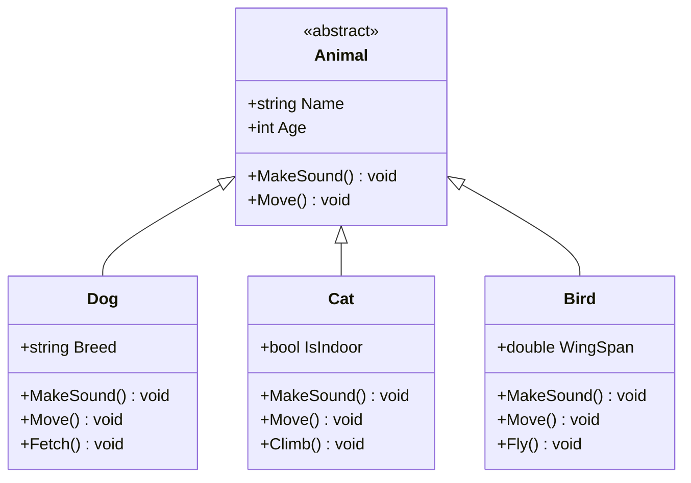
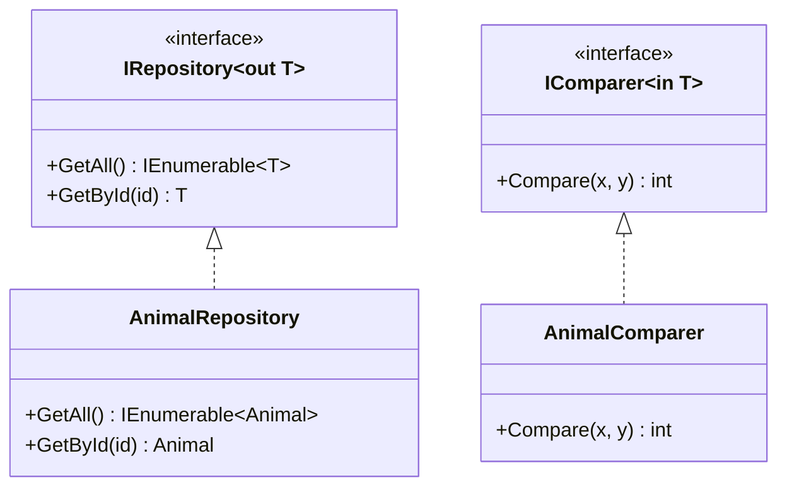
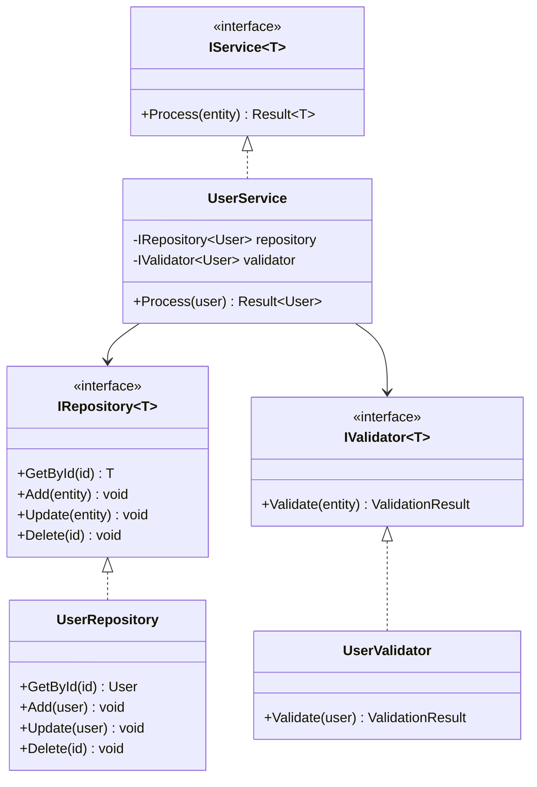
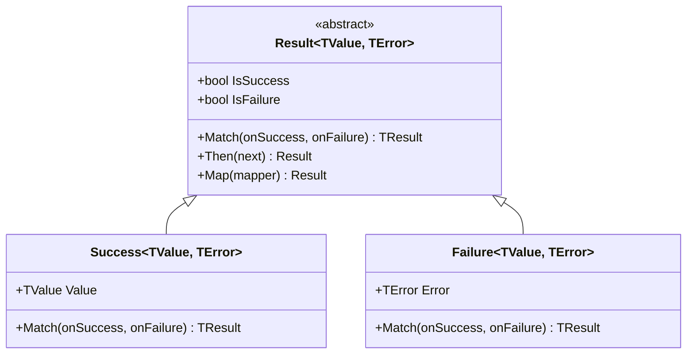

# C4 Model: Code Diagram

## Overview

The Code diagram shows how specific components are implemented as classes and interfaces. This level of detail is optional and typically generated from the code itself.

## Key Class Hierarchies

### Polymorphism Example



### Covariance/Contravariance



### SOLID Principles



### Result Pattern



## Package Structure

```
src/AdvancedConcepts.Core/
├── Beginner/
│   ├── PolymorphismBasics.cs
│   ├── InheritanceExamples.cs
│   └── InterfaceBasics.cs
├── Intermediate/
│   ├── BoxingUnboxingExamples.cs
│   ├── CovarianceExamples.cs
│   ├── ContravarianceExamples.cs
│   └── GenericVarianceExamples.cs
├── Advanced/
│   ├── PatternMatchingExamples.cs
│   ├── LinqAdvancedExamples.cs
│   ├── AsyncAwaitExamples.cs
│   ├── PerformancePatterns.cs
│   ├── DIExamples.cs
│   ├── PollyExamples.cs
│   ├── ValidationExamples.cs
│   ├── ResultPattern.cs
│   ├── EnhancedSerilogExamples.cs
│   ├── OpenTelemetryExamples.cs
│   └── HealthCheckExamples.cs
└── Program.cs
```

## References

- [C4 Code Diagram](https://c4model.com/#CodeDiagram)
- [UML Class Diagrams](https://www.uml-diagrams.org/class-diagrams-overview.html)

---

**Abstraction Level:** Level 4 - Code
**Target Audience:** Developers (implementation details)
**Last Updated:** 2025-11-30
**Note:** For complete code-level documentation, see API reference generated by DocFX
