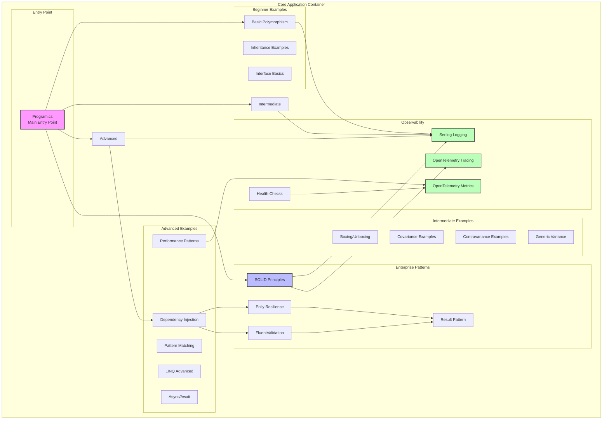

# C4 Model: Component Diagram

## Overview

The Component diagram zooms into an individual container to show the components inside it. These components map to real abstractions (classes, interfaces) in the codebase.

## Core Application Components



## Component Catalog

### Entry Point Components

#### Program.cs
- **Type:** Main entry point
- **Responsibilities:**
  - Application bootstrapping
  - Dependency injection setup
  - Configuration loading
  - Logging initialization
  - Example orchestration
- **Dependencies:**
  - Microsoft.Extensions.DependencyInjection
  - Serilog
  - All example modules

### Beginner Examples Components

#### Basic Polymorphism (PolymorphismBasics.cs)
**Purpose:** Demonstrate fundamental polymorphism concepts

**Classes:**
- `Animal` (base class)
- `Dog`, `Cat`, `Bird` (derived classes)
- `PolymorphismDemo` (demonstration class)

**Concepts:**
- Virtual methods
- Method overriding
- Base class references
- Runtime polymorphism

#### Inheritance Examples
**Classes:**
- `Vehicle` (base)
- `Car`, `Motorcycle` (derived)
- Abstract classes and methods

**Concepts:**
- Inheritance hierarchies
- Abstract classes
- Sealed classes
- Protected members

#### Interface Basics
**Interfaces:**
- `IShape`
- `IComparable<T>`
- `IDisposable`

**Concepts:**
- Interface implementation
- Multiple interfaces
- Interface segregation
- Explicit implementation

### Intermediate Examples Components

#### Boxing/Unboxing (BoxingUnboxingExamples.cs)
**Purpose:** Demonstrate value/reference type conversion

**Examples:**
- Value type to object (boxing)
- Object to value type (unboxing)
- Performance implications
- Generic alternatives

**Performance Impact:**
- Heap allocation on boxing
- Type checking on unboxing
- Generic solution (no boxing)

#### Covariance Examples (CovarianceExamples.cs)
**Purpose:** Demonstrate covariant generic interfaces

**Interfaces:**
- `IEnumerable<out T>` (covariant)
- `IRepository<out T>`

**Examples:**
```csharp
IEnumerable<Dog> dogs = GetDogs();
IEnumerable<Animal> animals = dogs; // Covariance
```

#### Contravariance Examples (ContravarianceExamples.cs)
**Purpose:** Demonstrate contravariant generic interfaces

**Interfaces:**
- `IComparer<in T>` (contravariant)
- `Action<in T>`

**Examples:**
```csharp
IComparer<Animal> animalComparer = new AnimalComparer();
IComparer<Dog> dogComparer = animalComparer; // Contravariance
```

### Advanced Examples Components

#### Pattern Matching (PatternMatchingExamples.cs)
**Purpose:** Modern C# pattern matching techniques

**Patterns:**
- Type patterns
- Property patterns
- Positional patterns
- Relational patterns
- Logical patterns (and, or, not)
- List patterns

#### LINQ Advanced (LinqAdvancedExamples.cs)
**Purpose:** Advanced LINQ operations and optimization

**Topics:**
- Deferred execution
- Query syntax vs method syntax
- Custom LINQ operators
- Performance optimization
- PLINQ (Parallel LINQ)

#### Dependency Injection (DIExamples.cs)
**Purpose:** Microsoft.Extensions.DependencyInjection usage

**Lifetimes:**
- Singleton
- Scoped
- Transient

**Patterns:**
- Constructor injection
- Factory pattern
- Service locator (anti-pattern)

### Enterprise Pattern Components

#### SOLID Principles
**Purpose:** Demonstrate all 5 SOLID principles

**Components:**
1. **Single Responsibility (SRP)**
   - `UserRepository` (data access only)
   - `UserValidator` (validation only)
   - `UserService` (orchestration)

2. **Open/Closed (OCP)**
   - `IPaymentProcessor` interface
   - `CreditCardProcessor`, `PayPalProcessor` implementations
   - Extensible without modification

3. **Liskov Substitution (LSP)**
   - `Rectangle` and `Square` proper hierarchy
   - Behavioral compatibility

4. **Interface Segregation (ISP)**
   - `IReader`, `IWriter` (segregated)
   - Clients depend only on what they use

5. **Dependency Inversion (DIP)**
   - High-level modules depend on abstractions
   - `IRepository<T>` abstraction
   - Concrete `SqlRepository<T>` implementation

#### Polly Resilience (PollyExamples.cs)
**Purpose:** Resilience and transient fault handling

**Patterns:**
- **Retry:** Exponential backoff
- **Circuit Breaker:** Fail fast when downstream unhealthy
- **Timeout:** Cancel long-running operations
- **Fallback:** Provide alternative response
- **Bulkhead:** Limit concurrent operations

**Example:**
```csharp
var retryPolicy = Policy
    .Handle<HttpRequestException>()
    .WaitAndRetryAsync(3, attempt => TimeSpan.FromSeconds(Math.Pow(2, attempt)));

await retryPolicy.ExecuteAsync(() => httpClient.GetAsync(url));
```

#### FluentValidation (ValidationExamples.cs)
**Purpose:** Complex validation scenarios

**Validators:**
- `CustomerValidator`
- `OrderValidator`
- `AddressValidator`

**Features:**
- Property validation
- Complex rules
- Nested validators
- Collection validation
- Custom validators

#### Result Pattern (ResultPattern.cs)
**Purpose:** Railway-oriented programming

**Classes:**
- `Result<TValue, TError>`
- `Success<TValue>`
- `Failure<TError>`

**Operations:**
- `Then` - Railway chaining
- `Map` - Transform success
- `Match` - Pattern match result
- `Tap` - Side effects

### Observability Components

#### Serilog Logging (EnhancedSerilogExamples.cs)
**Purpose:** Structured logging with rich context

**Features:**
- **Enrichers:**
  - Machine name
  - Environment name
  - Process ID
  - Thread ID
- **Log Context:**
  - Correlation IDs
  - User context
  - Request scope
- **Sinks:**
  - Console (development)
  - File (persistent)
  - Seq (aggregation)

**Usage:**
```csharp
using (LogContext.PushProperty("CorrelationId", correlationId))
{
    _logger.Information("Processing order {OrderId}", orderId);
}
```

#### OpenTelemetry Tracing (OpenTelemetryExamples.cs)
**Purpose:** Distributed tracing

**Concepts:**
- **Activity/Span:** Unit of work
- **Trace:** Collection of spans
- **Parent-Child:** Span relationships
- **Attributes:** Semantic conventions
- **Events:** Structured events within span

**Example:**
```csharp
using var activity = activitySource.StartActivity("ProcessOrder");
activity?.SetTag("order.id", orderId);
activity?.AddEvent(new ActivityEvent("OrderValidated"));
```

#### OpenTelemetry Metrics
**Purpose:** Application metrics

**Metric Types:**
- **Counter:** Monotonically increasing (request count)
- **Histogram:** Value distribution (request duration)
- **Observable Gauge:** Current value (active connections)

#### Health Checks (HealthCheckExamples.cs)
**Purpose:** Application and dependency health

**Checks:**
- Database connectivity
- Cache availability
- External API health
- Memory usage
- Disk space

**Tags:**
- `ready` - Readiness probe
- `live` - Liveness probe

## Component Dependencies

### Dependency Graph

```
Program.cs
  ├── Beginner Examples
  │     ├── Serilog (logging)
  │     └── No external dependencies
  ├── Intermediate Examples
  │     ├── Serilog (logging)
  │     └── System.Collections.Generic
  ├── Advanced Examples
  │     ├── Microsoft.Extensions.DependencyInjection
  │     ├── Serilog
  │     └── System.Linq
  └── Enterprise Patterns
        ├── Polly (resilience)
        ├── FluentValidation
        ├── Serilog
        ├── OpenTelemetry
        └── Microsoft.Extensions.Diagnostics.HealthChecks
```

### Cross-Cutting Concerns

#### Logging
- **Used by:** All components
- **Implementation:** Serilog with enrichers
- **Output:** Console, File, Seq

#### Error Handling
- **Pattern:** Result<T, TError>
- **Resilience:** Polly policies
- **Validation:** FluentValidation

#### Performance
- **Measurement:** BenchmarkDotNet
- **Optimization:** Span<T>, ArrayPool<T>
- **Monitoring:** OpenTelemetry metrics

## Component Interactions

### Example Flow: Processing Order

```
User Request
   ↓
Program.cs (Main)
   ↓
DI Container Resolution
   ↓
OrderService (SOLID - SRP)
   ├→ OrderValidator (FluentValidation)
   │    └→ Result<Order, ValidationError>
   ├→ OrderRepository (DIP)
   │    ├→ Polly Retry Policy
   │    └→ Result<Order, DbError>
   └→ Logger (Serilog)
        ├→ LogContext (CorrelationId)
        ├→ Activity (Tracing)
        └→ Counter (Metrics)
```

### Example Flow: Benchmark Execution

```
BenchmarkSwitcher
   ↓
Category Selection
   ↓
Benchmark Runner
   ├→ Boxing Benchmarks
   ├→ Polymorphism Benchmarks
   ├→ LINQ Benchmarks
   ├→ Span Benchmarks
   └→ Type Conversion Benchmarks
        ↓
Statistical Analysis
        ↓
Report Generation (HTML, Markdown, CSV)
```

## Component Testing Strategy

### Unit Testing
- **Each component tested in isolation**
- **Mocking:** Moq/NSubstitute for dependencies
- **Data:** AutoFixture + Bogus

### Integration Testing
- **Cross-component scenarios**
- **Real dependencies** (where appropriate)
- **Performance integration tests**

### Property-Based Testing
- **FsCheck for components with invariants**
- **Example:** Covariance/Contravariance rules

## Performance Considerations

### Hot Path Optimization
- **LINQ:** Avoid in performance-critical paths
- **Span<T>:** Use for array slicing
- **ValueTask<T>:** For frequently synchronous async methods
- **ArrayPool<T>:** Reuse arrays

### Memory Management
- **Minimize allocations:** Use structs where appropriate
- **Avoid boxing:** Use generics instead
- **Dispose pattern:** Proper resource cleanup

## Security

### Input Validation
- **All public APIs:** FluentValidation
- **Boundary validation:** Never trust input

### Exception Handling
- **Don't expose internals:** Use Result pattern
- **Log security events:** Failed validations, unauthorized access

## References

- [C4 Component Diagram](https://c4model.com/#ComponentDiagram)
- [.NET Dependency Injection](https://learn.microsoft.com/en-us/dotnet/core/extensions/dependency-injection)
- [SOLID Principles](https://learn.microsoft.com/en-us/dotnet/architecture/modern-web-apps-azure/architectural-principles)

---

**Abstraction Level:** Level 3 - Component
**Target Audience:** Developers
**Last Updated:** 2025-11-30
