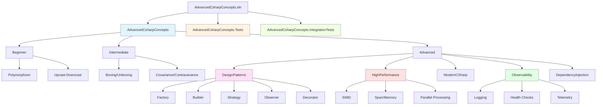
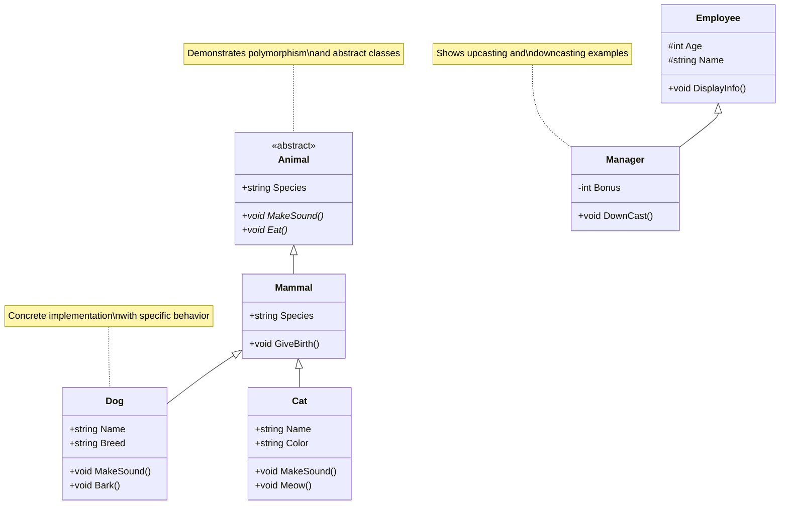
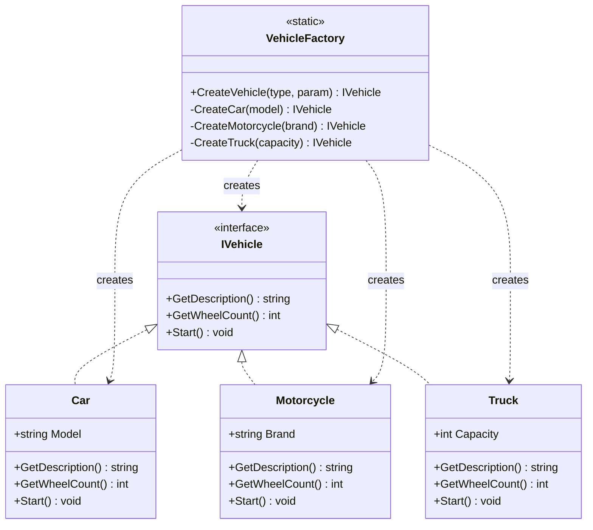
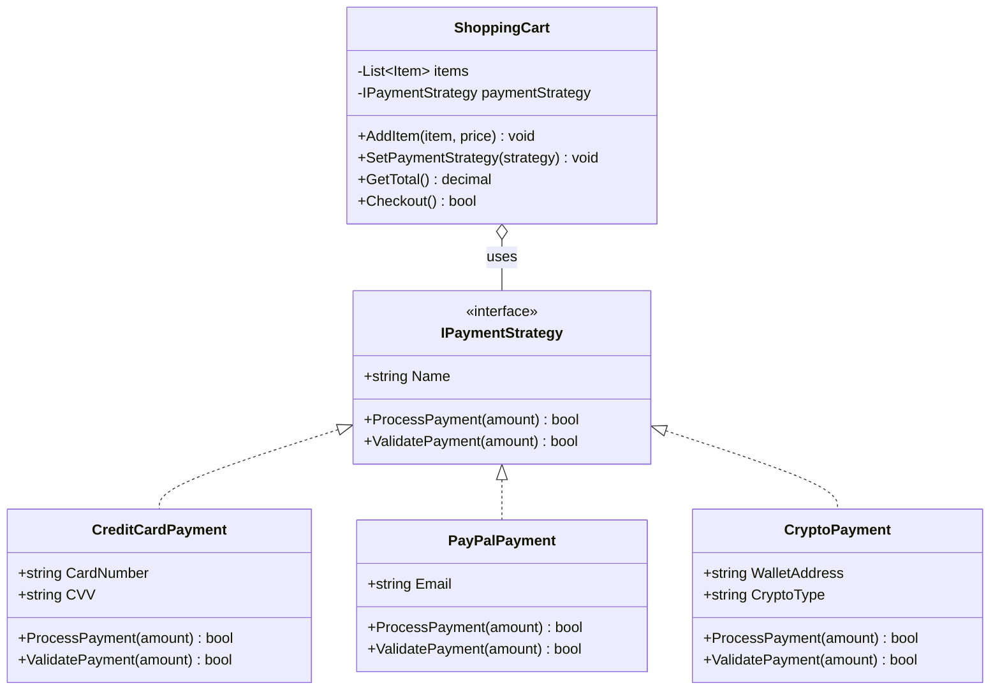
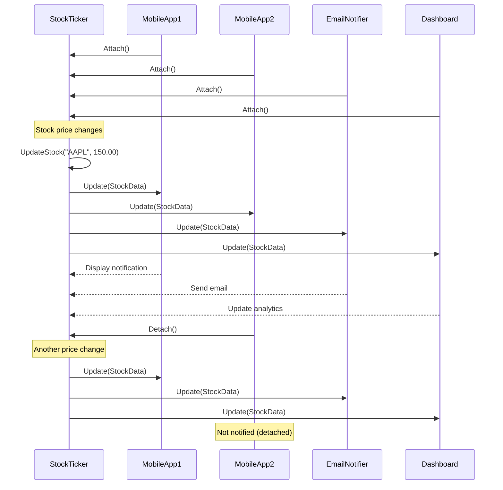
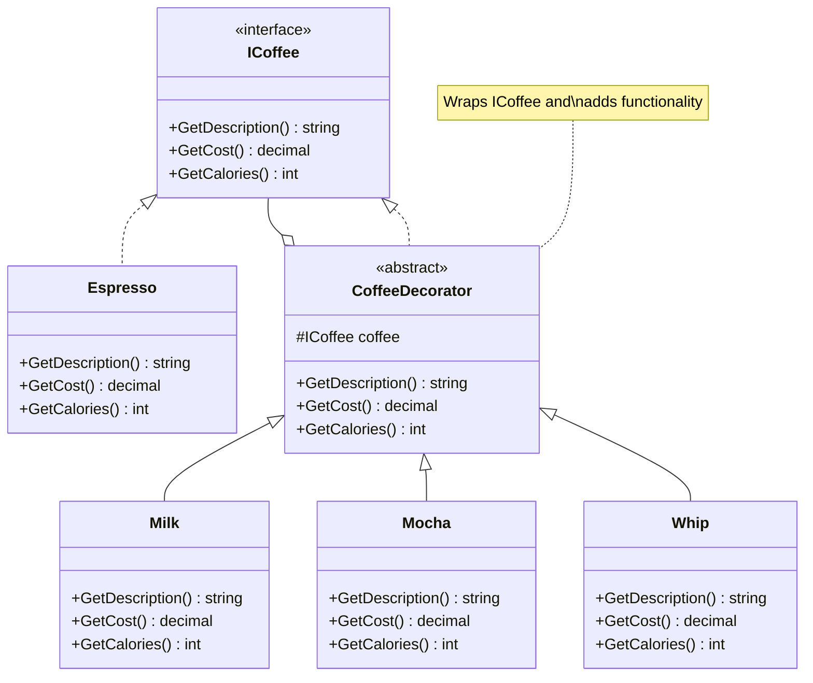
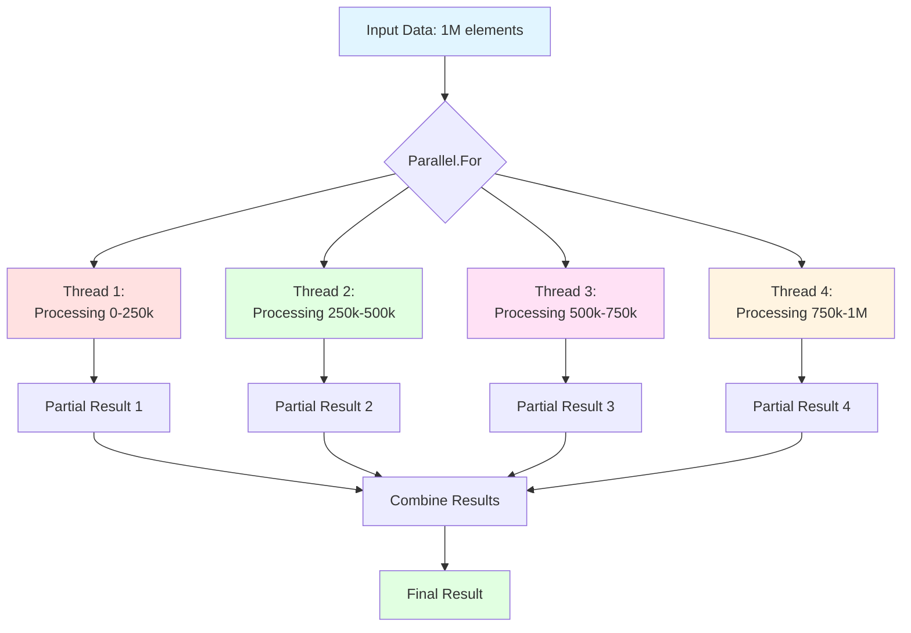
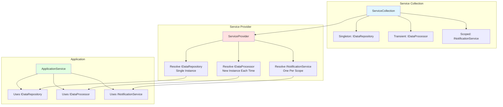
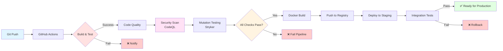
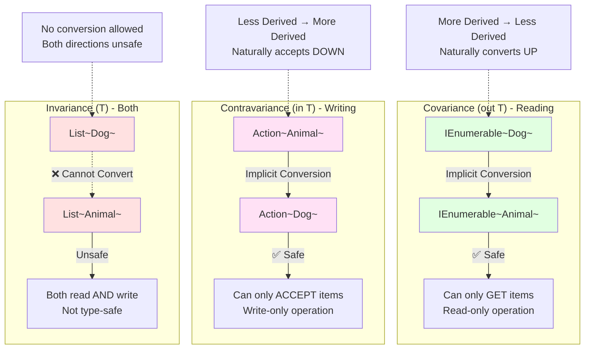

# Architecture Diagrams

This document contains architecture diagrams for the C# Advanced Concepts project.

## Table of Contents

1. [Project Structure](#1-project-structure)
2. [Polymorphism Class Hierarchy](#2-polymorphism-class-hierarchy)
3. [Design Patterns Architecture](#3-design-patterns-architecture)
4. [Observability Architecture](#4-observability-architecture)
5. [High-Performance Data Flow](#5-high-performance-data-flow)
6. [Dependency Injection Container](#6-dependency-injection-container)

---

## 1. Project Structure



---

## 2. Polymorphism Class Hierarchy



---

## 3. Design Patterns Architecture

### Factory Pattern



### Strategy Pattern



### Observer Pattern



### Decorator Pattern



---

## 4. Observability Architecture

```mermaid
graph TB
    subgraph Application
        A[Application Code]
        A --> L[Structured Logging]
        A --> M[Metrics]
        A --> T[Distributed Tracing]
        A --> H[Health Checks]
    end

    subgraph Logging
        L --> L1[Serilog]
        L1 --> L2[Console Sink]
        L1 --> L3[File Sink]
        L1 --> L4[Seq/ELK Sink]
    end

    subgraph Metrics
        M --> M1[System.Diagnostics.Metrics]
        M1 --> M2[Counter]
        M1 --> M3[Histogram]
        M1 --> M4[Gauge]
        M --> M5[OpenTelemetry Exporter]
        M5 --> M6[Prometheus]
    end

    subgraph Tracing
        T --> T1[Activity/Span]
        T1 --> T2[OpenTelemetry]
        T2 --> T3[Jaeger]
        T2 --> T4[Zipkin]
        T2 --> T5[Azure Monitor]
    end

    subgraph Health
        H --> H1[Database Check]
        H --> H2[API Check]
        H --> H3[Memory Check]
        H --> H4[Disk Check]
        H1 & H2 & H3 & H4 --> H5[/health endpoint]
    end

    subgraph Visualization
        M6 --> V1[Grafana]
        T3 --> V2[Jaeger UI]
        L4 --> V3[Kibana]
    end

    style Application fill:#e1f5ff
    style Logging fill:#ffe1e1
    style Metrics fill:#e1ffe1
    style Tracing fill:#ffe1f5
    style Health fill:#fff4e1
    style Visualization fill:#f0f0ff
```

---

## 5. High-Performance Data Flow

### SIMD Vectorization

```mermaid
graph LR
    subgraph "Scalar Processing (Old)"
        S1[Data1] --> SP1[Process]
        S2[Data2] --> SP2[Process]
        S3[Data3] --> SP3[Process]
        S4[Data4] --> SP4[Process]
        SP1 --> SR1[Result1]
        SP2 --> SR2[Result2]
        SP3 --> SR3[Result3]
        SP4 --> SR4[Result4]
    end

    subgraph "SIMD Processing (New)"
        V1[Data1, Data2, Data3, Data4] --> VP[Vector Process]
        VP --> VR[Result1, Result2, Result3, Result4]
    end

    style "Scalar Processing (Old)" fill:#ffe1e1
    style "SIMD Processing (New)" fill:#e1ffe1

    Note1[4x Sequential Operations] -.-> S1
    Note2[1x Parallel Operation\n4-8x Faster!] -.-> V1
```

### Parallel Processing



---

## 6. Dependency Injection Container



---

## 7. CI/CD Pipeline



---

## 8. Covariance and Contravariance Flow



---

## Summary

These diagrams illustrate:

1. **Project Structure**: Clear organization from beginner to advanced topics
2. **Class Hierarchies**: Polymorphism and inheritance relationships
3. **Design Patterns**: Factory, Strategy, Observer, Decorator implementations
4. **Observability**: Logging, metrics, tracing, and health checks
5. **High-Performance**: SIMD vectorization and parallel processing
6. **Dependency Injection**: Service lifetimes and resolution
7. **CI/CD**: Automated build, test, and deployment pipeline
8. **Type Variance**: Covariance, contravariance, and invariance

All diagrams use **Mermaid** syntax and can be rendered in:
- GitHub README files
- GitLab documentation
- Markdown preview tools
- Documentation websites (DocFX, MkDocs, Docusaurus)
