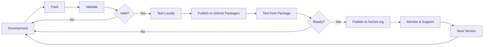

# NuGet Package Publishing Guide

## Overview

This guide covers creating, configuring, and publishing NuGet packages for the Advanced C# Concepts project, including multi-target packages, symbol packages, Source Link integration, and publishing to NuGet.org and GitHub Packages.

## Table of Contents

- [Package Configuration](#package-configuration)
- [Package Metadata](#package-metadata)
- [Multi-Targeting](#multi-targeting)
- [Symbol Packages](#symbol-packages)
- [Source Link](#source-link)
- [Package Validation](#package-validation)
- [Publishing to NuGet.org](#publishing-to-nugetorg)
- [Publishing to GitHub Packages](#publishing-to-github-packages)
- [Package Icons and README](#package-icons-and-readme)
- [Best Practices](#best-practices)

## Package Configuration

### Basic Package Properties

Add to your `.csproj` file:

```xml
<Project Sdk="Microsoft.NET.Sdk">
  <PropertyGroup>
    <!-- Basic Configuration -->
    <TargetFramework>net8.0</TargetFramework>
    <OutputType>Library</OutputType>
    <ImplicitUsings>enable</ImplicitUsings>
    <Nullable>enable</Nullable>

    <!-- Package Configuration -->
    <IsPackable>true</IsPackable>
    <GeneratePackageOnBuild>false</GeneratePackageOnBuild>
    <IncludeSymbols>true</IncludeSymbols>
    <SymbolPackageFormat>snupkg</SymbolPackageFormat>

    <!-- Deterministic Build -->
    <ContinuousIntegrationBuild Condition="'$(GITHUB_ACTIONS)' == 'true'">true</ContinuousIntegrationBuild>
    <Deterministic>true</Deterministic>
  </PropertyGroup>
</Project>
```

### Complete Package Metadata

```xml
<PropertyGroup>
  <!-- Package Identity -->
  <PackageId>AdvancedConcepts.Core</PackageId>
  <Version>1.0.0</Version>
  <AssemblyVersion>1.0.0.0</AssemblyVersion>
  <FileVersion>1.0.0.0</FileVersion>

  <!-- Package Description -->
  <Title>Advanced C# Concepts - Core Library</Title>
  <Description>
    Enterprise-grade C# library demonstrating advanced concepts including
    covariance, contravariance, polymorphism, SOLID principles, design patterns,
    and performance optimization techniques. Built with .NET 8 for production use.
  </Description>
  <Summary>Production-ready C# advanced concepts and design patterns</Summary>

  <!-- Authors and Ownership -->
  <Authors>Doğa Aydın</Authors>
  <Company>AdvancedConcepts</Company>
  <Product>Advanced C# Concepts</Product>
  <Copyright>Copyright © 2025 Doğa Aydın</Copyright>

  <!-- Package Metadata -->
  <PackageTags>csharp;covariance;contravariance;polymorphism;solid;design-patterns;performance;dotnet;enterprise</PackageTags>
  <PackageProjectUrl>https://github.com/dogaaydinn/CSharp-Covariance-Polymorphism-Exercises</PackageProjectUrl>
  <RepositoryUrl>https://github.com/dogaaydinn/CSharp-Covariance-Polymorphism-Exercises</RepositoryUrl>
  <RepositoryType>git</RepositoryType>

  <!-- License -->
  <PackageLicenseExpression>MIT</PackageLicenseExpression>
  <!-- OR use license file: -->
  <!-- <PackageLicenseFile>LICENSE</PackageLicenseFile> -->

  <!-- Documentation -->
  <PackageReadmeFile>README.md</PackageReadmeFile>
  <PackageIcon>icon.png</PackageIcon>

  <!-- Release Notes -->
  <PackageReleaseNotes>
    See https://github.com/dogaaydinn/CSharp-Covariance-Polymorphism-Exercises/releases
  </PackageReleaseNotes>

  <!-- Repository Info -->
  <PublishRepositoryUrl>true</PublishRepositoryUrl>
  <EmbedUntrackedSources>true</EmbedUntrackedSources>

  <!-- NuGet Package Validation -->
  <EnablePackageValidation>true</EnablePackageValidation>
  <PackageValidationBaselineVersion>1.0.0</PackageValidationBaselineVersion>
</PropertyGroup>

<!-- Include files in package -->
<ItemGroup>
  <None Include="..\..\README.md" Pack="true" PackagePath="\" />
  <None Include="..\..\LICENSE" Pack="true" PackagePath="\" />
  <None Include="..\..\docs\images\icon.png" Pack="true" PackagePath="\" />
</ItemGroup>
```

## Package Metadata

### Required Metadata

| Property | Description | Example |
|----------|-------------|---------|
| `PackageId` | Unique package identifier | AdvancedConcepts.Core |
| `Version` | Package version (SemVer) | 1.0.0 |
| `Authors` | Package authors | Doğa Aydın |
| `Description` | Detailed description | Enterprise-grade C# library... |

### Recommended Metadata

| Property | Description | Example |
|----------|-------------|---------|
| `Title` | Display name | Advanced C# Concepts - Core |
| `PackageTags` | Searchable tags | csharp;design-patterns |
| `PackageProjectUrl` | Project homepage | https://github.com/user/repo |
| `RepositoryUrl` | Source repository | https://github.com/user/repo |
| `PackageLicenseExpression` | License (SPDX) | MIT |
| `PackageReadmeFile` | README file | README.md |
| `PackageIcon` | Package icon | icon.png |

### Optional Metadata

```xml
<PropertyGroup>
  <!-- Additional Info -->
  <PackageRequireLicenseAcceptance>false</PackageRequireLicenseAcceptance>
  <PackageReleaseNotes>Bug fixes and performance improvements</PackageReleaseNotes>
  <PackageOutputPath>./nupkg</PackageOutputPath>

  <!-- Development Dependency -->
  <DevelopmentDependency>false</DevelopmentDependency>

  <!-- Service Index (for multi-package solutions) -->
  <PackageType>Dependency</PackageType>
</PropertyGroup>
```

## Multi-Targeting

### Target Multiple Frameworks

```xml
<PropertyGroup>
  <!-- Multiple targets -->
  <TargetFrameworks>net6.0;net7.0;net8.0</TargetFrameworks>

  <!-- OR target .NET Standard for broader compatibility -->
  <TargetFrameworks>netstandard2.0;netstandard2.1;net8.0</TargetFrameworks>
</PropertyGroup>

<!-- Conditional compilation -->
<PropertyGroup Condition="'$(TargetFramework)' == 'net8.0'">
  <DefineConstants>$(DefineConstants);NET8_0_OR_GREATER</DefineConstants>
</PropertyGroup>

<!-- Framework-specific dependencies -->
<ItemGroup Condition="'$(TargetFramework)' == 'netstandard2.0'">
  <PackageReference Include="System.Text.Json" Version="8.0.0" />
</ItemGroup>

<ItemGroup Condition="'$(TargetFramework)' == 'net8.0'">
  <!-- .NET 8 has built-in System.Text.Json -->
</ItemGroup>
```

### Conditional Code

```csharp
#if NET8_0_OR_GREATER
    // Use .NET 8 specific features
    public async IAsyncEnumerable<int> GetNumbersAsync()
    {
        await foreach (var number in GenerateAsync())
        {
            yield return number;
        }
    }
#else
    // Fallback for older frameworks
    public async Task<IEnumerable<int>> GetNumbersAsync()
    {
        var results = new List<int>();
        await foreach (var number in GenerateAsync())
        {
            results.Add(number);
        }
        return results;
    }
#endif
```

## Symbol Packages

### Configuration

```xml
<PropertyGroup>
  <!-- Generate symbol package (.snupkg) -->
  <IncludeSymbols>true</IncludeSymbols>
  <SymbolPackageFormat>snupkg</SymbolPackageFormat>

  <!-- Debug Information -->
  <DebugType>portable</DebugType>
  <DebugSymbols>true</DebugSymbols>

  <!-- Embed PDB in DLL (alternative) -->
  <!-- <DebugType>embedded</DebugType> -->
</PropertyGroup>
```

### Symbol Package Types

**Portable PDB (Recommended):**
```xml
<DebugType>portable</DebugType>
<!-- Generates .pdb file compatible with all platforms -->
```

**Embedded PDB:**
```xml
<DebugType>embedded</DebugType>
<!-- Embeds PDB inside DLL, no separate .snupkg needed -->
```

**Full PDB (Windows only):**
```xml
<DebugType>full</DebugType>
<!-- Legacy Windows format, not recommended -->
```

## Source Link

### Installation

```xml
<ItemGroup>
  <!-- Source Link for GitHub -->
  <PackageReference Include="Microsoft.SourceLink.GitHub" Version="8.0.0" PrivateAssets="All" />

  <!-- OR for GitLab -->
  <!-- <PackageReference Include="Microsoft.SourceLink.GitLab" Version="8.0.0" PrivateAssets="All" /> -->

  <!-- OR for Azure DevOps -->
  <!-- <PackageReference Include="Microsoft.SourceLink.AzureRepos.Git" Version="8.0.0" PrivateAssets="All" /> -->

  <!-- OR for Bitbucket -->
  <!-- <PackageReference Include="Microsoft.SourceLink.Bitbucket.Git" Version="8.0.0" PrivateAssets="All" /> -->
</ItemGroup>

<PropertyGroup>
  <!-- Enable Source Link -->
  <PublishRepositoryUrl>true</PublishRepositoryUrl>

  <!-- Include untracked sources (build-generated files) -->
  <EmbedUntrackedSources>true</EmbedUntrackedSources>

  <!-- Continuous Integration Build (for determinism) -->
  <ContinuousIntegrationBuild Condition="'$(CI)' == 'true'">true</ContinuousIntegrationBuild>
</PropertyGroup>
```

### Verification

```bash
# Install Source Link test tool
dotnet tool install --global sourcelink

# Test Source Link in package
sourcelink test AdvancedConcepts.Core.1.0.0.nupkg

# Expected output:
# sourcelink test passed: AdvancedConcepts.Core.dll
```

## Package Validation

### Enable Package Validation

```xml
<PropertyGroup>
  <!-- Enable package validation -->
  <EnablePackageValidation>true</EnablePackageValidation>

  <!-- Baseline version for breaking change detection -->
  <PackageValidationBaselineVersion>1.0.0</PackageValidationBaselineVersion>

  <!-- Strict mode (recommended) -->
  <EnableStrictModeForCompatibleTfms>true</EnableStrictModeForCompatibleTfms>
  <EnableStrictModeForCompatibleFrameworksInPackage>true</EnableStrictModeForCompatibleFrameworksInPackage>

  <!-- Generate compatibility suppression file -->
  <GenerateCompatibilitySuppressionFile>true</GenerateCompatibilitySuppressionFile>
</PropertyGroup>

<ItemGroup>
  <!-- Package validation package -->
  <PackageReference Include="Microsoft.DotNet.PackageValidation" Version="8.0.0" PrivateAssets="All" />
</ItemGroup>
```

### Running Validation

```bash
# Pack with validation
dotnet pack --configuration Release

# Validation runs automatically and reports:
# - Breaking changes (compared to baseline)
# - Missing XML documentation
# - Missing target frameworks
# - Assembly compatibility issues
```

### Suppression File

If you have intentional breaking changes:

```xml
<!-- CompatibilitySuppressions.xml -->
<?xml version="1.0" encoding="utf-8"?>
<Suppressions xmlns:xsi="http://www.w3.org/2001/XMLSchema-instance" xmlns:xsd="http://www.w3.org/2001/XMLSchema">
  <Suppression>
    <DiagnosticId>CP0002</DiagnosticId>
    <Target>M:AdvancedConcepts.Core.UserService.DeleteUser(System.Int32)</Target>
    <Left>lib/net6.0/AdvancedConcepts.Core.dll</Left>
    <Right>lib/net8.0/AdvancedConcepts.Core.dll</Right>
    <Justification>Method removed as part of v2.0 redesign</Justification>
  </Suppression>
</Suppressions>
```

## Publishing to NuGet.org

### Create API Key

1. Go to https://www.nuget.org/
2. Sign in or create account
3. Go to "API Keys" section
4. Create new API key with push permissions
5. Store securely (add to GitHub Secrets)

### Manual Publishing

```bash
# Pack the project
dotnet pack --configuration Release

# Push to NuGet.org
dotnet nuget push bin/Release/AdvancedConcepts.Core.1.0.0.nupkg \
  --api-key YOUR_API_KEY \
  --source https://api.nuget.org/v3/index.json

# Push symbol package
dotnet nuget push bin/Release/AdvancedConcepts.Core.1.0.0.snupkg \
  --api-key YOUR_API_KEY \
  --source https://api.nuget.org/v3/index.json
```

### Automated Publishing (GitHub Actions)

```yaml
# .github/workflows/publish-nuget.yml
name: Publish to NuGet

on:
  release:
    types: [published]

jobs:
  publish:
    runs-on: ubuntu-latest
    steps:
      - uses: actions/checkout@v4
        with:
          fetch-depth: 0

      - name: Setup .NET
        uses: actions/setup-dotnet@v4
        with:
          dotnet-version: '8.0.x'

      - name: Restore dependencies
        run: dotnet restore

      - name: Build
        run: dotnet build --configuration Release --no-restore

      - name: Pack
        run: dotnet pack --configuration Release --no-build --output ./nupkg

      - name: Push to NuGet
        run: dotnet nuget push ./nupkg/*.nupkg --api-key ${{ secrets.NUGET_API_KEY }} --source https://api.nuget.org/v3/index.json --skip-duplicate

      - name: Push Symbols
        run: dotnet nuget push ./nupkg/*.snupkg --api-key ${{ secrets.NUGET_API_KEY }} --source https://api.nuget.org/v3/index.json --skip-duplicate
```

### NuGet.org Best Practices

- ✅ Use meaningful package ID (namespace-based)
- ✅ Follow semantic versioning
- ✅ Include comprehensive description
- ✅ Add relevant tags (max 20)
- ✅ Include README and icon
- ✅ Publish symbol packages
- ✅ Enable Source Link
- ✅ Respond to package issues

## Publishing to GitHub Packages

### Configuration

```bash
# Add GitHub Packages as source
dotnet nuget add source --username YOUR_GITHUB_USERNAME --password YOUR_GITHUB_TOKEN --store-password-in-clear-text --name github "https://nuget.pkg.github.com/YOUR_GITHUB_USERNAME/index.json"
```

### Manual Publishing

```bash
# Pack the project
dotnet pack --configuration Release

# Push to GitHub Packages
dotnet nuget push bin/Release/AdvancedConcepts.Core.1.0.0.nupkg \
  --api-key YOUR_GITHUB_TOKEN \
  --source "github"
```

### Automated Publishing (GitHub Actions)

```yaml
# .github/workflows/publish-github.yml
name: Publish to GitHub Packages

on:
  release:
    types: [published]

jobs:
  publish:
    runs-on: ubuntu-latest
    permissions:
      packages: write
      contents: read

    steps:
      - uses: actions/checkout@v4

      - name: Setup .NET
        uses: actions/setup-dotnet@v4
        with:
          dotnet-version: '8.0.x'

      - name: Pack
        run: dotnet pack --configuration Release --output ./nupkg

      - name: Push to GitHub Packages
        run: dotnet nuget push ./nupkg/*.nupkg --api-key ${{ secrets.GITHUB_TOKEN }} --source "https://nuget.pkg.github.com/${{ github.repository_owner }}/index.json" --skip-duplicate
```

### Consuming GitHub Packages

```xml
<!-- nuget.config -->
<?xml version="1.0" encoding="utf-8"?>
<configuration>
  <packageSources>
    <add key="nuget.org" value="https://api.nuget.org/v3/index.json" />
    <add key="github" value="https://nuget.pkg.github.com/YOUR_USERNAME/index.json" />
  </packageSources>
  <packageSourceCredentials>
    <github>
      <add key="Username" value="YOUR_USERNAME" />
      <add key="ClearTextPassword" value="YOUR_GITHUB_TOKEN" />
    </github>
  </packageSourceCredentials>
</configuration>
```

## Package Icons and README

### Package Icon

```xml
<PropertyGroup>
  <PackageIcon>icon.png</PackageIcon>
</PropertyGroup>

<ItemGroup>
  <None Include="../../docs/images/icon.png" Pack="true" PackagePath="\" />
</ItemGroup>
```

**Icon Requirements:**
- Format: PNG
- Size: 128x128 pixels (recommended)
- Max: 1 MB
- Transparent background recommended

### Package README

```xml
<PropertyGroup>
  <PackageReadmeFile>README.md</PackageReadmeFile>
</PropertyGroup>

<ItemGroup>
  <None Include="../../README.md" Pack="true" PackagePath="\" />
</ItemGroup>
```

**README Best Practices:**
- Clear description
- Installation instructions
- Quick start example
- Link to full documentation
- Keep it concise (<500 lines)

### Example Package README

```markdown
# Advanced C# Concepts - Core Library

Enterprise-grade C# library demonstrating advanced concepts and design patterns.

## Installation

```bash
dotnet add package AdvancedConcepts.Core
```

## Quick Start

```csharp
using AdvancedConcepts.Core;

var service = new UserService();
var result = await service.ProcessUserAsync(userId);
```

## Features

- ✅ SOLID Principles
- ✅ Design Patterns
- ✅ Performance Optimization
- ✅ Production Ready

## Documentation

Full documentation: https://github.com/dogaaydinn/CSharp-Covariance-Polymorphism-Exercises

## License

MIT License - see [LICENSE](LICENSE)
```

## Best Practices

### 1. Package Design

- ✅ Single responsibility per package
- ✅ Minimal dependencies
- ✅ Follow semantic versioning strictly
- ✅ Support multiple target frameworks when appropriate
- ✅ Keep package size small (<5 MB ideal)

### 2. Metadata

- ✅ Provide comprehensive description
- ✅ Use relevant, searchable tags
- ✅ Include project URL and repository URL
- ✅ Specify license clearly
- ✅ Add package icon and README

### 3. Versioning

- ✅ Never delete published packages
- ✅ Use pre-release versions for testing (1.0.0-beta.1)
- ✅ Test packages before publishing
- ✅ Maintain backwards compatibility
- ✅ Document breaking changes

### 4. Documentation

- ✅ Include XML documentation for public APIs
- ✅ Provide code examples
- ✅ Link to detailed documentation
- ✅ Update release notes
- ✅ Maintain CHANGELOG.md

### 5. Quality

- ✅ Enable package validation
- ✅ Include symbol packages
- ✅ Enable Source Link
- ✅ Sign packages (optional)
- ✅ Run security scans

### 6. Publishing

- ✅ Automate publishing via CI/CD
- ✅ Publish to multiple registries (NuGet.org, GitHub)
- ✅ Test in clean environment before publishing
- ✅ Monitor package download stats
- ✅ Respond to issues and feedback

## Package Lifecycle



## Troubleshooting

### Common Issues

**Issue: "Package already exists"**
```bash
# Solution: Use --skip-duplicate flag
dotnet nuget push package.nupkg --skip-duplicate
```

**Issue: "Unable to load the service index"**
```bash
# Solution: Check source URL and authentication
dotnet nuget list source
```

**Issue: "Package validation failed"**
```bash
# Solution: Review breaking changes and add suppressions
dotnet pack --configuration Release /p:GenerateCompatibilitySuppressionFile=true
```

**Issue: "Source Link test failed"**
```bash
# Solution: Ensure ContinuousIntegrationBuild is set
dotnet pack /p:ContinuousIntegrationBuild=true
```

## Commands Reference

```bash
# Pack project
dotnet pack

# Pack with specific configuration
dotnet pack --configuration Release --output ./nupkg

# Push to NuGet.org
dotnet nuget push package.nupkg --source nuget.org --api-key KEY

# List NuGet sources
dotnet nuget list source

# Add source
dotnet nuget add source URL --name NAME

# Remove source
dotnet nuget remove source NAME

# Delete package (NuGet.org - deprecation only)
dotnet nuget delete PACKAGE_ID VERSION --source nuget.org --api-key KEY

# Verify package contents
dotnet nuget verify package.nupkg
```

## Resources

- [NuGet Documentation](https://docs.microsoft.com/nuget/)
- [Creating NuGet Packages](https://docs.microsoft.com/nuget/create-packages/)
- [Package Validation](https://devblogs.microsoft.com/dotnet/package-validation/)
- [Source Link](https://github.com/dotnet/sourcelink)
- [NuGet Best Practices](https://docs.microsoft.com/nuget/create-packages/package-authoring-best-practices)

---

**Last Updated:** 2025-12-01
**Version:** 1.0
