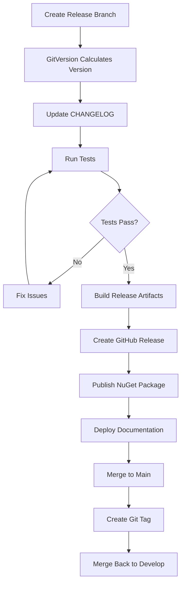

# Versioning and Release Strategy Guide

## Overview

This guide covers the versioning and release strategy for the Advanced C# Concepts project, including Semantic Versioning, GitVersion automation, Conventional Commits, and release management best practices.

## Table of Contents

- [Semantic Versioning 2.0](#semantic-versioning-20)
- [GitVersion Configuration](#gitversion-configuration)
- [Conventional Commits](#conventional-commits)
- [Release Branches](#release-branches)
- [Tag Management](#tag-management)
- [Release Workflow](#release-workflow)
- [Version Bumping Rules](#version-bumping-rules)
- [Best Practices](#best-practices)

## Semantic Versioning 2.0

### Version Format

```
MAJOR.MINOR.PATCH[-PRERELEASE][+BUILD]

Examples:
- 1.0.0          (stable release)
- 1.0.0-alpha.1  (pre-release)
- 1.0.0-beta.2   (beta release)
- 1.0.0-rc.1     (release candidate)
- 1.0.0+20231130 (with build metadata)
```

### Version Components

**MAJOR version (X.0.0):**
- Incompatible API changes
- Breaking changes
- Major architectural changes
- Example: 1.0.0 → 2.0.0

**MINOR version (0.X.0):**
- New features (backwards-compatible)
- Significant enhancements
- New public APIs
- Example: 1.0.0 → 1.1.0

**PATCH version (0.0.X):**
- Bug fixes (backwards-compatible)
- Minor improvements
- Documentation updates
- Security patches
- Example: 1.0.0 → 1.0.1

**Pre-release identifiers:**
- `alpha` - Early development, unstable
- `beta` - Feature complete, testing phase
- `rc` - Release candidate, final testing
- Format: `1.0.0-alpha.1`, `1.0.0-beta.2`, `1.0.0-rc.1`

**Build metadata:**
- Build number, commit SHA, date
- Format: `1.0.0+20231130.abc123`
- Does not affect version precedence

### Version Precedence

```
1.0.0-alpha.1 < 1.0.0-alpha.2 < 1.0.0-beta.1 < 1.0.0-rc.1 < 1.0.0
```

## GitVersion Configuration

### Installation

```bash
# Install globally
dotnet tool install --global GitVersion.Tool

# Install locally in project
dotnet tool install GitVersion.Tool
dotnet tool restore
```

### GitVersion.yml Configuration

Our current configuration (`GitVersion.yml` in project root):

```yaml
mode: ContinuousDelivery
branches:
  main:
    regex: ^main$
    mode: ContinuousDelivery
    tag: ''
    increment: Patch
    prevent-increment-of-merged-branch-version: true
    track-merge-target: false
    source-branches: ['develop', 'release']

  develop:
    regex: ^develop$
    mode: ContinuousDeployment
    tag: 'alpha'
    increment: Minor
    prevent-increment-of-merged-branch-version: false
    track-merge-target: true
    source-branches: []

  release:
    regex: ^release[/-]
    mode: ContinuousDelivery
    tag: 'rc'
    increment: Patch
    prevent-increment-of-merged-branch-version: true
    track-merge-target: false
    source-branches: ['develop']

  feature:
    regex: ^feature[/-]
    mode: ContinuousDeployment
    tag: 'feature'
    increment: Minor
    prevent-increment-of-merged-branch-version: false
    track-merge-target: false
    source-branches: ['develop']

  hotfix:
    regex: ^hotfix[/-]
    mode: ContinuousDeployment
    tag: 'hotfix'
    increment: Patch
    prevent-increment-of-merged-branch-version: false
    track-merge-target: false
    source-branches: ['main']

ignore:
  sha: []

merge-message-formats: {}
```

### Branch-Based Versioning

| Branch Type | Version Pattern | Example | Description |
|------------|----------------|---------|-------------|
| `main` | X.Y.Z | 1.0.0 | Production releases |
| `develop` | X.Y.Z-alpha.N | 1.1.0-alpha.5 | Development builds |
| `release/X.Y` | X.Y.Z-rc.N | 1.1.0-rc.1 | Release candidates |
| `feature/name` | X.Y.Z-feature.N | 1.1.0-feature.3 | Feature branches |
| `hotfix/name` | X.Y.Z-hotfix.N | 1.0.1-hotfix.2 | Hotfix branches |

### Using GitVersion

```bash
# Calculate version
dotnet gitversion

# Get specific version component
dotnet gitversion /showvariable SemVer
dotnet gitversion /showvariable MajorMinorPatch
dotnet gitversion /showvariable NuGetVersionV2

# Update AssemblyInfo files
dotnet gitversion /updateassemblyinfo

# Output format options
dotnet gitversion /output json
dotnet gitversion /output buildserver
```

### GitVersion in CI/CD

```yaml
# GitHub Actions example
- name: Install GitVersion
  uses: gittools/actions/gitversion/setup@v0
  with:
    versionSpec: '5.x'

- name: Determine Version
  id: gitversion
  uses: gittools/actions/gitversion/execute@v0

- name: Display Version
  run: |
    echo "SemVer: ${{ steps.gitversion.outputs.semVer }}"
    echo "NuGetVersion: ${{ steps.gitversion.outputs.nuGetVersionV2 }}"
```

## Conventional Commits

### Commit Message Format

```
<type>[optional scope]: <description>

[optional body]

[optional footer(s)]
```

### Commit Types

| Type | Description | Version Impact | Example |
|------|-------------|---------------|---------|
| `feat` | New feature | MINOR bump | `feat: add user authentication` |
| `fix` | Bug fix | PATCH bump | `fix: resolve null reference error` |
| `docs` | Documentation only | None | `docs: update API documentation` |
| `style` | Code style changes | None | `style: format code with dotnet format` |
| `refactor` | Code refactoring | None | `refactor: extract validation logic` |
| `perf` | Performance improvement | PATCH bump | `perf: optimize LINQ queries` |
| `test` | Add or update tests | None | `test: add unit tests for UserService` |
| `build` | Build system changes | None | `build: update .NET SDK to 8.0.200` |
| `ci` | CI/CD changes | None | `ci: add Docker build step` |
| `chore` | Maintenance tasks | None | `chore: update dependencies` |
| `revert` | Revert previous commit | Varies | `revert: revert "feat: add feature X"` |

### Breaking Changes

Indicate breaking changes with `!` or `BREAKING CHANGE:` footer:

```
feat!: remove deprecated API

BREAKING CHANGE: The old authentication API has been removed.
Users must migrate to the new OAuth2-based API.
```

### Commit Message Examples

**Feature Addition:**
```
feat(auth): add OAuth2 authentication support

Implement OAuth2 authentication flow with support for
Google and GitHub providers.

Closes #123
```

**Bug Fix:**
```
fix(validation): prevent null reference in email validator

Added null check before accessing email properties
to prevent NullReferenceException.

Fixes #456
```

**Breaking Change:**
```
feat(api)!: redesign user API endpoints

BREAKING CHANGE: User API endpoints have been redesigned
for better REST compliance. Old endpoints are removed.

Migration guide: docs/migration/v2.0.md
```

**Multiple Issues:**
```
fix: resolve authentication and authorization bugs

- Fix token expiration validation
- Correct permission check logic
- Update role assignment flow

Fixes #789, #790, #791
```

### Scope Examples

```
feat(core): add new data structure
feat(ui): implement dark mode
feat(api): add user management endpoints
fix(tests): correct assertion in unit test
docs(readme): add installation instructions
```

### Commitizen - Interactive Commits

```bash
# Install globally
npm install -g commitizen cz-conventional-changelog

# Initialize in project
commitizen init cz-conventional-changelog --save-dev --save-exact

# Use commitizen
git cz
```

## Release Branches

### Branch Strategy

```
main (1.0.0)
  │
  └─→ develop (1.1.0-alpha)
       │
       ├─→ feature/user-auth (1.1.0-feature)
       ├─→ feature/reporting (1.1.0-feature)
       │
       └─→ release/1.1 (1.1.0-rc)
            │
            └─→ main (1.1.0)
                 │
                 └─→ hotfix/critical-bug (1.1.1-hotfix)
                      │
                      └─→ main (1.1.1)
```

### Creating Release Branches

```bash
# Create release branch from develop
git checkout develop
git pull origin develop
git checkout -b release/1.1.0

# GitVersion will calculate: 1.1.0-rc.1

# Push release branch
git push -u origin release/1.1.0
```

### Release Branch Workflow

1. **Create Release Branch**
   ```bash
   git checkout -b release/1.1.0 develop
   ```

2. **Prepare Release**
   - Update CHANGELOG.md
   - Update version in documentation
   - Final testing
   - Bug fixes only (no new features)

3. **Merge to Main**
   ```bash
   git checkout main
   git merge --no-ff release/1.1.0
   git tag -a v1.1.0 -m "Release version 1.1.0"
   git push origin main --tags
   ```

4. **Merge Back to Develop**
   ```bash
   git checkout develop
   git merge --no-ff release/1.1.0
   git push origin develop
   ```

5. **Delete Release Branch** (optional)
   ```bash
   git branch -d release/1.1.0
   git push origin --delete release/1.1.0
   ```

## Tag Management

### Annotated Tags

Always use annotated tags for releases:

```bash
# Create annotated tag
git tag -a v1.0.0 -m "Release version 1.0.0"

# Push tag to remote
git push origin v1.0.0

# Push all tags
git push origin --tags
```

### Tag Format

```
v{MAJOR}.{MINOR}.{PATCH}[-{PRERELEASE}]

Examples:
- v1.0.0
- v1.1.0-rc.1
- v2.0.0-beta.1
```

### Tag Message Template

```bash
git tag -a v1.0.0 -m "Release v1.0.0

Major Features:
- User authentication system
- Advanced caching layer
- Real-time notifications

Bug Fixes:
- Fixed memory leak in background service
- Corrected validation logic

Breaking Changes:
- Removed deprecated API endpoints (see migration guide)
"
```

### Tag Operations

```bash
# List all tags
git tag

# List tags matching pattern
git tag -l "v1.*"

# Show tag details
git show v1.0.0

# Delete local tag
git tag -d v1.0.0

# Delete remote tag
git push origin --delete v1.0.0

# Checkout specific tag
git checkout v1.0.0

# Create branch from tag
git checkout -b hotfix/1.0.1 v1.0.0
```

### Lightweight vs Annotated Tags

**Annotated Tags (Recommended):**
```bash
git tag -a v1.0.0 -m "Release 1.0.0"
# Contains: tagger, date, message, GPG signature
```

**Lightweight Tags (Not Recommended for Releases):**
```bash
git tag v1.0.0
# Just a pointer to commit
```

## Release Workflow

### Automated Release Process



### Manual Release Checklist

**Pre-Release:**
- [ ] All tests passing
- [ ] Code coverage >90%
- [ ] Security scan passing
- [ ] Performance benchmarks meet targets
- [ ] Documentation updated
- [ ] CHANGELOG.md updated
- [ ] Migration guide prepared (if breaking changes)

**Release:**
- [ ] Create release branch
- [ ] Update version numbers
- [ ] Final testing
- [ ] Create release tag
- [ ] Build release artifacts
- [ ] Create GitHub release
- [ ] Publish NuGet packages
- [ ] Deploy documentation

**Post-Release:**
- [ ] Monitor for issues
- [ ] Update project boards
- [ ] Announce release
- [ ] Close milestone
- [ ] Merge back to develop

## Version Bumping Rules

### When to Bump MAJOR (Breaking Changes)

```csharp
// 1.0.0 → 2.0.0

// Removing public API
// BEFORE
public class UserService
{
    public void DeleteUser(int id) { }
}

// AFTER (BREAKING)
public class UserService
{
    // Method removed - MAJOR bump required
}

// Changing method signatures
// BEFORE
public void ProcessUser(int id) { }

// AFTER (BREAKING)
public void ProcessUser(string id) { }  // MAJOR bump

// Changing return types
// BEFORE
public string GetName() { }

// AFTER (BREAKING)
public User GetName() { }  // MAJOR bump
```

### When to Bump MINOR (New Features)

```csharp
// 1.0.0 → 1.1.0

// Adding new public methods
public class UserService
{
    public void DeleteUser(int id) { }  // Existing

    public void ArchiveUser(int id) { }  // NEW - MINOR bump
}

// Adding new optional parameters
// BEFORE
public void ProcessUser(int id) { }

// AFTER (Non-breaking)
public void ProcessUser(int id, bool validate = true) { }  // MINOR bump

// Adding new classes/interfaces
public interface IUserRepository { }  // NEW - MINOR bump
```

### When to Bump PATCH (Bug Fixes)

```csharp
// 1.0.0 → 1.0.1

// Bug fixes without API changes
public void ProcessUser(int id)
{
    // BEFORE (bug)
    if (id < 0) throw new Exception();

    // AFTER (fix)
    if (id <= 0) throw new ArgumentException(nameof(id));  // PATCH bump
}

// Performance improvements
public List<User> GetUsers()
{
    // BEFORE (slow)
    return users.Where(u => u.IsActive).ToList();

    // AFTER (optimized)
    return users.Where(u => u.IsActive).ToList();  // PATCH bump
}
```

## Best Practices

### 1. Versioning

- ✅ Always use Semantic Versioning 2.0
- ✅ Use GitVersion for automated version calculation
- ✅ Tag all releases with annotated tags
- ✅ Document breaking changes clearly
- ✅ Maintain CHANGELOG.md

### 2. Commits

- ✅ Use Conventional Commits format
- ✅ Write clear, descriptive commit messages
- ✅ Reference issues in commit messages
- ✅ Keep commits atomic and focused
- ✅ Squash feature branch commits before merging

### 3. Branches

- ✅ Protect main and develop branches
- ✅ Require pull request reviews
- ✅ Enforce CI checks before merge
- ✅ Delete feature branches after merge
- ✅ Keep release branches for support

### 4. Releases

- ✅ Test thoroughly before release
- ✅ Automate release process
- ✅ Generate release notes automatically
- ✅ Publish to multiple registries (NuGet, GitHub)
- ✅ Monitor releases for issues

### 5. Documentation

- ✅ Update CHANGELOG for every release
- ✅ Document breaking changes
- ✅ Provide migration guides
- ✅ Version API documentation
- ✅ Maintain backwards compatibility when possible

## Tools

### Recommended Tools

- **GitVersion** - Automated version calculation
- **Commitizen** - Interactive conventional commits
- **commitlint** - Lint commit messages
- **husky** - Git hooks
- **semantic-release** - Automated release workflow
- **conventional-changelog** - Generate CHANGELOG
- **git-cliff** - Advanced changelog generation

### Configuration Examples

**commitlint.config.js:**
```javascript
module.exports = {
  extends: ['@commitlint/config-conventional'],
  rules: {
    'type-enum': [2, 'always', [
      'feat', 'fix', 'docs', 'style', 'refactor',
      'perf', 'test', 'build', 'ci', 'chore', 'revert'
    ]],
    'subject-case': [2, 'always', 'sentence-case'],
    'body-max-line-length': [2, 'always', 100]
  }
};
```

**.huskyrc:**
```json
{
  "hooks": {
    "commit-msg": "commitlint -E HUSKY_GIT_PARAMS",
    "pre-commit": "dotnet test && dotnet format --verify-no-changes"
  }
}
```

## Resources

- [Semantic Versioning 2.0](https://semver.org/)
- [GitVersion Documentation](https://gitversion.net/)
- [Conventional Commits](https://www.conventionalcommits.org/)
- [Keep a Changelog](https://keepachangelog.com/)
- [Git Flow](https://nvie.com/posts/a-successful-git-branching-model/)

---

**Last Updated:** 2025-12-01
**Version:** 1.0
