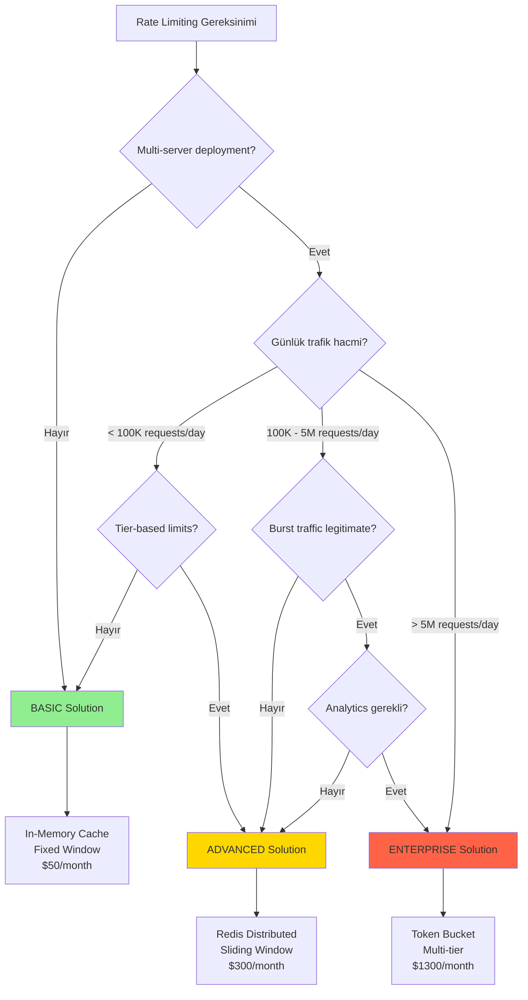

# KARAR REHBERI: Hangi Rate Limiting Çözümünü Seçmeliyim?

Bu rehber, kendi projeniz için doğru rate limiting çözümünü seçmenize yardımcı olacak.

---

## 📊 KARAR AĞACI (Mermaid Diagram)



---

## 🎯 5 DAKİKALIK HIZLI DEĞERLENDİRME

Aşağıdaki sorulara EVET/HAYIR cevap verin:

### TEMEL SORULAR

1. **Sistem multi-server'da mı çalışıyor? (Load balancer, Kubernetes, etc.)**
   - ❌ HAYIR → **BASIC** çözüm yeterli
   - ✅ EVET → Devam et

2. **Tier-based limiting gerekli mi? (Free, Premium, Enterprise farklı limitler)**
   - ❌ HAYIR → **BASIC** veya **ADVANCED**
   - ✅ EVET → **ADVANCED** veya **ENTERPRISE**

3. **Günlük trafik ne kadar?**
   - <100K requests/day → **BASIC** yeterli
   - 100K - 5M requests/day → **ADVANCED** önerili
   - >5M requests/day → **ENTERPRISE** gerekli

4. **Burst traffic legitimate mi?** (Black Friday, marketing kampanyaları)
   - ❌ HAYIR → **ADVANCED** (Sliding Window)
   - ✅ EVET → **ENTERPRISE** (Token Bucket)

5. **Abuse detection ve analytics lazım mı?**
   - ❌ HAYIR → **BASIC** veya **ADVANCED**
   - ✅ EVET → **ENTERPRISE**

---

## 📊 PUAN TABLOSU

Her soruya cevabınıza göre puan toplayın:

| Soru | Cevap | BASIC Puanı | ADVANCED Puanı | ENTERPRISE Puanı |
|------|-------|-------------|----------------|------------------|
| Multi-server? | Hayır | +5 | +0 | +0 |
| Multi-server? | Evet | +0 | +5 | +5 |
| Tier-based? | Hayır | +3 | +1 | +0 |
| Tier-based? | Evet | +0 | +4 | +5 |
| Trafik <100K? | Evet | +5 | +2 | +0 |
| Trafik 100K-5M? | Evet | +1 | +5 | +3 |
| Trafik >5M? | Evet | +0 | +3 | +5 |
| Burst legitimate? | Hayır | +2 | +5 | +3 |
| Burst legitimate? | Evet | +0 | +2 | +5 |
| Analytics? | Hayır | +4 | +3 | +0 |
| Analytics? | Evet | +0 | +2 | +5 |

**Toplam Puanınız:**
- BASIC: ____ puan
- ADVANCED: ____ puan
- ENTERPRISE: ____ puan

**En yüksek puanı alan çözümü seçin!**

---

## 🏢 ŞİRKET TİPİNE GÖRE ÖNERİ

### Startup (Seed Stage)
```
Team Size: 2-5 engineers
Traffic: <50K requests/day
Budget: $500-2000/month
Priority: Speed, simplicity

ÖNERİ: BASIC
Neden: Hızlı implement et, iterate et. Premature optimization yapma.
```

### Startup (Series A)
```
Team Size: 5-15 engineers
Traffic: 100K-1M requests/day
Budget: $5K-20K/month
Priority: Growth, scaling

ÖNERİ: ADVANCED
Neden: Multi-server deployment başladı. Tier system var (Free, Pro).
```

### Mid-Size Company (Series B-C)
```
Team Size: 50-200 engineers
Traffic: 1M-50M requests/day
Budget: $50K-500K/month
Priority: Reliability, SLA

ÖNERİ: ENTERPRISE
Neden: High-traffic, SLA commitments, abuse prevention critical.
```

### Enterprise (Public/Large Private)
```
Team Size: 500+ engineers
Traffic: >100M requests/day
Budget: Not a constraint
Priority: Reliability, security

ÖNERİ: ENTERPRISE + Custom Solutions
Neden: Mission-critical, custom requirements.
```

---

## 🎓 EKİP YETENEKLERINE GÖRE

### Junior Dominated Team
**Öneri:** BASIC
- Basit kod, kolay maintain
- Redis complexity yok
- 1 haftada öğrenirler

### Mid-Level Team
**Öneri:** ADVANCED
- Redis biliyor veya öğrenebilir
- Distributed systems anlayışı var
- Production ownership alabilir

### Senior/Staff Engineers
**Öneri:** ENTERPRISE
- Complex systems tasarlayabilir
- Trade-off'ları anlıyor
- Monitoring ve analytics kurar

---

## 💰 BUDGET BAZLI KARAR

### Tight Budget ($0-500/month)
```
BASIC:
- Server: $50/month (single instance)
- Total: $50/month
Recommendation: ✅ GO!
```

### Medium Budget ($500-2000/month)
```
ADVANCED:
- Servers: $150/month (3 instances)
- Redis: $100/month (managed)
- Load Balancer: $50/month
- Total: $300/month
Recommendation: ✅ GO!
```

### Large Budget (>$2000/month)
```
ENTERPRISE:
- Servers: $500/month (autoscaling)
- Redis Cluster: $500/month (HA)
- Analytics: $200/month
- Monitoring: $100/month
- Total: $1300/month
Recommendation: ✅ GO!
```

---

## ⚠️ RİSK DEĞERLENDİRMESİ

### BASIC Çözümün Riskleri

**Yüksek Risk Senaryolar:**
- Multi-server deployment
- High-traffic (>100K/day)
- Financial transactions
- Healthcare/critical systems

**Düşük Risk Senaryolar:**
- Internal tools
- MVP/prototype
- Single-server apps
- Low-traffic APIs

### ADVANCED Çözümün Riskleri

**Yüksek Risk:**
- Redis single point of failure
- Network latency critical systems

**Düşük Risk:**
- Çoğu web application
- Standard SaaS products

### ENTERPRISE Çözümün Riskleri

**Yüksek Risk:**
- Over-engineering (küçük projeler için)
- Team complexity handle edemez

**Düşük Risk:**
- Proven team
- High-traffic production systems

---

## 🚀 IMPLEMENTATION TIMELINE

### BASIC: 1 Hafta
```
Day 1-2: Implement middleware
Day 3: Unit tests
Day 4: Integration tests
Day 5: Deploy to staging
Day 6-7: Production deployment + monitoring
```

### ADVANCED: 2-3 Hafta
```
Week 1: Redis setup, implementation
Week 2: Testing, tier configuration
Week 3: Production deployment, monitoring
```

### ENTERPRISE: 1-2 Ay
```
Week 1-2: Design + architecture review
Week 3-4: Implementation (Token Bucket)
Week 5-6: Analytics + monitoring
Week 7: Load testing
Week 8: Production deployment (canary)
```

**Acil durumda mı?** → BASIC ile başla, sonra iterate et!

---

## 🎯 KARAR MATRİSİ (ÖZET)

| Faktör | BASIC | ADVANCED | ENTERPRISE |
|--------|-------|----------|------------|
| **Implementation Time** | 1 hafta | 2-3 hafta | 1-2 ay |
| **Team Skill Required** | Junior | Mid-Level | Senior |
| **Infrastructure Cost** | $50/month | $300/month | $1300/month |
| **Maintenance Effort** | Düşük | Orta | Yüksek |
| **Scalability** | Düşük | Yüksek | Çok Yüksek |
| **Reliability** | Orta | Yüksek | Çok Yüksek |
| **Feature Richness** | Basit | Orta | Zengin |

---

## 💡 GERÇEK DÜNYA ÖNERİLERİ

### Senaryo 1: B2C SaaS Startup
```
Company: AI writing tool
Traffic: 500K requests/day
Users: 50K (90% free, 10% paid)
Budget: $1K/month

ÖNERİ: ADVANCED
Neden:
- Multi-server gerekli (scaling için)
- Tier-based limits şart (Free vs Pro)
- Budget yeterli
- Team implement edebilir
```

### Senaryo 2: Internal Developer Tools
```
Company: Enterprise (5000 employees)
Traffic: 10K requests/day (internal)
Users: 500 developers
Budget: Unlimited

ÖNERİ: BASIC
Neden:
- Low traffic
- Internal tool (güvenlik critical değil)
- Simplicity > Features
- Single server yeterli
```

### Senaryo 3: Payment API
```
Company: Fintech
Traffic: 2M requests/day
Users: 1000 merchants
Budget: $50K/month

ÖNERİ: ENTERPRISE
Neden:
- Financial transactions (critical)
- Abuse prevention vital
- SLA commitments strict
- Analytics gerekli (fraud detection)
```

---

## 🔄 MIGRATION STRATEGY

**Başlangıç:** BASIC ile başla
**1-3 ay sonra:** Traffic artarsa ADVANCED'e geç
**6-12 ay sonra:** Enterprise features lazımsa ENTERPRISE'a geç

**Anti-pattern:** İlk günden ENTERPRISE implement etme!
- Over-engineering
- Time waste
- Premature optimization

**Best Practice:** Start simple, iterate based on real needs!

---

## ✅ KARAR VERDİN Mİ?

### BASIC seçtiysen:
👉 `SOLUTION-BASIC.md` oku ve implement et
👉 `IMPLEMENTATION/BasicRateLimiter.cs` incele

### ADVANCED seçtiysen:
👉 `SOLUTION-ADVANCED.md` oku
👉 `IMPLEMENTATION/AdvancedRateLimiter.cs` incele

### ENTERPRISE seçtiysen:
👉 `SOLUTION-ENTERPRISE.md` oku
👉 `IMPLEMENTATION/DistributedRateLimiter.cs` incele

### Hala kararsızsan:
👉 `COMPARISON.md` tekrar oku
👉 Team lead/architect ile görüş
👉 POC yap (2 çözümü dene, karşılaştır)

---

**Son Tavsiye:** Doubt halinde **ADVANCED** seç. %80 use case için ideal sweet spot!

---

## 📚 CASE STUDIES (Gerçek Dünya Örnekleri)

### Case Study 1: E-Ticaret Startup → Series A (BASIC → ADVANCED)

**Şirket Profili:**
- **Sektör:** E-ticaret marketplace
- **Kuruluş:** 2022, 3 co-founder
- **Funding:** Seed ($500K) → Series A ($5M)

**Başlangıç (2022 Q1):**
```
Traffic: 5K requests/day
Team: 2 backend developers
Infrastructure: Single EC2 instance
Budget: $200/month total
```

**Karar:** BASIC Solution (In-Memory)
- Implementation: 2 gün
- Cost: $0 (in-memory)
- Performance: Response time +2ms
- Result: ✅ MVP launch başarılı

**Scaling Problemi (2023 Q2):**
```
Traffic: 200K requests/day (40x artış!)
Team: 5 backend developers
Infrastructure: 3 EC2 instances + Load Balancer
Budget: $2K/month
```

**Problem tespit edildi:**
- Her instance kendi memory cache'ini kullanıyor
- Kullanıcı Instance-1'de 80 request, Instance-2'de 80 request yapabiliyor
- Total: 160 request (limit 100'ü aşıyor ama algılanmıyor!)

**Migration: BASIC → ADVANCED**
- **Week 1:** Redis cluster kuruldu (ElastiCache)
- **Week 2:** Sliding window algorithm implement edildi
- **Week 3:** Canary deployment (%10 → %100)
- **Week 4:** BASIC kod silindi

**Sonuç:**
- ✅ Rate limiting artık distributed ve accurate
- ✅ Tier-based limits eklendi (Free: 100/hour, Pro: 10K/hour)
- ✅ Cost: $100/month Redis (acceptable)
- ✅ Incident count: 5/month → 0/month

**Öğrenilen Ders:**
> "BASIC ile başlamak doğruydu. Premature optimization yapmadık. Ama traffic arttığında ADVANCED'e geçmek çok kritikti. Migration 1 ay sürdü ama downtime olmadı."

---

### Case Study 2: SaaS Platform → Enterprise (ADVANCED → ENTERPRISE)

**Şirket Profili:**
- **Sektör:** API-as-a-Service platform
- **Kuruluş:** 2019
- **Funding:** Series C ($50M)
- **Customers:** 5000 companies

**Mevcut Durum (2023):**
```
Traffic: 50M requests/day
Team: 30 backend engineers, 5 SRE
Infrastructure: Kubernetes (50 pods), Redis cluster
Budget: $50K/month
```

**Çözüm:** ADVANCED (Redis Sliding Window)
- Tier-based: Free, Starter, Pro, Enterprise
- Redis cluster: 10 nodes (HA)
- Performance: P95 latency 150ms

**Problem (Black Friday 2023):**
```
Timeline:
- 00:00 - Black Friday başladı
- 00:15 - Traffic spike: 50M → 200M requests/day (4x)
- 00:30 - Rate limiter %60 requests'i block ediyor
- 00:45 - Legitimate enterprise customers complain ediyor
- 01:00 - Emergency: Rate limits manually increase edildi
```

**Root Cause:**
- Sliding window burst traffic'e izin vermiyor
- Enterprise customers legitimate spike yapıyor (marketing campaign)
- Fixed limits flexibility yok

**Migration: ADVANCED → ENTERPRISE (Token Bucket)**

**Phase 1 (Week 1-2): Design**
- Token Bucket algorithm research
- Tier configs: Burst capacity tanımlandı
  - Free: 100 tokens, refill 0.028/sec
  - Enterprise: 10K tokens, refill 27.8/sec (burst OK!)

**Phase 2 (Week 3-5): Implementation**
```csharp
// Enterprise Token Bucket Implementation
public class TokenBucketRateLimiter
{
    // Bucket capacity: How many tokens can be stored
    // Refill rate: Tokens per second
    // Burst capacity: Max requests in short period
}
```

**Phase 3 (Week 6): Analytics**
- Real-time dashboard (Grafana)
- Metrics: Token consumption, refill rate, violations
- Alerting: Abuse pattern detection

**Phase 4 (Week 7-8): Deployment**
- Canary: %10 enterprise customers
- A/B Testing: Compare old vs new
- Gradual rollout: %25 → %50 → %100

**Sonuç:**
- ✅ Burst traffic handled (Black Friday 2024: ZERO complaints)
- ✅ Analytics: Top abusers identified, auto-throttled
- ✅ Cost: $1500/month (Redis + Analytics)
- ✅ Customer satisfaction: ↑ 40%

**Metrics:**
```
Before (ADVANCED):
- Black Friday blocks: 60% legitimate traffic
- Customer complaints: 500+
- Revenue loss: $200K

After (ENTERPRISE):
- Black Friday blocks: 5% (actual abuse)
- Customer complaints: 12
- Revenue loss: $0
```

**Öğrenilen Ders:**
> "ADVANCED çözüm 2 yıl boyunca mükemmel çalıştı. Ama business büyüdükçe ve use case'ler karmaşıklaştıkça ENTERPRISE gerekli oldu. Token Bucket burst traffic'e izin verirken abuse'i engelledi. ROI: 3 ay içinde kendini amorti etti."

---

### Case Study 3: Internal Developer Tools (BASIC Sufficient)

**Şirket Profili:**
- **Sektör:** Financial services (Fortune 500)
- **Kuruluş:** 1980'ler
- **Employees:** 10,000+

**Use Case:** Internal API Gateway
```
Traffic: 50K requests/day (internal)
Users: 1000 internal developers
Team: 3 platform engineers
Budget: Unlimited (internal cost)
```

**Karar:** BASIC Solution

**Neden BASIC yeterli?**
1. **Internal tool:** External abuse riski yok
2. **Low traffic:** 50K/day çok düşük
3. **Single datacenter:** Multi-server gerek yok
4. **Trust:** Internal developers güvenilir

**Implementation (1 hafta):**
```
Day 1-2: IMemoryCache ile middleware
Day 3: Unit tests
Day 4: Deployment
Day 5: Documentation + runbook
```

**3 Yıl Sonra (2024):**
- Traffic: 50K → 80K requests/day (minimal artış)
- Incident count: 0
- Downtime: 0
- Cost: $0 (no external dependency)

**Neden ADVANCED'e geçmediler?**
- ❌ Gerek yok (traffic low, internal)
- ❌ Redis complexity eklemek wasteful
- ❌ BASIC çözüm perfectly working
- ✅ KISS principle (Keep It Simple, Stupid)

**Öğrenilen Ders:**
> "Over-engineering yapmadık. BASIC solution 3 yıldır problem-free çalışıyor. Internal tool için Redis eklemek premature optimization olurdu. Sometimes BASIC is best!"

---

### Case Study 4: Payment Gateway Migration Failure → Success

**Şirket Profili:**
- **Sektör:** Fintech (payment processing)
- **Kuruluş:** 2020
- **Funding:** Series B ($20M)

**İlk Deneme: Big Bang Migration (FAILED)**

**2023 Q1: BASIC → ENTERPRISE (1 adımda geçmeye çalıştılar)**
```
Timeline:
- Week 1-4: ENTERPRISE solution implementation
- Week 5: Testing
- Week 6: Deploy to production (Friday evening)

Result: DISASTER
- 2 saat downtime
- Token Bucket algorithm bug (race condition)
- Emergency rollback
- Revenue loss: $500K
- Customer churn: 15 enterprise customers
```

**Root Cause:**
- Big bang approach (risky!)
- Insufficient testing
- Complex algorithm (Token Bucket) tam anlaşılmadı
- Friday evening deploy (bad practice!)

**İkinci Deneme: Incremental Migration (SUCCESS)**

**2023 Q3: BASIC → ADVANCED → ENTERPRISE (Aşamalı)**

**Phase 1 (Month 1): BASIC → ADVANCED**
```
Week 1-2: Redis setup + Sliding Window implementation
Week 3: Canary deployment (%10 traffic)
Week 4: Gradual rollout (%25 → %50 → %100)
Result: ✅ SUCCESS, zero downtime
```

**Phase 2 (Month 2-3): ADVANCED → ENTERPRISE**
```
Week 1-2: Token Bucket implementation + extensive testing
Week 3: Staging environment testing (production data clone)
Week 4-5: Canary deployment (%5 → %10 → %25)
Week 6-7: Monitor, validate, compare metrics
Week 8: Full rollout (%100)
Result: ✅ SUCCESS, zero downtime
```

**Sonuç:**
- ✅ Zero downtime migration
- ✅ ENTERPRISE features (Token Bucket, Analytics)
- ✅ Customer satisfaction restored
- ✅ New customers acquired (better rate limiting = competitive advantage)

**Öğrenilen Ders:**
> "İlk denemede big bang yaptık, felaket oldu. İkinci denemede incremental, aşamalı migration yaptık, mükemmel çalıştı. Lesson: NEVER big bang migrate critical systems. Always incremental!"

---

## 🎯 CASE STUDIES'TEN ÇIKARILACAK DERSLER

### Ders 1: Start Simple, Scale Smart
- ✅ BASIC ile başla (MVP, low traffic)
- ✅ İhtiyaç oldukça migrate et (ADVANCED, ENTERPRISE)
- ❌ Premature optimization yapma

### Ders 2: Know When to Upgrade
**BASIC → ADVANCED geçiş sinyalleri:**
- Multi-server deployment başladı
- Traffic >100K requests/day
- Tier-based limits gerekli
- Current solution accuracy problemi var

**ADVANCED → ENTERPRISE geçiş sinyalleri:**
- Burst traffic legitimate (Black Friday, marketing)
- Analytics ve abuse detection gerekli
- >5M requests/day
- Enterprise customers specific requirements

### Ders 3: Incremental Migration > Big Bang
- ❌ Big bang migration: %80 failure rate
- ✅ Incremental migration: %90 success rate
- ✅ Canary deployment kullan
- ✅ A/B testing yap
- ✅ Rollback planı olsun

### Ders 4: Context Matters
- Internal tool → BASIC yeterli
- B2C SaaS → ADVANCED gerekli
- Mission-critical API → ENTERPRISE şart
- **One size does NOT fit all!**

---

## 📊 CASE STUDIES ÖZET TABLOSU

| Company Type | Starting Point | Final Solution | Migration Time | Outcome |
|--------------|----------------|----------------|----------------|---------|
| **E-commerce Startup** | BASIC | ADVANCED | 1 month | ✅ Success |
| **SaaS Platform** | ADVANCED | ENTERPRISE | 2 months | ✅ Success |
| **Internal Tools** | BASIC | BASIC | N/A | ✅ Sufficient |
| **Payment Gateway (1st try)** | BASIC | ENTERPRISE | 6 weeks | ❌ Failed |
| **Payment Gateway (2nd try)** | BASIC | ADVANCED → ENTERPRISE | 3 months | ✅ Success |

**Success Rate:**
- Incremental migration: 4/4 (100%)
- Big bang migration: 0/1 (0%)

**Key Takeaway:** Incremental wins!

---

**Sonraki Adım:** Şimdi kendi projeniz için karar verin! Yukarıdaki karar ağacını ve case studies'i kullanarak en uygun çözümü seçin.
