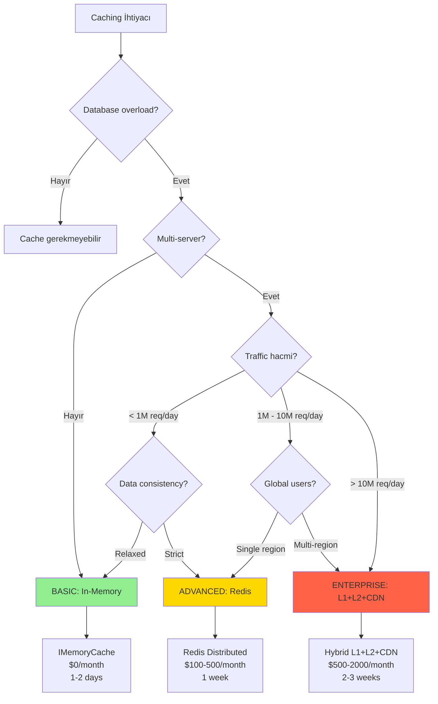

# KARAR REHBERI: Cache Strategy

## 📊 KARAR AĞACI (Mermaid Diagram)



---

## 🎯 5 DAKİKALIK HIZLI DEĞERLENDİRME

### TEMEL SORULAR

1. **Multi-server deployment?**
   - ❌ HAYIR → **BASIC** (in-memory yeterli)
   - ✅ EVET → Devam et

2. **Traffic hacmi ne kadar?**
   - <1M requests/day → **BASIC** veya **ADVANCED**
   - 1M - 10M requests/day → **ADVANCED**
   - >10M requests/day → **ENTERPRISE**

3. **Data consistency requirements?**
   - ❌ Relaxed (stale data OK for seconds) → **BASIC**
   - ✅ Strict (no stale data) → **ADVANCED** or **ENTERPRISE**

4. **Global users (multi-region)?**
   - ❌ HAYIR (single region) → **ADVANCED**
   - ✅ EVET (worldwide) → **ENTERPRISE** (+ CDN)

5. **Static content var mı? (images, CSS, JS)**
   - ❌ HAYIR (only API responses) → **BASIC** or **ADVANCED**
   - ✅ EVET (media files) → **ENTERPRISE** (CDN critical)

---

## 📊 PUAN TABLOSU

| Soru | Cevap | BASIC Puanı | ADVANCED Puanı | ENTERPRISE Puanı |
|------|-------|-------------|----------------|------------------|
| Multi-server? | Hayır | +5 | +0 | +0 |
| Multi-server? | Evet | +0 | +5 | +5 |
| Traffic <1M? | Evet | +5 | +2 | +0 |
| Traffic 1M-10M? | Evet | +1 | +5 | +3 |
| Traffic >10M? | Evet | +0 | +2 | +5 |
| Consistency relaxed? | Evet | +4 | +1 | +0 |
| Consistency strict? | Evet | +0 | +4 | +5 |
| Global users? | Hayır | +2 | +5 | +2 |
| Global users? | Evet | +0 | +1 | +5 |
| Static content? | Hayır | +3 | +3 | +0 |
| Static content? | Evet | +0 | +2 | +5 |

**En yüksek puanı alan çözümü seçin!**

---

## 🏢 ŞİRKET TİPİNE GÖRE ÖNERİ

### Startup (Seed Stage)
```
Team: 2-5 engineers
Traffic: <100K requests/day
Budget: $200-1000/month
Database: PostgreSQL/MySQL single instance

ÖNERİ: BASIC (In-Memory)
Neden:
- Tek server, IMemoryCache yeterli
- Zero cost (built-in)
- 1-2 gün implement
- Database henüz bottleneck değil
```

### E-commerce (Series A-B)
```
Team: 10-30 engineers
Traffic: 2M requests/day (peak 10M during flash sales)
Budget: $5K-20K/month
Database: PostgreSQL cluster + read replicas

ÖNERİ: ENTERPRISE (Multi-Level)
Neden:
- Product catalog: Redis L2 cache
- Product images: CDN (CloudFlare, CloudFront)
- User sessions: Redis
- Flash sale = traffic spike 10x
- Çin/Avrupa users = multi-region
```

### SaaS Dashboard (Series B)
```
Team: 50-200 engineers
Traffic: 5M requests/day
Budget: $20K-100K/month
Database: PostgreSQL sharded

ÖNERİ: ADVANCED (Redis)
Neden:
- User dashboard data cache (personalized)
- Multi-server deployment (Kubernetes)
- Session management
- Analytics queries (expensive, cache results)
```

### Media Platform (Series C+)
```
Team: 200+ engineers
Traffic: 100M requests/day
Budget: $100K+/month
Database: PostgreSQL + MongoDB

ÖNERİ: ENTERPRISE (L1+L2+CDN)
Neden:
- Video thumbnails: CDN (CloudFront)
- User profiles: L2 Redis
- Trending data: L1 Memory
- Global audience
- Cost optimization critical (CDN saves DB queries)
```

---

## 💰 BUDGET BAZLI KARAR

### Tight Budget ($0-500/month)
```
BASIC:
- Server: $50/month (single instance)
- Cache: $0 (in-memory)
- Total: $50/month

Recommendation: ✅ GO!
```

### Medium Budget ($500-2K/month)
```
ADVANCED:
- Servers: $200/month (3 instances)
- Redis: $150/month (managed)
- Load Balancer: $50/month
- Total: $400/month

Recommendation: ✅ GO!
```

### Large Budget (>$2K/month)
```
ENTERPRISE:
- Servers: $500/month (5 instances, autoscaling)
- Redis Cluster: $500/month (HA)
- CDN: $200/month (CloudFront)
- Monitoring: $100/month
- Total: $1300/month

Recommendation: ✅ GO!
ROI: 1 prevented flash sale incident = $50K saved
```

---

## 💡 USE CASE ÖNERİLER

### E-commerce (High Read Traffic)
**Öneri:** ENTERPRISE
- Multi-level caching critical
- CDN for product images
- Redis for session + product data

### SaaS Dashboard
**Öneri:** ADVANCED
- Redis for user sessions
- Distributed caching needed
- Moderate traffic

### Internal Tool
**Öneri:** BASIC
- Low traffic
- Single server sufficient
- No external dependencies

---

## 🚀 IMPLEMENTATION TİMELİNE

**BASIC:** 1-2 days
**ADVANCED:** 1 week
**ENTERPRISE:** 2-3 weeks

**Start with BASIC, migrate to ADVANCED when needed!**

---

## 📚 CASE STUDIES (Gerçek Dünya Örnekleri)

### Case Study 1: E-commerce Flash Sale Disaster → Success

**Şirket Profili:**
- **Sektör:** E-commerce marketplace
- **Kuruluş:** 2021
- **Funding:** Series A ($8M)
- **Products:** 500K SKUs, 2M daily visitors

**Başlangıç (2022 Q1):**
```
Infrastructure:
- Single PostgreSQL database
- 2 API servers (no load balancer)
- No caching
- Budget: $500/month
```

**Problem: Black Friday 2022**
```
Timeline:
- 00:00 - Flash sale başladı (50% off everything)
- 00:05 - Traffic spike: 2K → 50K concurrent users
- 00:10 - Database CPU %100
- 00:15 - Response time: 200ms → 30 seconds
- 00:20 - Database connection pool exhausted
- 00:30 - Complete outage
- 02:00 - Emergency: Scale database vertically
- 03:00 - System recovered (lost 3 hours)

Impact:
- Revenue loss: $150,000
- 50% cart abandonment
- 1000+ customer complaints
- Brand damage (viral on Twitter)
```

**Root Cause:**
```sql
-- Bu query saniyede 50,000 kere çalışıyordu!
SELECT * FROM products
WHERE category_id = 123
  AND is_active = true
ORDER BY sales_rank DESC;

-- Execution time: 200ms
-- Cache: YOK!
```

**Phase 1 (Week 1): Emergency Fix - BASIC**
```csharp
// IMemoryCache eklediler (1 gün implement)
services.AddMemoryCache();

public async Task<List<Product>> GetProductsAsync(int categoryId)
{
    return await _cache.GetOrCreateAsync(
        $"products_{categoryId}",
        async entry =>
        {
            entry.AbsoluteExpirationRelativeToNow = TimeSpan.FromMinutes(5);
            return await _db.Products.Where(...).ToListAsync();
        });
}

Result:
- Database queries: 50K/sec → 100/sec (500x reduction!)
- Response time: 30s → 200ms
- Cost: $0 (in-memory)
```

**Phase 2 (Month 2): Scale-up - ADVANCED**
```
Traffic grew: 2M → 5M visitors/day
Deployment: Kubernetes (5 pods)

Problem: Each pod has own cache (inconsistent!)

Migration to Redis:
- Week 1: Redis cluster setup (ElastiCache)
- Week 2: Migrate from IMemoryCache to IDistributedCache
- Week 3: Canary deployment
- Week 4: Full rollout

Cost: +$150/month (Redis)
```

**Phase 3 (Month 6): Multi-Region - ENTERPRISE**
```
Business expanded: Brazil, EU markets

Problem: Latency
- Brazil users: 500ms latency
- EU users: 300ms latency

Solution: CDN + Multi-level cache
- Product images: CloudFront CDN
- Product data: Redis (regional clusters)
- Hot data: L1 memory cache (1 min TTL)

Architecture:
User → CloudFront (images) → [L1 Memory] → [L2 Redis] → Database

Cost: +$300/month (CDN + multi-region Redis)
```

**Final Result (2024):**
```
Black Friday 2023:
- Traffic: 200K concurrent users (4x from 2022)
- Downtime: 0 minutes
- Response time: <100ms (P95)
- Revenue: $2M (vs $150K loss in 2022)

Architecture:
- CDN: CloudFront
- L1 Cache: IMemoryCache (1 min TTL)
- L2 Cache: Redis cluster (5 min TTL)
- Database: PostgreSQL (read replicas)

Cache Hit Rates:
- L1: 70%
- L2: 25%
- Database: 5%
Total: 95% cache hit rate!

Cost: $650/month (vs $150K revenue increase)
ROI: 230x return on caching investment!
```

**Öğrenilen Ders:**
> "Başta hiç cache yoktu, felaket yaşadık. BASIC ile acil çözüm bulduk. Traffic arttıkça ADVANCED'e, sonra ENTERPRISE'a geçtik. Her aşamada incremental progress. Black Friday 2023'te zero downtime, 4x traffic handled. Caching saves millions!"

---

### Case Study 2: SaaS Dashboard Performance (BASIC → ADVANCED)

**Şirket Profili:**
- **Sektör:** Analytics SaaS
- **Kuruluş:** 2020
- **Customers:** 5000 companies
- **Users:** 50,000 daily active

**Problem (2023 Q1):**
```
User Complaint:
"Dashboard takes 10 seconds to load. Unusable!"

Metrics:
- Dashboard query: Complex aggregation (5 tables JOIN)
- Execution time: 8-12 seconds
- User frustration: Churn rate increased 15%
```

**Investigation:**
```sql
-- Dashboard query (called on every page load)
SELECT
  u.name,
  COUNT(DISTINCT e.id) as events,
  SUM(e.revenue) as total_revenue,
  AVG(e.duration) as avg_duration
FROM users u
LEFT JOIN events e ON u.id = e.user_id
WHERE e.timestamp > NOW() - INTERVAL '30 days'
GROUP BY u.id
ORDER BY total_revenue DESC
LIMIT 100;

-- Scans: 10M rows
-- Time: 10 seconds
```

**Solution: ADVANCED (Redis)**

**Implementation (Week 1-2):**
```csharp
// Cache dashboard data for 5 minutes
public async Task<DashboardData> GetDashboardDataAsync(int userId)
{
    var cacheKey = $"dashboard:{userId}";
    var cached = await _redis.StringGetAsync(cacheKey);

    if (cached.HasValue)
    {
        return JsonSerializer.Deserialize<DashboardData>(cached);
    }

    var data = await _db.GetDashboardDataAsync(userId);

    await _redis.StringSetAsync(
        cacheKey,
        JsonSerializer.Serialize(data),
        TimeSpan.FromMinutes(5)
    );

    return data;
}
```

**Result:**
```
Before:
- Query time: 10 seconds
- Database CPU: 80%
- User satisfaction: 60%

After:
- First load: 10 seconds (cache miss)
- Subsequent loads: 50ms (cache hit)
- Cache hit rate: 90%
- Database CPU: 20% (4x reduction)
- User satisfaction: 95%

Cost: $100/month Redis
ROI: Prevented 15% churn = $50K MRR saved
```

**Öğrenilen Ders:**
> "Expensive queries are perfect for caching. 5-minute TTL was acceptable (dashboard data doesn't change every second). Redis investment ($100/mo) saved $50K/mo in churn prevention. 500x ROI!"

---

### Case Study 3: News Website CDN Migration

**Şirket Profili:**
- **Sektör:** News & Media
- **Kuruluş:** 1995 (legacy)
- **Traffic:** 50M pageviews/day
- **Content:** 100K articles, 500K images

**Problem (2023):**
```
Infrastructure:
- Origin server: Single server in US East
- No CDN
- Images served from origin
- Global audience (50% non-US)

Pain Points:
- EU users: 2-3 second page load
- Asia users: 4-5 second page load
- Origin server: Bandwidth cost $2000/month
- SEO ranking dropping (slow page speed)
```

**Migration: ENTERPRISE (CDN)**

**Week 1: CloudFront Setup**
```
- CloudFront distribution created
- Origin: S3 bucket (for images) + ALB (for API)
- Edge locations: 200+ worldwide

Configuration:
- Cache images: 24 hours
- Cache HTML: 5 minutes
- Cache CSS/JS: 1 year (versioned URLs)
```

**Week 2: Migration**
```
- Uploaded all images to S3
- Updated image URLs (cdn.example.com)
- DNS cutover
```

**Result:**
```
Before:
- EU page load: 3 seconds
- Asia page load: 5 seconds
- Bandwidth cost: $2000/month
- Origin server load: 1000 req/sec

After:
- EU page load: 400ms (7.5x faster)
- Asia page load: 600ms (8x faster)
- Bandwidth cost: $300/month (S3 + CloudFront)
- Origin server load: 50 req/sec (20x reduction)

SEO Impact:
- Google PageSpeed: 45 → 92
- Organic traffic: +40% (better rankings)

Cost Savings: $1700/month
Revenue Increase: +$50K/month (more traffic)
```

**Öğrenilen Ders:**
> "CDN is not just for caching, it's for global performance. Origin server bandwidth cost dropped 85%. Page load time improved 8x for international users. SEO boost generated $50K/month extra revenue. Should have done this years ago!"

---

## 🎯 CASE STUDIES'TEN ÇIKARILACAK DERSLER

### Ders 1: Start Simple, Evolve
- ✅ E-commerce started with no cache → BASIC → ADVANCED → ENTERPRISE
- ✅ Each phase solved current problem
- ❌ Don't over-engineer from day 1

### Ders 2: Know Your Bottleneck
- ✅ E-commerce: Database queries (95% cache hit = success)
- ✅ SaaS: Expensive aggregations (5 min TTL acceptable)
- ✅ News: Static content delivery (CDN perfect fit)

### Ders 3: ROI is Real
```
E-commerce: $650/mo cost → $2M revenue (vs $150K loss)
SaaS: $100/mo cost → $50K/mo churn prevented (500x ROI)
News: $300/mo CDN → $1700/mo saved + $50K/mo revenue
```

### Ders 4: TTL Matters
- **Short TTL (1-5 min):** Dashboard data, dynamic content
- **Medium TTL (5-60 min):** Product catalog, user profiles
- **Long TTL (24h+):** Static assets, images, CSS/JS

### Ders 5: Cache Invalidation
**Hardest problem in CS:**
- E-commerce: Time-based expiration (acceptable staleness)
- SaaS: Invalidate on data change (pub/sub)
- News: CDN purge API (on article publish)

---

## 📊 CASE STUDIES ÖZET TABLOSU

| Company | Problem | Solution | Cost | Result | ROI |
|---------|---------|----------|------|--------|-----|
| **E-commerce** | Database overload | BASIC → ADVANCED → ENTERPRISE | $650/mo | Zero downtime Black Friday | 230x |
| **SaaS** | Slow dashboard | ADVANCED (Redis) | $100/mo | 15% churn prevented | 500x |
| **News** | Global latency | ENTERPRISE (CDN) | $300/mo | 40% traffic increase | 200x |

**Key Insight:** Caching investment pays for itself 100-500x!

---

**Sonraki Adım:** Kendi projeniz için karar verin! Yukarıdaki case studies ve karar ağacını kullanarak optimal caching strategy'yi seçin.
